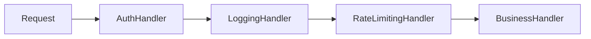

# Bài 2: Adapter & Chain of Responsibility (Bộ Chuyển Đổi & Chuỗi Trách Nhiệm)

> **Trọng tâm bài học:** Cách sử dụng **Adapter Pattern** để làm cầu nối giữa hai interface không tương thích (ví dụ thư viện cũ Legacy vs hệ thống mới), và cách xây dựng đường ống xử lý theo chuỗi **Chain of Responsibility Pattern** (nền tảng của Middleware ASP.NET Core).

---

## 1. Adapter Pattern (Bộ Chuyển Đổi Phích Cắm)

Adapter chuyển đổi giao diện của một lớp thành một giao diện khác mà Client mong đợi. Nó cho phép các lớp vốn dĩ không thể làm việc cùng nhau do khác biệt về giao diện có thể phối hợp trơn tru.

```mermaid
graph LR
    Client["Client Code"] --> ITarget["<<interface>><br/>INewLogger<br/>Log(string msg, LogLevel lvl)"]
    ITarget <|.. Adapter["LegacyLoggerAdapter"]
    Adapter --> Adaptee["LegacyXmlLogger<br/>WriteXmlLog(string xmlData)"]
```

```csharp
namespace BootCamp.Chapter.Examples.Adapter
{
    // Giao diện mới mà ứng dụng hiện tại đang dùng
    public interface INewLogger
    {
        void Log(string message, string level);
    }

    // Thư viện bên thứ 3 hoặc code cũ (Adaptee) không thể sửa mã nguồn
    public class LegacyXmlLogger
    {
        public void WriteXml(string xmlContent)
        {
            Console.WriteLine($"[LEGACY XML LOGGER]: {xmlContent}");
        }
    }

    // Adapter đứng ở giữa làm cầu nối
    public class LegacyLoggerAdapter : INewLogger
    {
        private readonly LegacyXmlLogger _legacyLogger;

        public LegacyLoggerAdapter(LegacyXmlLogger legacyLogger)
        {
            _legacyLogger = legacyLogger;
        }

        public void Log(string message, string level)
        {
            // Chuyển đổi định dạng tham số sang XML mà thư viện cũ mong đợi:
            string xml = $"<log level='{level}'><time>{DateTime.UtcNow}</time><msg>{message}</msg></log>";
            _legacyLogger.WriteXml(xml);
        }
    }
}
```

---

## 2. Chain of Responsibility Pattern (Chuỗi Trách Nhiệm)

Chain of Responsibility cho phép bạn chuyển tiếp các yêu cầu dọc theo một chuỗi các trình xử lý (Handlers). Khi nhận được yêu cầu, mỗi Handler sẽ quyết định:
1. Xử lý yêu cầu hoặc bỏ qua.
2. Quyết định có chuyển tiếp yêu cầu cho Handler tiếp theo trong chuỗi hay dừng lại ngay lập tức (Short-circuit).



```csharp
namespace BootCamp.Chapter.Examples.ChainOfResponsibility
{
    public abstract class Handler
    {
        protected Handler _next;

        public Handler SetNext(Handler next)
        {
            _next = next;
            return next; // Hỗ trợ cú pháp chuỗi Fluent (h1.SetNext(h2).SetNext(h3))
        }

        public virtual void Handle(HttpRequest request)
        {
            _next?.Handle(request);
        }
    }

    public class AuthenticationHandler : Handler
    {
        public override void Handle(HttpRequest request)
        {
            if (string.IsNullOrEmpty(request.Token))
            {
                Console.WriteLine("❌ [Chặn]: Token không hợp lệ! Dừng chuỗi.");
                return; // Ngắt chuỗi (Short-circuit), không gọi _next!
            }

            Console.WriteLine("✅ [Auth]: Xác thực thành công.");
            base.Handle(request); // Chuyển cho Handler kế tiếp
        }
    }

    public class LoggingHandler : Handler
    {
        public override void Handle(HttpRequest request)
        {
            Console.WriteLine($"📝 [Log]: Đang xử lý Request tới URL: {request.Url}");
            base.Handle(request);
        }
    }
}
```
