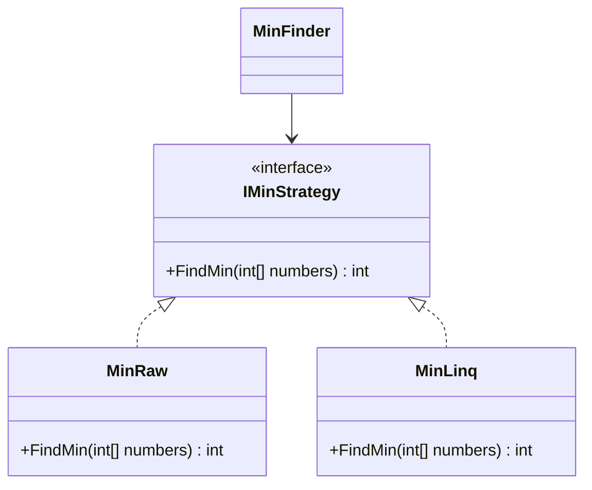

# Bài 3: Strategy & Command (Chiến Lược & Mệnh Lệnh)

> **Trọng tâm bài học:** Phân biệt và ứng dụng hai mẫu hành vi (Behavioral Patterns) phổ biến nhất: **Strategy Pattern** (Đóng gói thuật toán hoán đổi qua Case Study `MinFinder`) và **Command Pattern** (Đóng gói hành động thành đối tượng có khả năng Undo/Redo qua Case Study Điều khiển TV `TvRemoteController`).

---

## 1. Strategy Pattern: Thuật Toán Hoán Đổi Linh Hoạt

Strategy định nghĩa một họ các thuật toán, đóng gói từng thuật toán lại và làm cho chúng có thể hoán đổi cho nhau mà không làm ảnh hưởng đến mã nguồn của Client sử dụng.

### Case Study: Thuật toán tìm giá trị nhỏ nhất `MinFinder` (Trích nhánh `Strategy-Command`):



```csharp
namespace BootCamp.Chapter.Examples.MinStrategy
{
    // 1. Trừu tượng hóa Strategy
    public interface IMinStrategy
    {
        int FindMin(int[] numbers);
    }

    // 2. Thuật toán duyệt vòng lặp truyền thống O(N)
    public class MinRaw : IMinStrategy
    {
        public int FindMin(int[] numbers)
        {
            if (numbers == null || numbers.Length == 0) throw new ArgumentException("Mảng rỗng!");
            int min = numbers[0];
            for (int i = 1; i < numbers.Length; i++)
            {
                if (numbers[i] < min) min = numbers[i];
            }
            return min;
        }
    }

    // 3. Thuật toán dùng LINQ
    public class MinBetterLinq : IMinStrategy
    {
        public int FindMin(int[] numbers) => numbers.Min();
    }

    // 4. Client sử dụng: Có thể đổi thuật toán lúc Runtime!
    public class MinFinder
    {
        private IMinStrategy _strategy;

        public MinFinder(IMinStrategy strategy)
        {
            _strategy = strategy;
        }

        public void SetStrategy(IMinStrategy strategy) => _strategy = strategy;

        public int Execute(int[] numbers) => _strategy.FindMin(numbers);
    }
}
```

---

## 2. Command Pattern: Đóng Gói Yêu Cầu Thành Đối Tượng

Command biến một yêu cầu thành một đối tượng độc lập chứa đầy đủ thông tin về yêu cầu đó: người nhận (`Receiver`), hành động cần thực hiện (`Execute`), và cả thao tác hoàn tác (`Undo`).

### Case Study: Điều khiển TV từ xa (Trích nhánh `Strategy-Command`):

```csharp
namespace BootCamp.Chapter.Examples.TvRemoteControllerCommands
{
    // 1. Receiver (Đối tượng nhận và thực hiện hành động vật lý)
    public class Tv
    {
        public bool IsOn { get; private set; }
        public int Volume { get; private set; } = 10;
        public int Channel { get; private set; } = 1;

        public void TurnOn() => IsOn = true;
        public void TurnOff() => IsOn = false;
        public void SetVolume(int vol) => Volume = vol;
        public void SetChannel(int ch) => Channel = ch;
    }

    // 2. Command Interface
    public interface ICommand
    {
        void Execute();
        void Undo();
    }

    // 3. Lệnh cụ thể: Bật/Tắt TV
    public class TogglePowerCommand : ICommand
    {
        private readonly Tv _tv;

        public TogglePowerCommand(Tv tv) => _tv = tv;

        public void Execute()
        {
            if (_tv.IsOn) _tv.TurnOff();
            else _tv.TurnOn();
            Console.WriteLine($"TV hiện đang: {(_tv.IsOn ? "BẬT" : "TẮT")}");
        }

        public void Undo() => Execute(); // Đảo ngược trạng thái
    }

    // 4. Lệnh đổi kênh (Có lưu lại kênh cũ để Undo!)
    public class ChangeChannelCommand : ICommand
    {
        private readonly Tv _tv;
        private readonly int _targetChannel;
        private int _previousChannel;

        public ChangeChannelCommand(Tv tv, int targetChannel)
        {
            _tv = tv;
            _targetChannel = targetChannel;
        }

        public void Execute()
        {
            _previousChannel = _tv.Channel;
            _tv.SetChannel(_targetChannel);
            Console.WriteLine($"Đã chuyển sang kênh {_targetChannel}");
        }

        public void Undo()
        {
            _tv.SetChannel(_previousChannel);
            Console.WriteLine($"[UNDO] Đã quay lại kênh cũ {_previousChannel}");
        }
    }

    // 5. Invoker (Bộ điều khiển lưu lịch sử lệnh)
    public class TvRemoteController
    {
        private readonly Stack<ICommand> _history = new();

        public void PressButton(ICommand command)
        {
            command.Execute();
            _history.Push(command);
        }

        public void PressUndo()
        {
            if (_history.Count > 0)
            {
                var lastCommand = _history.Pop();
                lastCommand.Undo();
            }
            else
            {
                Console.WriteLine("Không còn lệnh nào trong lịch sử để Undo!");
            }
        }
    }
}
```
