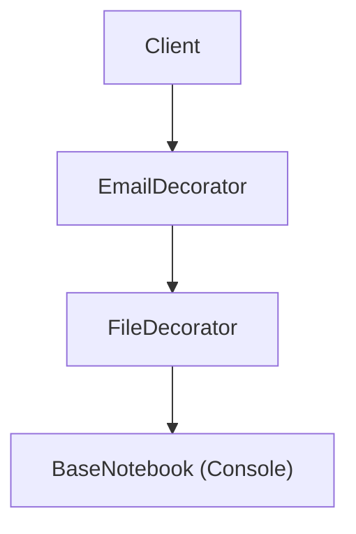

# Bài 4: Decorator & Builder (Trang Trí & Xây Dựng)

> **Trọng tâm bài học:** Giải pháp xếp chồng tính năng linh hoạt lúc chạy của **Decorator Pattern** (thay thế cho việc kế thừa nhiều tầng qua Case Study `Notebook` ghi dữ liệu đa kênh từ repo), và cách xây dựng các đối tượng phức tạp với cú pháp chuỗi mượt mà bằng **Builder Pattern**.

---

## 1. Decorator Pattern: Xếp Chồng Tính Năng (Stacking Behavior)

Decorator cho phép bạn bổ sung các hành vi mới cho một đối tượng hiện có mà không làm thay đổi mã nguồn của lớp đó, bằng cách bọc đối tượng gốc bên trong các "lớp vỏ" trang trí (Wrapper).

### Vấn đề:
Bạn có một cuốn sổ ghi chú (`Notebook`). Người dùng muốn:
- Ghi vào Console thuần túy.
- Hoặc ghi vào Console VÀ lưu vào File.
- Hoặc ghi vào Console VÀ lưu Database VÀ gửi Email thông báo.
Nếu dùng kế thừa, bạn sẽ rơi vào thảm họa bùng nổ lớp. Với Decorator, bạn chỉ cần bọc các lớp lại như búp bê Nga Matryoshka:



```csharp
namespace BootCamp.Chapter.Examples.Decorator
{
    // 1. Interface chung cho cả đối tượng gốc lẫn các Decorator
    public interface INotebook
    {
        void Write(string note);
    }

    // 2. Đối tượng gốc cơ bản
    public class SimpleNotebook : INotebook
    {
        public void Write(string note)
        {
            Console.WriteLine($"[Ghi Sổ Console]: {note}");
        }
    }

    // 3. Lớp Decorator cơ sở
    public abstract class NotebookDecorator : INotebook
    {
        protected readonly INotebook _decoratedNotebook;

        protected NotebookDecorator(INotebook notebook)
        {
            _decoratedNotebook = notebook;
        }

        public virtual void Write(string note)
        {
            _decoratedNotebook.Write(note);
        }
    }

    // 4. Decorator bổ sung tính năng lưu File
    public class FileNotebookDecorator : NotebookDecorator
    {
        public FileNotebookDecorator(INotebook notebook) : base(notebook) { }

        public override void Write(string note)
        {
            base.Write(note); // Gọi hàm của lớp bên trong
            Console.WriteLine($"  -> [File Storage]: Đã lưu '{note}' vào đĩa cứng.");
        }
    }

    // 5. Decorator bổ sung tính năng gửi Email
    public class EmailNotebookDecorator : NotebookDecorator
    {
        public EmailNotebookDecorator(INotebook notebook) : base(notebook) { }

        public override void Write(string note)
        {
            base.Write(note);
            Console.WriteLine($"  -> [Email Alert]: Đã bắn email thông báo nội dung '{note}'.");
        }
    }
}
```

### Sử dụng lắp ráp tự do lúc Runtime:
```csharp
// Muốn ghi vừa Console, vừa File, vừa Email:
INotebook myNotebook = new EmailNotebookDecorator(
                            new FileNotebookDecorator(
                                new SimpleNotebook()));

myNotebook.Write("Cuộc họp khẩn lúc 9h sáng!");
```

---

## 2. Builder Pattern (Mẫu Xây Dựng Đối Tượng Phức Tạp)

Builder tách rời quá trình khởi tạo một đối tượng phức tạp khỏi biểu diễn thực tế của nó, cho phép cùng một quy trình xây dựng có thể tạo ra các biến thể khác nhau với cú pháp Fluent API:

```csharp
public class Computer
{
    public string Cpu { get; set; }
    public int RamGb { get; set; }
    public string Gpu { get; set; }
    public bool HasWaterCooling { get; set; }
}

public class ComputerBuilder
{
    private readonly Computer _computer = new();

    public ComputerBuilder SetCpu(string cpu)
    {
        _computer.Cpu = cpu;
        return this; // Trả về chính builder để chuỗi hóa phương thức
    }

    public ComputerBuilder SetRam(int ramGb)
    {
        _computer.RamGb = ramGb;
        return this;
    }

    public ComputerBuilder SetGpu(string gpu)
    {
        _computer.Gpu = gpu;
        return this;
    }

    public ComputerBuilder EnableWaterCooling()
    {
        _computer.HasWaterCooling = true;
        return this;
    }

    public Computer Build() => _computer;
}

// Sử dụng Fluent API cực kỳ rõ ràng:
var gamingPc = new ComputerBuilder()
    .SetCpu("Intel Core i9-14900K")
    .SetRam(64)
    .SetGpu("NVIDIA RTX 4090")
    .EnableWaterCooling()
    .Build();
```
