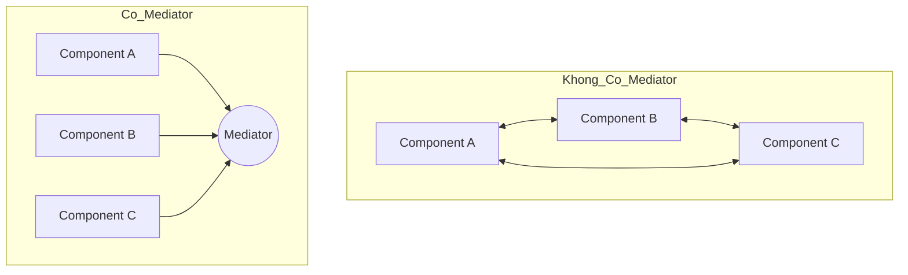

# Bài 6: Mediator & Observer (Điều Phối & Quan Sát)

> **Trọng tâm bài học:** Giải quyết mớ hỗn độn liên kết chằng chịt giữa các đối tượng (Spaghetti Dependencies) bằng **Mediator Pattern** (nền tảng của thư viện MediatR trong kiến trúc Clean Architecture / CQRS), và mô hình **Observer Pattern** (Xuất bản - Đăng ký thông báo).

---

## 1. Mediator Pattern (Người Điều Phối Không Lưu Trạm)

Thay vì để các đối tượng giao tiếp trực tiếp với nhau (tạo thành một mạng lưới hình sao phức tạp), Mediator đóng vai trò là một trung tâm điều phối duy nhất. Các đối tượng (Colleagues) chỉ cần gửi thông điệp tới Mediator, và Mediator sẽ chịu trách nhiệm phân phát tới các thành phần liên quan.



### Ứng dụng trong Clean Architecture với MediatR:
```csharp
// 1. Định nghĩa Command/Request
public record CreateUserCommand(string Username, string Email) : IRequest<int>;

// 2. Định nghĩa Handler xử lý riêng biệt
public class CreateUserHandler : IRequestHandler<CreateUserCommand, int>
{
    private readonly IUserRepository _repo;

    public CreateUserHandler(IUserRepository repo) => _repo = repo;

    public async Task<int> Handle(CreateUserCommand request, CancellationToken cancellationToken)
    {
        var user = new User(request.Username, request.Email);
        await _repo.AddAsync(user);
        return user.Id;
    }
}

// 3. Trong Controller: Controller hoàn toàn không biết CreateUserHandler là ai!
[ApiController]
[Route("api/users")]
public class UsersController : ControllerBase
{
    private readonly IMediator _mediator;
    public UsersController(IMediator mediator) => _mediator = mediator;

    [HttpPost]
    public async Task<IActionResult> Create([FromBody] CreateUserCommand command)
    {
        int id = await _mediator.Send(command);
        return Ok(new { UserId = id });
    }
}
```

---

## 2. Observer Pattern (Mẫu Quan Sát / Pub-Sub)

Observer định nghĩa mối phụ thuộc 1-Nhiều giữa các đối tượng: khi một đối tượng (Subject/Publisher) thay đổi trạng thái, tất cả các đối tượng phụ thuộc đã đăng ký (Observers/Subscribers) sẽ tự động nhận được thông báo.

- Trong C#, Observer Pattern được ngôn ngữ hỗ trợ tự nhiên ở cấp độ cú pháp thông qua **`event` và `delegate`** (đã học ở Chapter 3 - Monster Fight).
- Ở mức độ kiến trúc phân tán, Observer mở rộng thành các Message Broker như RabbitMQ, Apache Kafka, Redis Pub/Sub.
