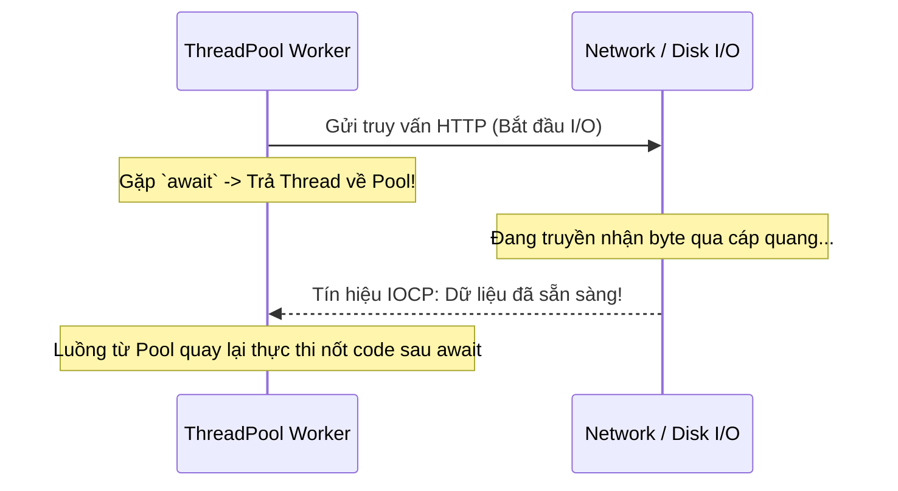

# Bài 3: Lập Trình Bất Đồng Bộ Trong C# (`async` / `await` & TAP)

> **Trọng tâm bài học:** Giải mã Task-based Asynchronous Pattern (TAP), sự khác biệt giữa I/O-bound vs CPU-bound, tại sao `async` không tạo ra luồng mới mà giúp giải phóng luồng máy chủ (Thread Starvation), cơ chế `CancellationToken` và bẫy chết người `Sync-over-Async` (`.Result` / `.Wait()`).

---

## 1. Bản Chất Của `async` / `await`

Lập trình bất đồng bộ sinh ra để giải quyết vấn đề nghẽn luồng xử lý (I/O Bottlenecks: chờ CSDL trả lời, chờ gọi API bên ngoài, chờ đọc ổ đĩa).
- **Đồng bộ (Synchronous):** Luồng đang xử lý bị khóa chặt (Blocked), ngồi chờ thụ động cho đến khi mạng hoặc ổ đĩa phản hồi. Nếu có 1000 request đồng thời, máy chủ hết sạch luồng -> Treo cứng hệ thống (Thread Starvation).
- **Bất đồng bộ (Asynchronous):** Khi gặp `await`, luồng xử lý được **trả tự do ngay lập tức** về ThreadPool để phục vụ các yêu cầu khác. Khi thao tác phần cứng I/O hoàn tất, hệ điều hành gửi tín hiệu I/O Completion Port (IOCP), và một luồng bất kỳ từ ThreadPool sẽ quay lại thực thi nốt phần code còn lại.



---

## 2. Các Bẫy Tử Thần Trong Lập Trình Bất Đồng Bộ

### 1. Bẫy Sync-over-Async (Dùng `.Result` hoặc `.Wait()`):
```csharp
// ❌ CỰC KỲ NGUY HIỂM: Gây Deadlock luồng và làm cạn kiệt ThreadPool!
public string GetData()
{
    return FetchFromApiAsync().Result; // KHÔNG BAO GIỜ LÀM ĐIỀU NÀY!
}

// ✅ CHUẨN: "Async all the way down" (Bất đồng bộ xuyên suốt toàn bộ cây gọi hàm)
public async Task<string> GetDataAsync()
{
    return await FetchFromApiAsync();
}
```

### 2. Bẫy `async void`:
- Chỉ dùng `async void` duy nhất cho các sự kiện UI (Event Handlers như `OnClick`).
- Với mọi hàm nghiệp vụ thông thường, **LUÔN LUÔN** trả về `Task` hoặc `Task<T>`. Hàm `async void` không thể bắt được ngoại lệ (Unhandled Exception sẽ làm sập toàn bộ ứng dụng ngay lập tức).

---

## 3. Quản Lý Hủy Bỏ Tác Vụ Với `CancellationToken`

Luôn truyền `CancellationToken` vào các phương thức bất đồng bộ để kịp thời dừng công việc khi người dùng tắt trình duyệt hoặc request bị timeout:

```csharp
public async Task<string> DownloadReportAsync(string url, CancellationToken ct)
{
    using var httpClient = new HttpClient();

    // Nếu người dùng hủy yêu cầu, httpClient sẽ tự động hủy socket và ném OperationCanceledException
    var response = await httpClient.GetAsync(url, ct);
    return await response.Content.ReadAsStringAsync(ct);
}
```
