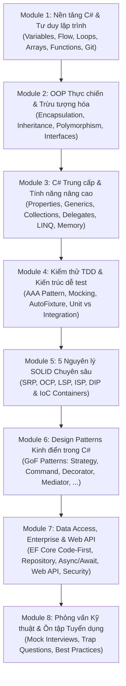

# C#: From Zero To Hero - Toàn Tập Lộ Trình & Kho Kiến Thức C# Thực Chiến

> **Nguyên lý cốt lõi của tác giả (Almantas Karpavicius):**  
> *"Programming is hard. Yes, but not harder than running a marathon for a person who has never run. It's not harder than building a house if you never built one. Programming is hard only until you practice it (like any other skill). Ignite passion for finding little miracles in code every day."*

Kho tư liệu này được trích xuất, biên dịch và hoàn thiện từ dự án đào tạo mã nguồn mở nổi tiếng **[CSharp-From-Zero-To-Hero](https://github.com/Almantask/CSharp-From-Zero-To-Hero)** cùng toàn bộ hệ sinh thái:
- **88 Git Branches** chứa mã nguồn thực tế, bài tập, unit tests và refactoring (Bad vs Good code).
- **GitHub Wiki toàn tập** với lý thuyết chuyên sâu và hướng dẫn kiến trúc.
- **Hệ thống bài giảng Slide (Google Slides)** & **Video bài giảng (YouTube/Twitch)** chính thức từ tác giả.
- **Hệ thống Homework (1 -> 12), Challenges (Hangman, Exterminator)** và bộ đề thi trắc nghiệm (Google Forms).

---

## 🗺️ Bản Đồ Lộ Trình Toàn Khóa (Master Roadmap)

---

## 📚 Danh Mục Module & Tài Liệu Bài Học

| Module | Thư mục | Chủ đề trọng tâm | Số bài / Tài liệu | Tài nguyên đi kèm |
| :--- | :--- | :--- | :---: | :--- |
| **01** | **[01-fundamentals/](file:///d:/my-project/revision-document/dotnet/csharp-from-zero-to-hero/01-fundamentals/README.md)** | Cú pháp, Biến, CTS, Console, Git/GitHub, Luồng logic, Vòng lặp, Mảng, Hàm, Debugging, File I/O, Encoding, Random | 10 bài + Homework | [Slide Deck 1-10](file:///d:/my-project/revision-document/dotnet/csharp-from-zero-to-hero/01-fundamentals/README.md#tài-nguyên-video--slides), Đề thi Chapter 1 |
| **02** | **[02-oop-deep-dive/](file:///d:/my-project/revision-document/dotnet/csharp-from-zero-to-hero/02-oop-deep-dive/README.md)** | Encapsulation, Che giấu dữ liệu, Inheritance, Composition vs Inheritance, Virtual/Abstract, Interface toàn tập | 6 bài + Shop Simulator | [Slide Deck 1-4](file:///d:/my-project/revision-document/dotnet/csharp-from-zero-to-hero/02-oop-deep-dive/README.md#tài-nguyên-video--slides), Đề thi Chapter 2 |
| **03** | **[03-intermediate-csharp/](file:///d:/my-project/revision-document/dotnet/csharp-from-zero-to-hero/03-intermediate-csharp/README.md)** | Properties, Enums, in/out/ref, Null operators, Generics, N-Arrays, Dictionary, Delegates & Events, LINQ, Extensions, Serialization, Attributes | 11 bài + Code mẫu | [Slide Deck 1-13](file:///d:/my-project/revision-document/dotnet/csharp-from-zero-to-hero/03-intermediate-csharp/README.md#tài-nguyên-video--slides), Monster Fight Simulator |
| **04** | **[04-testing-and-tdd/](file:///d:/my-project/revision-document/dotnet/csharp-from-zero-to-hero/04-testing-and-tdd/README.md)** | Quy trình TDD (Red-Green-Refactor), Mô hình AAA, Test doubles & Moq, AutoFixture, FluentAssertions, Unit vs Integration | 5 bài + Case studies | [Slide Deck 1-6](file:///d:/my-project/revision-document/dotnet/csharp-from-zero-to-hero/04-testing-and-tdd/README.md#tài-nguyên-video--slides), AppointmentService TDD |
| **05** | **[05-solid-principles/](file:///d:/my-project/revision-document/dotnet/csharp-from-zero-to-hero/05-solid-principles/README.md)** | 5 nguyên lý SOLID chi tiết với code đối chiếu Bad vs Good (Taxes, SchoolTerminal, Composition Root, IoC) | 5 bài + Refactor code | [Slide Deck 1-5](file:///d:/my-project/revision-document/dotnet/csharp-from-zero-to-hero/05-solid-principles/README.md#tài-nguyên-video--slides), DI Containers (Autofac/Unity) |
| **06** | **[06-design-patterns/](file:///d:/my-project/revision-document/dotnet/csharp-from-zero-to-hero/06-design-patterns/README.md)** | GoF Patterns: Strategy & Command, Singleton & Facade, State & Bridge & Null Object, Mediator & Observer, Decorator & Builder, Adapter & CoR | 6 bài + 12 Patterns | [Slide Deck 1-6](file:///d:/my-project/revision-document/dotnet/csharp-from-zero-to-hero/06-design-patterns/README.md#tài-nguyên-video--slides), Code mô phỏng TV Remote, Notebook |
| **07** | **[07-data-access-and-architecture/](file:///d:/my-project/revision-document/dotnet/csharp-from-zero-to-hero/07-data-access-and-architecture/README.md)** | EF Core Code-First, Migrations, Repository & Unit of Work, Async/Await (TAP), Web API RESTful, Security & Best Practices | 4 bài + Kiến trúc chuẩn | EF Core Migrations Demo, Async Patterns |
| **08** | **[08-career-and-interviews/](file:///d:/my-project/revision-document/dotnet/csharp-from-zero-to-hero/08-career-and-interviews/interview-questions-and-prep.md)** | Kinh nghiệm phỏng vấn tuyển dụng C#, câu hỏi bẫy kỹ thuật, phân tích phản hồi phỏng vấn thực tế từ tác giả | Tổng hợp Mock Interviews | Video Mock Interview, Checklist kinh nghiệm |

---

## 🎯 Phương Pháp Học & Luyện Tập Khuyến Nghị

1. **Học theo cặp Lý thuyết - Thực hành:**
   - Đọc kỹ tài liệu lý thuyết trong từng file `.md` để hiểu sâu *Bản chất hoạt động (Under the hood)* và *Tại sao lại thiết kế như vậy*.
   - Đối chiếu với các đoạn mã nguồn mẫu thực tế (`Bad Code` vs `Good Code` / `Refactored Code`).
2. **Làm bài tập & Thử thách (Homework & Challenges):**
   - Đọc yêu cầu bài tập và thử tự giải quyết trước khi xem code mẫu.
   - Viết Unit Tests kiểm tra các trường hợp biên (edge cases).
3. **Tuân thủ quy tắc Clean Code & Ponytail:**
   - Không lạm dụng code thừa (YAGNI).
   - Đặt tên hàm bằng động từ (`Verb-first`), tên biến rõ nghĩa theo chuẩn PascalCase / camelCase.
   - Luôn kiểm soát trạng thái dữ liệu qua Encapsulation.
