# Module 01: Kiến Trúc Cốt Lõi & Lệnh Cơ Bản (Git Basics & Architecture)

## 🎯 Mục Tiêu Học Tập
Module này cung cấp nền tảng bản chất cấp thấp về cách Git vận hành dưới tầng hệ thống tệp và cấu trúc dữ liệu:
1. **Git Architecture & Internals**: Hiểu thấu kiến trúc 3 cây (Working Tree, Index, Repository/HEAD), 4 đối tượng cốt lõi (`blob`, `tree`, `commit`, `tag`), cơ chế băm Content-Addressable Storage (CAS) và giải phẫu thư mục `.git/`.
2. **Commands & Staging Lifecycle**: Nắm vững các phạm vi cấu hình (`--system`, `--global`, `--local`), vòng đời trạng thái file (Untracked, Staged, Unmodified, Modified), phân biệt chính xác `git diff` vs `git diff --staged` và hoàn tác staging an toàn với `git restore --staged`.
3. **Branching & Merging**: Thấu hiểu bản chất con trỏ branch di động trong `.git/refs/heads/`, phân biệt rạch ròi Fast-forward merge và 3-way merge commit (2 parents), điều hướng hiện đại bằng `git switch` và cơ chế xóa nhánh an toàn (`-d` vs `-D`).
4. **Stashing & Tagging**: Khai thác ngăn xếp Stash lưu trữ trạng thái dở dang (`stash push -u`, `pop`, `apply`, `branch`), phân biệt Lightweight tag (con trỏ thuần) và Annotated tag (đối tượng tag hoàn chỉnh có tagger/message).
5. **Ignoring & Attributes**: Thiết lập quy tắc khớp mẫu trong `.gitignore`, gỡ bỏ theo dõi file đã lỡ commit (`git rm --cached`), điều tra xung đột ignore (`git check-ignore -v`) và chuẩn hóa xuống dòng CRLF/LF với `.gitattributes`.

---

## 🗺️ Bản Đồ Kiến Trúc Git (Internals Mindmap)

```mermaid
graph TD
    A["Git Version Control System"] --> B["The 3 Trees"]
    A --> C["The 4 Git Objects"]
    A --> D["Branching & DAG History"]
    A --> E["Working State Helpers"]

    B --> B1["Working Tree (File thực tế)"]
    B --> B2["Index / Staging (.git/index)"]
    B --> B3["Repository / HEAD (.git/objects)"]

    C --> C1["Blob (Nội dung tệp nén zlib)"]
    C --> C2["Tree (Thư mục & con trỏ Blob)"]
    C --> C3["Commit (Snapshot DAG & Parents)"]
    C --> C4["Tag (Mốc phát hành có chữ ký)"]

    D --> D1["Movable Pointers: .git/refs/heads/"]
    D --> D2["Fast-Forward (Trượt con trỏ O(1))"]
    D --> D3["3-Way Merge (2 Parents Commit)"]
    D --> D4["Modern Navigation: git switch"]

    E --> E1["Stash Stack (.git/refs/stash)"]
    E --> E2[".gitignore Pattern Matching"]
    E --> E3[".gitattributes (CRLF/LF Normalization)"]
    E --> E4["git rm --cached (Untrack mà giữ file)"]
```



---

## 📚 Danh Mục Bài Học & File Thực Hành

| STT | Tên Chủ Đề Chi Tiết | Tài Liệu Hướng Dẫn (.md) | Code Kiểm Chứng (.js) | Trọng Tâm Kỹ Thuật |
| :---: | :--- | :--- | :--- | :--- |
| **01** | **Kiến Trúc Nội Tại & Hệ Thống Lưu Trữ** | [01-git-architecture-and-internals.md](file:///d:/my-project/revision-document/git/01-basics-and-architecture/01-git-architecture-and-internals.md) | [01-architecture-demo.js](file:///d:/my-project/revision-document/git/01-basics-and-architecture/01-architecture-demo.js) | 3-Tree Architecture, SHA-1, 4 Objects (`blob`, `tree`, `commit`, `tag`), `.git/` dissection |
| **02** | **Lệnh Cơ Bản, Cấu Hình & Vùng Staging** | [02-basic-commands-and-staging.md](file:///d:/my-project/revision-document/git/01-basics-and-architecture/02-basic-commands-and-staging.md) | [02-staging-demo.js](file:///d:/my-project/revision-document/git/01-basics-and-architecture/02-staging-demo.js) | `git config` hierarchy, Staging lifecycle, `git diff` vs `--staged`, `restore --staged` |
| **03** | **Phân Nhánh & Hợp Nhất (Branching & Merging)** | [03-branching-and-merging.md](file:///d:/my-project/revision-document/git/01-basics-and-architecture/03-branching-and-merging.md) | [03-branching-demo.js](file:///d:/my-project/revision-document/git/01-basics-and-architecture/03-branching-demo.js) | Branch pointers, Fast-Forward, 3-Way Merge (2 parents), `git switch`, safe delete `-d` |
| **04** | **Lưu Tạm (Stash) & Đánh Dấu (Tag)** | [04-stashing-and-tagging.md](file:///d:/my-project/revision-document/git/01-basics-and-architecture/04-stashing-and-tagging.md) | [04-stashing-tagging-demo.js](file:///d:/my-project/revision-document/git/01-basics-and-architecture/04-stashing-tagging-demo.js) | Stash stack (`push -u`, `pop`, `apply`), Lightweight tag vs Annotated tag object |
| **05** | **Bỏ Qua (.gitignore) & Thuộc Tính (.gitattributes)** | [05-ignoring-and-attributes.md](file:///d:/my-project/revision-document/git/01-basics-and-architecture/05-ignoring-and-attributes.md) | [05-ignoring-demo.js](file:///d:/my-project/revision-document/git/01-basics-and-architecture/05-ignoring-demo.js) | Globbing patterns, `git rm --cached`, `git check-ignore -v`, CRLF/LF normalization |

---

## 🧪 Bộ Kiểm Thử Tự Động (Module Test Suite)

Toàn bộ 5 thử thách nâng cao được kiểm thử tự động trên repository tạm cô lập tại:
👉 **[practice.js](file:///d:/my-project/revision-document/git/01-basics-and-architecture/practice.js)**

### Cách chạy kiểm tra:
```bash
node git/01-basics-and-architecture/practice.js
```
100% assertions được kiểm định tự động bằng `node:assert/strict`.
