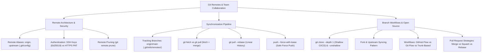

# Module 02: Máy Chủ Từ Xa & Phối Hợp Nhóm (Git Remotes & Collaboration)

## 🎯 Mục Tiêu Học Tập
Module này trang bị tư duy và kỹ năng làm việc trong môi trường nhóm và các nền tảng mã nguồn mở (GitHub, GitLab, Bitbucket):
1. **Remote Repositories & Protocols**: Quản lý cấu hình remote (`remote add`, `set-url`, `rename`, `prune`), cơ chế định danh tác giả và bảo mật bằng khóa SSH (thuật toán hiện đại Ed25519) thay thế hoàn toàn mật khẩu qua HTTPS.
2. **Fetch, Pull, Push & Upstream**: Nắm vững cơ chế con trỏ theo dõi từ xa (`refs/remotes/origin/`), thiết lập upstream tracking (`git push -u`), phân biệt giữa `git fetch` (an toàn) và `git pull` (fetch + merge), áp dụng `git pull --rebase` giữ lịch sử tuyến tính và bảo vệ an toàn nhánh chung với `push --force-with-lease`.
3. **Fork, Clone & Workflows**: Tối ưu hóa pipeline CI/CD với Shallow Clone (`--depth 1`) và Sparse Checkout, làm chủ quy trình đóng góp mã nguồn mở Fork & Upstream Syncing, so sánh ưu nhược điểm của GitHub Flow, Git Flow và Trunk-Based Development.

---

## 🗺️ Bản Đồ Kiến Trúc Remote (Collaboration Mindmap)



---

## 📚 Danh Mục Bài Học & File Thực Hành

| STT | Tên Chủ Đề Chi Tiết | Tài Liệu Hướng Dẫn (.md) | Code Kiểm Chứng (.js) | Trọng Tâm Kỹ Thuật |
| :---: | :--- | :--- | :--- | :--- |
| **01** | **Máy Chủ Từ Xa & Giao Thức Xác Thực** | [01-remote-repositories-and-protocols.md](file:///d:/my-project/revision-document/git/02-remotes-and-collaboration/01-remote-repositories-and-protocols.md) | [01-remotes-demo.js](file:///d:/my-project/revision-document/git/02-remotes-and-collaboration/01-remotes-demo.js) | Remote aliases, `.git/config`, SSH Ed25519 keys, HTTPS Personal Access Token |
| **02** | **Đồng Bộ Fetch, Pull, Push & Tracking** | [02-fetch-pull-push-and-tracking.md](file:///d:/my-project/revision-document/git/02-remotes-and-collaboration/02-fetch-pull-push-and-tracking.md) | [02-pull-push-demo.js](file:///d:/my-project/revision-document/git/02-remotes-and-collaboration/02-pull-push-demo.js) | `origin/main`, Upstream tracking `-u`, `pull --rebase`, `push --force-with-lease` |
| **03** | **Quy Trình Fork, Clone & Mô Hình Dự Án** | [03-fork-clone-and-workflows.md](file:///d:/my-project/revision-document/git/02-remotes-and-collaboration/03-fork-clone-and-workflows.md) | [03-workflows-demo.js](file:///d:/my-project/revision-document/git/02-remotes-and-collaboration/03-workflows-demo.js) | Fork sync, Shallow clone `--depth 1`, GitHub Flow vs Git Flow vs Trunk-Based |

---

## 🧪 Bộ Kiểm Thử Tự Động (Module Test Suite)

Toàn bộ 5 thử thách nâng cao được kiểm thử tự động với Bare Remote Repo trên ổ đĩa tại:
👉 **[practice.js](file:///d:/my-project/revision-document/git/02-remotes-and-collaboration/practice.js)**

### Cách chạy kiểm tra:
```bash
node git/02-remotes-and-collaboration/practice.js
```
100% assertions được kiểm định tự động bằng `node:assert/strict`.
