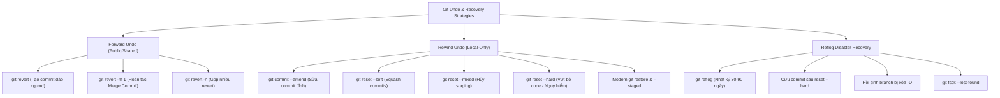

# Module 03: Hoàn Tác & Cứu Hộ Dữ Liệu (Git Undo & History Recovery)

## 🎯 Mục Tiêu Học Tập
Module này cung cấp các kỹ năng an toàn và cứu hộ dữ liệu khẩn cấp khi gặp sự cố trong Git:
1. **Amend & Safe Revert**: Sửa đổi commit đỉnh cục bộ (`git commit --amend`), thấu hiểu nguyên lý hoàn tác an toàn tiến về phía trước (`git revert`), hoàn tác các merge commit có 2 cha với `git revert -m 1`.
2. **The 3 Trees & Reset Matrix**: Phân biệt rạch ròi 3 cờ `--soft` (chỉ di chuyển HEAD), `--mixed` (di chuyển HEAD + xóa Index), `--hard` (xóa sạch Working Tree), áp dụng lệnh hiện đại `git restore` và `git restore --staged` để phòng tránh rủi ro mất dữ liệu.
3. **Git Reflog & Emergency Data Recovery**: Giải phẫu nhật ký tham chiếu cục bộ `.git/logs/`, hồi sinh các commit mồ côi (dangling commits) sau khi lỡ `reset --hard`, cứu các nhánh bị xóa nhầm bằng `git branch -D` và phục hồi stash bị drop.

---

## 🗺️ Bản Đồ Cứu Hộ Dữ Liệu (Undo Mindmap)



---

## 📚 Danh Mục Bài Học & File Thực Hành

| STT | Tên Chủ Đề Chi Tiết | Tài Liệu Hướng Dẫn (.md) | Code Kiểm Chứng (.js) | Trọng Tâm Kỹ Thuật |
| :---: | :--- | :--- | :--- | :--- |
| **01** | **Sửa Đổi & Hoàn Tác An Toàn** | [01-amend-and-revert.md](file:///d:/my-project/revision-document/git/03-undo-and-history-recovery/01-amend-and-revert.md) | [01-revert-demo.js](file:///d:/my-project/revision-document/git/03-undo-and-history-recovery/01-revert-demo.js) | `commit --amend`, Forward undo `revert`, Revert merge commit `-m 1` |
| **02** | **Bản Chất Toán Tử Reset & Modern Restore** | [02-reset-soft-mixed-hard.md](file:///d:/my-project/revision-document/git/03-undo-and-history-recovery/02-reset-soft-mixed-hard.md) | [02-reset-demo.js](file:///d:/my-project/revision-document/git/03-undo-and-history-recovery/02-reset-demo.js) | 3-Tree impact: `--soft`, `--mixed`, `--hard`, `git restore --staged` |
| **03** | **Nhật Ký Tham Chiếu (Reflog) & Cứu Hộ Dữ Liệu** | [03-reflog-and-data-recovery.md](file:///d:/my-project/revision-document/git/03-undo-and-history-recovery/03-reflog-and-data-recovery.md) | [03-reflog-demo.js](file:///d:/my-project/revision-document/git/03-undo-and-history-recovery/03-reflog-demo.js) | Git Reflog, cứu commit sau `reset --hard`, cứu nhánh bị xóa `-D` |

---

## 🧪 Bộ Kiểm Thử Tự Động (Module Test Suite)

Toàn bộ 5 thử thách nâng cao được kiểm thử tự động tại:
👉 **[practice.js](file:///d:/my-project/revision-document/git/03-undo-and-history-recovery/practice.js)**

### Cách chạy kiểm tra:
```bash
node git/03-undo-and-history-recovery/practice.js
```
100% assertions được kiểm định tự động bằng `node:assert/strict`.
