# Module 04: Git Nâng Cao & Chuẩn Doanh Nghiệp (Advanced Git & Enterprise)

## 🎯 Mục Tiêu Học Tập
Module này trang bị kỹ thuật cấp cao và văn hóa kỹ thuật chuẩn Enterprise:
1. **Rebase & Interactive Squash**: Tuyến tính hóa lịch sử commit (Linear History), tuân thủ The Golden Rule of Rebase, làm chủ các lệnh `pick`, `reword`, `edit`, `squash`, `fixup`, `drop` trong `git rebase -i` và tối ưu quy trình với `--fixup` & `--autosquash`.
2. **Merge Conflicts & Rerere Engine**: Thấu hiểu bản chất xung đột thuật toán 3-way merge, giải phẫu conflict markers và `diff3`, thành thạo quy trình xử lý xung đột, thoát hiểm an toàn với `git merge --abort` và tự động hóa giải quyết xung đột với `git rerere` (Reuse Recorded Resolution).
3. **Cherry-Pick & Git Hooks**: Trích lọc từng commit bản vá độc lập (`git cherry-pick -x`), triển khai Quality Gatekeeper với Client-side Hooks (`pre-commit`, `commit-msg`) bắt buộc tuân thủ Conventional Commits, và hiểu thấu vai trò của Server-side Hooks (`pre-receive`).
4. **Submodules, Git LFS & Cryptographic Signing**: Quản lý đa repository phụ thuộc qua Git Submodules, xử lý file nhị phân lớn bằng Git LFS (Large File Storage) chống phình to `.git/objects`, và ký xác thực commit/tag bằng khóa SSH/GPG chống giả mạo danh tính tác giả.

---

## 🗺️ Bản Đồ Kiến Trúc Git Nâng Cao (Advanced Mindmap)

```mermaid
graph TD
    A["Advanced Git & Enterprise Best Practices"] --> B["History Rewriting & Linearity"]
    A --> C["Conflict Resolution Automation"]
    A --> D["Quality Gatekeepers & Patching"]
    A --> E["Enterprise Multi-Repo & Security"]

    B --> B1["git rebase (Base pointer replacement)"]
    B --> B2["The Golden Rule: Never rebase shared branches"]
    B --> B3["Interactive Rebase: pick, squash, fixup, drop"]
    B --> B4["git commit --fixup & --autosquash"]

    C --> C1["3-Way Conflict Markers & diff3 format"]
    C --> C2["git merge/rebase --abort Emergency Exit"]
    C --> C3["git rerere (Reuse Recorded Resolution)"]

    D --> D1["git cherry-pick -x (Provenance header)"]
    D --> D2["Client Hooks: pre-commit, commit-msg (.git/hooks)"]
    D --> D3["Server Hooks: pre-receive (Absolute Enforcement)"]

    E --> E1["Git Submodules (.gitmodules & OID tracking)"]
    E --> E2["Git LFS (Pointer files vs Blob storage)"]
    E --> E3["Cryptographic Signing: GPG/SSH Verified Badges"]
```



---

## 📚 Danh Mục Bài Học & File Thực Hành

| STT | Tên Chủ Đề Chi Tiết | Tài Liệu Hướng Dẫn (.md) | Code Kiểm Chứng (.js) | Trọng Tâm Kỹ Thuật |
| :---: | :--- | :--- | :--- | :--- |
| **01** | **Tái Cơ Cấu Lịch Sử & Interactive Squash** | [01-rebase-and-interactive-squash.md](file:///d:/my-project/revision-document/git/04-advanced-and-enterprise/01-rebase-and-interactive-squash.md) | [01-rebase-demo.js](file:///d:/my-project/revision-document/git/04-advanced-and-enterprise/01-rebase-demo.js) | Standard rebase, Golden Rule, `rebase -i`, `--fixup`, `--autosquash` |
| **02** | **Xử Lý Xung Đột & Cơ Chế Rerere** | [02-merge-conflicts-and-rerere.md](file:///d:/my-project/revision-document/git/04-advanced-and-enterprise/02-merge-conflicts-and-rerere.md) | [02-conflicts-demo.js](file:///d:/my-project/revision-document/git/04-advanced-and-enterprise/02-conflicts-demo.js) | Conflict markers, `diff3`, `merge --abort`, `git rerere.enabled true` |
| **03** | **Trích Lọc Commit & Git Hooks** | [03-cherry-pick-and-hooks.md](file:///d:/my-project/revision-document/git/04-advanced-and-enterprise/03-cherry-pick-and-hooks.md) | [03-hooks-demo.js](file:///d:/my-project/revision-document/git/04-advanced-and-enterprise/03-hooks-demo.js) | `cherry-pick -x`, Client-side Hooks (`commit-msg` enforcer), Server Hooks |
| **04** | **Submodules, Git LFS & Chữ Ký Số** | [04-submodules-lfs-and-signing.md](file:///d:/my-project/revision-document/git/04-advanced-and-enterprise/04-submodules-lfs-and-signing.md) | [04-submodules-demo.js](file:///d:/my-project/revision-document/git/04-advanced-and-enterprise/04-submodules-demo.js) | Git Submodules, `.gitmodules`, Git LFS, GPG/SSH commit verification |

---

## 🧪 Bộ Kiểm Thử Tự Động (Module Test Suite)

Toàn bộ 5 thử thách nâng cao được kiểm thử tự động tại:
👉 **[practice.js](file:///d:/my-project/revision-document/git/04-advanced-and-enterprise/practice.js)**

### Cách chạy kiểm tra:
```bash
node git/04-advanced-and-enterprise/practice.js
```
100% assertions được kiểm định tự động bằng `node:assert/strict`.
