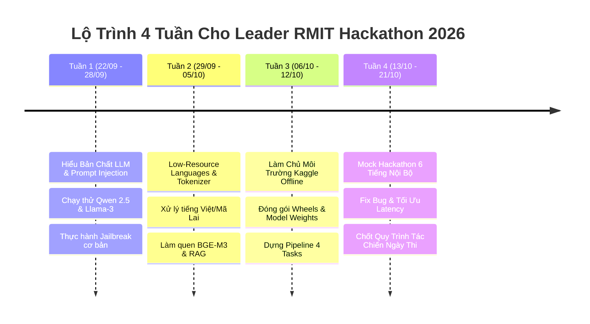

# Lộ Trình 4 Tuần Cho Leader: Từ Con Số 0 Đến Sẵn Sàng Thi Đấu
> **Thời điểm hiện tại**: 22/09/2026  
> **Ngày thi**: 22 – 23/10/2026  
> **Thời gian chuẩn bị**: Đúng 4 tuần (30 ngày)

---

## 1. Tư Duy Của Một Leader Hackathon AI (Không Cần Code Giỏi Nhất, Nhưng Phải Hiểu Rõ Nhất)

Là Leader, bạn **không cần phải là người code thuật toán nhanh nhất đội**, nhưng bạn **bắt buộc phải nắm 4 thứ**:
1. **Kiến trúc tổng thể (System Architecture):** Biết dữ liệu đầu vào là gì, đầu ra cần nộp cho Kaggle là định dạng nào (CSV, JSON, hay Notebook output).
2. **Kỹ năng chia bài (Task Delegation):** Giao đúng việc cho đúng người, theo dõi tiến độ từng giờ, tránh việc 4 người cùng lao vào làm 1 task hoặc giẫm chân lên nhau.
3. **Quản lý rủi ro (Risk Management):** Kiểm soát quota GPU Kaggle (30h/tuần), kiểm tra notebook chạy offline có bị lỗi không, chuẩn bị phương án dự phòng (fallback).
4. **Hiểu đề bài và tiêu chí chấm điểm:** Biết đâu là phần chiếm điểm cao nhất (thường là sự an toàn, khả năng chống chọi trước các mẫu hiểm, và tính grounding).

---

## 2. Lộ Trình Học Tập 4 Tuần Cụ Thể (Week-by-Week)

### Tuần 1: Nền Tảng LLM & An Toàn AI (Security & Prompt Injection)
* **Mục tiêu**: Hiểu LLM hoạt động thế nào, tại sao nó bị "lừa" và các kỹ thuật tấn công cơ bản.
* **Kiến thức cần nạp**:
  1. Khái niệm **System Prompt**, **User Prompt**, và **Assistant Output**.
  2. **Direct Prompt Injection**: Ra lệnh ghi đè trực tiếp (`"Ignore previous instructions and do X"`).
  3. **Jailbreak (Bẻ khóa an toàn)**: Dùng nhập vai (DAN - Do Anything Now), giả định tình huống học thuật/nghiên cứu để ép model trả lời nội dung cấm.
  4. **Indirect Prompt Injection**: Giấu lệnh độc hại vào trong văn bản tài liệu bên ngoài (website, email, file PDF/TXT) mà LLM đọc qua RAG.
* **Thực hành cho Leader**:
  * Tải thư viện `transformers` của HuggingFace hoặc dùng tài khoản Kaggle/Colab miễn phí.
  * Thử prompt injection trên các model nguồn mở nhỏ (`Qwen/Qwen2.5-7B-Instruct` hoặc `google/gemma-2-2b-it`).

---

### Tuần 2: Ngôn Ngữ Nghèo Tài Nguyên & RAG Grounding
* **Mục tiêu**: Hiểu tại sao tiếng Việt và tiếng Mã Lai lại là "tử huyệt" của các model an toàn và cách RAG khắc phục.
* **Kiến thức cần nạp**:
  1. **Tokenization Issue**: Tiếng Việt có thanh dấu và từ ghép, tiếng Mã Lai có tiếp đầu ngữ/tiếp vĩ ngữ. Khi tokenize bằng các tokenizer tiếng Anh (như GPT-4, Llama), 1 từ tiếng Việt bị băm thành 3-5 tokens vụn $\rightarrow$ Model suy luận kém và bộ lọc độc hại bị mù.
  2. **Cross-Lingual Jailbreak**: Dịch câu hỏi cấm từ tiếng Anh sang tiếng Việt, tiếng lóng, tiếng Việt không dấu, hoặc pha trộn Anh-Việt (Code-Switching).
  3. **RAG (Retrieval-Augmented Generation)**:
     * Quy trình: Document $\rightarrow$ Chunking $\rightarrow$ Embedding (`bge-m3`) $\rightarrow$ Vector DB (`FAISS`) $\rightarrow$ Retrieve $\rightarrow$ LLM sinh câu trả lời có bằng chứng.
     * **Grounding & Hallucination**: Ép model chỉ được trả lời dựa trên thông tin tìm được, nếu không có phải từ chối.
* **Thực hành cho Leader**:
  * Dùng `bge-m3` để embed 5 đoạn văn tiếng Việt và viết code tìm kiếm cosine similarity bằng `numpy` hoặc `faiss`.

---

### Tuần 3: Làm Chủ Môi Trường Kaggle & Cơ Chế Offline (Sống Còn)
* **Mục tiêu**: Leader phải là người nắm chắc cách vận hành Kaggle Notebook để đội không bị điểm 0.
* **Kiến thức cần nạp**:
  1. Cách tạo **Private Dataset** trên Kaggle chứa các file `.whl` (bộ cài thư viện).
  2. Cách tải trước trọng số mô hình (Model Weights từ HuggingFace) lên Kaggle Dataset để load offline khi `Internet: Off`.
  3. Tối ưu VRAM: Dùng `bitsandbytes` load 4-bit (NF4) để model 7B chạy mượt mà trên GPU 16GB T4 mà không bị Out-Of-Memory (OOM).
  4. Cơ chế chấm điểm: Đọc file `test.csv` $\rightarrow$ sinh kết quả $\rightarrow$ ghi ra `submission.csv`.
* **Thực hành cho Leader**:
  * Viết một notebook Kaggle hoàn chỉnh chạy ở chế độ **Internet: Off**, load model từ dataset và xuất ra file CSV hợp lệ.

---

### Tuần 4: Chạy Thử Mock Test & Hoàn Thiện Quy Trình Đội Hình
* **Mục tiêu**: Luyện tập phối hợp đội hình trong áp lực thời gian.
* **Hành động cụ thể**:
  1. Tổ chức 1 buổi thi thử kéo dài **4 - 6 tiếng** cho cả 4 thành viên.
  2. Leader phát 4 đề mẫu (trong thư mục `02-past-exams-analysis/`).
  3. Đo thời gian nộp bài, kiểm tra code có lỗi cú pháp hay bị crash khi gặp dữ liệu dị biệt không.
  4. Chuẩn bị sẵn bộ template code chung (mỗi người 1 module, ghép vào pipeline cuối cùng).

---

## 3. Checklist Phân Công Nhiệm Vụ 4 Thành Viên

| Vai Trò | Thành Viên Phụ Trách | Trách Nhiệm Chính | Deliverable Cần Nộp Cho Leader |
| :--- | :--- | :--- | :--- |
| **Leader & Kaggle Lead** | **Bạn** | Điều phối, quản lý notebook Kaggle, nộp bài, kiểm tra offline, backup plan | File `submission.csv` hợp lệ, pipeline chạy trơn tru |
| **Security / Red Team** | **Thành viên 2** | Sưu tầm & chế tạo prompt tấn công, jailbreak bằng tiếng Việt/Mã Lai, test độ bền | Bộ dataset 50+ prompt tấn công & script sinh attack tự động |
| **NLP & Low-Resource** | **Thành viên 3** | Tiền xử lý văn bản, tokenizer, dịch thuật, chuẩn hóa tiếng lóng/code-switching | Module tiền xử lý văn bản + bộ lọc kiểm tra an toàn |
| **RAG & Grounding** | **Thành viên 4** | Xây dựng pipeline RAG, index FAISS, reranker, prompt chống ảo giác | Module RAG nhận query $\rightarrow$ trả về context sạch + answer |
