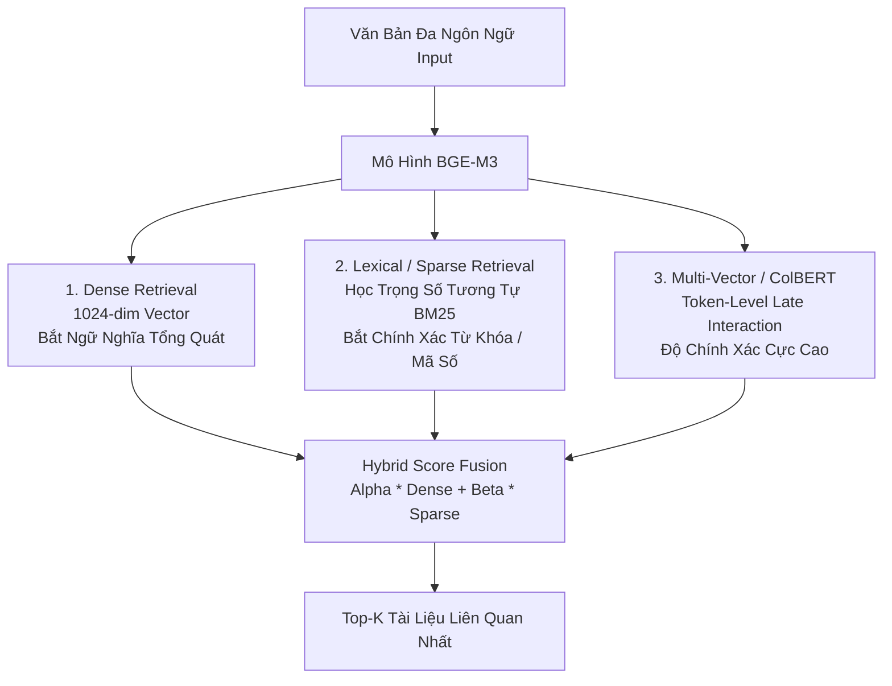

# Chuyên Đề 2: Xử Lý Ngôn Ngữ Nghèo Tài Nguyên, Tokenization & BGE-M3
> Tài liệu kỹ thuật nâng cao phục vụ RMIT Hackathon 2026 (Track: Security × GenAI × Low-Resource Languages)

---

## 1. Bản Chất Kỹ Thuật Của Vấn Đề "Low-Resource Languages"

### 1.1 Khái niệm Token Fertility (Hệ số sinh Token)
Mỗi mô hình LLM sử dụng một thuật toán Tokenizer (Byte-Pair Encoding - BPE, WordPiece, hoặc Unigram SentencePiece).  
* **Tiếng Anh**: 1 từ thường tương đương 1 đến 1.3 tokens (ví dụ: `security` = 1 token).
* **Tiếng Việt & Mã Lai (trên tokenizer tiếng Anh như Llama-3, GPT-4)**:
  * Từ `trường đại học` bị băm thành: `['tr', 'ư', 'ờ', 'ng', ' đ', 'ạ', 'i', ' h', 'ọ', 'c']` (lên đến 8-10 tokens!).
  * Hiện tượng này gọi là **High Token Fertility** (Hệ số sinh token cao).

### 1.2 Hậu Quả Đối Với Mô Hình:
1. **Context Window Bị Teo Nhỏ**: 8192 tokens đối với tiếng Anh chứa được ~6000 từ, nhưng với tiếng Việt bị băm nhỏ chỉ chứa được ~1500 - 2000 từ.
2. **Suy Giảm Khả Năng Lý Luận (Reasoning Degradation)**: Quá nhiều token vụn vặt làm phân tán cơ chế Attention, khiến LLM dễ bị mất tập trung và sinh ra ảo giác.
3. **Lỗ Hổng An Toàn**: Kẻ tấn công có thể lợi dụng sự phân rã này để giấu các từ nhạy cảm qua các mảnh token vô hại.

---

## 2. Giải Pháp Cứu Cánh: Mô Hình Đa Ngôn Ngữ Qwen 2.5 & Gemma 2

* **Tại sao phải chọn Qwen 2.5 cho cuộc thi này?**
  * Qwen 2.5 sở hữu tập từ vựng (Vocabulary size) lên tới **152,064 tokens**, bao gồm đầy đủ các âm tiết tiếng Việt và các ngôn ngữ Đông Nam Á.
  * 1 từ tiếng Việt trên Qwen 2.5 chỉ tốn **1.1 - 1.4 tokens**, gần ngang ngửa tiếng Anh.
  * Tốc độ suy luận tăng gấp 3 lần và khả năng hiểu ngữ cảnh tiếng bản địa vượt trội hoàn toàn so với Llama-3 (vốn tối ưu cho tiếng Anh/Tây Ban Nha).

---

## 3. Kiến Trúc BGE-M3: Chuẩn Mực Vàng Cho Truy Xuất Đa Ngôn Ngữ

Theo bài báo của Viện Trí tuệ Nhân tạo Bắc Kinh (BAAI, arXiv:2402.03216), **BGE-M3** là mô hình embedding đầu tiên trên thế giới tích hợp đồng thời **3 cơ chế truy xuất** trong một lần forward duy nhất:

### 3 Chế Độ Của BGE-M3 Được Ứng Dụng Như Thế Nào?

1. **Dense Retrieval (Ngữ nghĩa dày đặc)**:
   * Chuyển toàn bộ đoạn văn thành 1 vector 1024 chiều.
   * Cực mạnh khi câu hỏi và tài liệu diễn đạt khác từ nhưng cùng ý nghĩa (ví dụ: *"làm sao đổi pass"* $\rightarrow$ *"quy trình thiết lập lại mật khẩu"*).
2. **Lexical / Sparse Retrieval (Từ khóa thưa thớt)**:
   * Tự động gán trọng số cho từng từ (tương tự thuật toán BM25).
   * Cực mạnh khi câu hỏi chứa mã lỗi, mã hiệu tài liệu, hoặc thuật ngữ chuyên ngành (ví dụ: `DOC_SERVER_01`, `WPA2`, `timeout 15 phút`).
3. **Multi-Vector ColBERT (Tương tác trễ)**:
   * Giữ lại vector của từng token và so khớp ma trận điểm giữa câu hỏi và câu trả lời.
   * Đem lại độ chính xác cao nhất nhưng tốn nhiều bộ nhớ hơn.

---

## 4. Bảng So Sánh Các Công Cụ Tiền Xử Lý Tiếng Việt & Mã Lai

| Thư viện | Ngôn ngữ | Chức năng chính | Độ phức tạp |
| :--- | :--- | :--- | :--- |
| **`pyvi`** | Tiếng Việt | Tách từ ghép (`học sinh` $\rightarrow$ `học_sinh`), gán nhãn từ loại. | Siêu nhẹ, chạy offline 100%. |
| **`underthesea`** | Tiếng Việt | Chuẩn hóa Unicode, xử lý dấu thanh, phân tích cảm xúc. | Đầy đủ tính năng, rất phù hợp cho NLP pipeline. |
| **`malaya`** | Tiếng Mã Lai | Thư viện NLP tiêu chuẩn cho tiếng Mã Lai (tách từ, chuẩn hóa tiếng lóng). | Chuẩn công nghiệp cho thị trường Malaysia. |
| **`unicodedata`** | Mọi ngôn ngữ | Chuẩn hóa định dạng chuỗi `unicodedata.normalize('NFKC', text)`. | Tích hợp sẵn trong Python standard library. |
