# Chuyên Đề 3: Kiến Trúc RAG Đa Ngôn Ngữ & Kỹ Thuật Chống Ảo Giác (Grounding)
> Tài liệu kỹ thuật nâng cao phục vụ RMIT Hackathon 2026 (Track: Security × GenAI × Low-Resource Languages)

---

## 1. Sơ Đồ Kiến Trúc Pipeline RAG Chuẩn Thi Đấu

```mermaid
flowchart TD
    subgraph Ingestion["1. Giai đoạn nạp tài liệu"]
        RawDocs[Tài liệu thô: Vi / Ms / En] --> TextClean[Làm sạch & Chuẩn hóa Unicode NFKC]
        TextClean --> Chunker[Chunking: 300 - 500 từ, Overlap 50 từ]
        Chunker --> DocEmbed[Tạo Embedding với BGE-M3]
        DocEmbed --> VectorStore[Lưu vào FAISS Index]
        Chunker --> BM25Index[Tạo chỉ mục BM25 Okapi]
    end

    subgraph QueryFlow["2. Giai đoạn truy xuất & trả lời"]
        UserQ[Câu hỏi người dùng] --> DenseSearch[FAISS Dense Search: Top 20]
        UserQ --> SparseSearch[BM25 Lexical Search: Top 20]
        
        DenseSearch --> RRF[Hợp nhất thứ hạng: RRF Fusion]
        SparseSearch --> RRF
        
        RRF --> Reranker[BGE Reranker v2-M3: Lọc Top 3 Chunks]
        Reranker --> StrictPrompt[Ép Context vào Grounded Prompt]
        StrictPrompt --> LLM[Qwen 2.5 Sinh Câu Trả Lời]
        LLM --> CitationVerify[Bộ Kiểm Tra Trích Dẫn Thực Tế]
        
        CitationVerify -->|Khớp tài liệu| OutputValid[Trả về câu trả lời có trích dẫn]
        CitationVerify -->|Không khớp| OutputFallback[Ép về 'INSUFFICIENT_CONTEXT']
    end
```



---

## 2. Kỹ Thuật Hợp Nhất Thứ Hạng (Reciprocal Rank Fusion - RRF)

Khi kết hợp kết quả từ BM25 (tìm từ khóa) và FAISS (tìm ngữ nghĩa), không nên cộng điểm số trực tiếp vì thang điểm của chúng khác nhau.  
Thay vào đó, sử dụng thuật toán **RRF (Reciprocal Rank Fusion)** theo công thức chuẩn:

$$RRF\_Score(d) = \sum_{m \in M} \frac{1}{k + r_m(d)}$$

Trong đó:
* $M$: Tập hợp các bộ tìm kiếm (BM25 và FAISS).
* $r_m(d)$: Thứ hạng của tài liệu $d$ trong bộ tìm kiếm $m$ (1-indexed).
* $k$: Hằng số làm mượt (thường chọn $k = 60$).

### Code Python RRF Mẫu Chạy Offline:
```python
def reciprocal_rank_fusion(dense_results, sparse_results, k=60):
    """
    dense_results: list of doc_ids sắp xếp theo độ tương đồng ngữ nghĩa
    sparse_results: list of doc_ids sắp xếp theo điểm BM25
    """
    scores = {}
    for rank, doc_id in enumerate(dense_results):
        scores[doc_id] = scores.get(doc_id, 0.0) + 1.0 / (k + rank + 1)
        
    for rank, doc_id in enumerate(sparse_results):
        scores[doc_id] = scores.get(doc_id, 0.0) + 1.0 / (k + rank + 1)
        
    # Sắp xếp lại theo điểm RRF giảm dần
    sorted_docs = sorted(scores.items(), key=lambda item: item[1], reverse=True)
    return [doc_id for doc_id, score in sorted_docs]
```

---

## 3. Reranker: "Chìa Khóa Vàng" Tăng Precision Cho RAG

Embedding chỉ giúp lấy ra một tập ứng viên thô (Top 20). Để đạt điểm tuyệt đối trong Kaggle, **bắt buộc phải có bước Reranking**:
* **Mô hình đề xuất**: `BAAI/bge-reranker-v2-m3`.
* **Cơ chế**: Nhận cặp `(query, document_chunk)` đưa vào mô hình Cross-Encoder để tính trực tiếp điểm tương thích giữa câu hỏi và từng chunk.
* **Tác dụng**: Lọc bỏ hoàn toàn các chunk chứa từ khóa trùng khớp nhưng ngữ cảnh vô nghĩa.

---

## 4. Thuật Toán Khử Ảo Giác "Self-Citation Verification"

Trong các cuộc thi Kaggle GenAI, **ảo giác (Hallucination) là bẫy nguy hiểm nhất** vì ban giám khảo sẽ trừ gấp đôi điểm cho mỗi câu trả lời sai sự thật.

### Quy Trình Kiểm Tra 2 Bước:
1. **Bước 1: Trích xuất trích dẫn (Citation Extraction)**
   * Yêu cầu LLM chỉ ra số thứ tự tài liệu chứa thông tin (ví dụ: `[DOC_01]`).
   * Nếu model không trích dẫn được tài liệu nào $\rightarrow$ Tự động gán kết quả là `"INSUFFICIENT_CONTEXT"`.
2. **Bước 2: So khớp n-gram & Ngữ nghĩa (Factual Overlap)**
   * Lấy câu trả lời của LLM và đoạn văn bản gốc của `DOC_01`.
   * Tính tỷ lệ giao thoa từ khóa chính (nouns/entities overlap) hoặc Cosine Similarity.
   * Nếu câu trả lời chứa các con số hoặc thực thể lạ không xuất hiện trong `DOC_01` $\rightarrow$ Đánh cờ là Ảo giác (Hallucination) và ép về `"INSUFFICIENT_CONTEXT"`.
