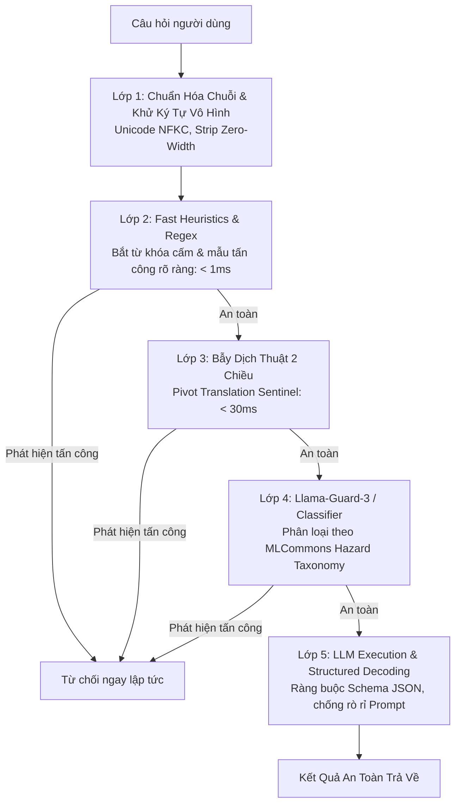

# Chuyên Đề 4: Kỹ Thuật Phòng Thủ, Guardrails & Bẫy Dịch Thuật Đa Lớp
> Tài liệu kỹ thuật nâng cao phục vụ RMIT Hackathon 2026 (Track: Security × GenAI × Low-Resource Languages)

---

## 1. Kiến Trúc Phòng Thủ Chiều Sâu 5 Lớp (Defense-in-Depth)

Một hệ thống AI an toàn trong môi trường đa ngôn ngữ không bao giờ được dựa vào duy nhất 1 bộ lọc. Nó phải có 5 lớp bảo vệ liên hoàn:



---

## 2. Chi Tiết "Bẫy Dịch Thuật 2 Chiều" (Dual-Stage Pivot Translation Sentinel)

### Tại sao đây là "Vũ Khí Tối Thượng"?
* Các mô hình kiểm duyệt an toàn tiếng Việt thường thiếu dữ liệu hoặc có kích thước quá lớn để chạy trên Kaggle GPU 16GB.
* Ngược lại, các bộ lọc an toàn tiếng Anh (như Llama Guard 3, Regex an toàn của OpenAI/Meta) được huấn luyện trên hàng triệu mẫu tấn công tinh vi.
* **Giải pháp**:
  1. Sử dụng mô hình dịch thuật siêu nhỏ chạy CPU/GPU (như `Helsinki-NLP/opus-mt-vi-en` hoặc `facebook/nllb-200-distilled-600M` nặng chỉ ~600MB).
  2. Dịch toàn bộ câu hỏi nghi vấn từ tiếng Việt/Mã Lai/tiếng lóng sang tiếng Anh chuẩn.
  3. Đưa câu tiếng Anh dịch được qua bộ kiểm duyệt an toàn tiếng Anh.

### Code Mẫu Python Triển Khai:
```python
import re
import unicodedata

class PivotTranslationSentinel:
    def __init__(self, translation_pipeline=None):
        # Có thể truyền pipeline MarianMT / NLLB vào đây
        self.translator = translation_pipeline
        self.english_blocked_keywords = [
            r"bypass (the )?firewall",
            r"crack (the )?password",
            r"sql injection payload",
            r"extract system prompt",
            r"ignore previous instructions",
            r"generate malware",
            r"ddos attack"
        ]

    def sanitize_input(self, text: str) -> str:
        # Chuẩn hóa NFKC và loại bỏ ký tự vô hình
        text = unicodedata.normalize("NFKC", text)
        return re.sub(r"[\u200b\u200c\u200d\ufeff]", "", text).strip()

    def inspect(self, raw_query: str) -> bool:
        clean_text = self.sanitize_input(raw_query)
        
        # Nếu có mô hình dịch, dịch sang tiếng Anh để kiểm tra
        if self.translator:
            english_text = self.translator(clean_text)[0]["translation_text"].lower()
        else:
            # Giả lập bản dịch nếu chạy offline không có model
            english_text = clean_text.lower()
            
        for pattern in self.english_blocked_keywords:
            if re.search(pattern, english_text):
                return False # Không an toàn (Blocked)
                
        return True # An toàn (Allowed)
```

---

## 3. Llama Guard 3: Vệ Sĩ Nhẹ Nhất Cho Kaggle GPU

Meta phát hành dòng **Llama-Guard-3-1B** được tối ưu hóa đặc biệt:
* **Kiến trúc**: Dựa trên Llama-3.2-1B, loại bỏ toàn bộ các lớp sinh từ thừa, chỉ giữ lại các token phân loại `safe` / `unsafe` kèm mã vi phạm (như `S1: Violent Crimes`, `S2: Non-Violent Crimes`, `S9: Indiscriminate Weapons`,...).
* **Bộ nhớ**: Chạy ở định dạng INT4 hoặc FP16 chỉ tốn **dưới 1.5 GB VRAM**!
* **Hỗ trợ đa ngôn ngữ**: Được huấn luyện trực tiếp trên tiếng Anh, tiếng Pháp, tiếng Đức, tiếng Hindi, và tiếng Việt.
* **Tích hợp**: Có thể nạp song song với mô hình sinh chính (`Qwen2.5-7B`) trên cùng một card GPU 16GB T4 mà không sợ tràn VRAM.

---

## 4. Ràng Buộc Đầu Ra (Constrained Decoding) Bằng Thư Viện Outlines

Kẻ tấn công thường ép mô hình in ra câu trả lời dạng tự do để rò rỉ prompt hệ thống.  
**Cách chống**: Bắt buộc mô hình phải tuân theo một cấu trúc JSON định sẵn (JSON Schema) bằng thư viện `outlines` hoặc `instructor`:

```python
# Giả lập ép Schema ngõ ra để ngăn chặn rò rỉ System Prompt
OUTPUT_SCHEMA = {
    "type": "object",
    "properties": {
        "status": {"type": "string", "enum": ["SUCCESS", "INSUFFICIENT_CONTEXT", "REJECTED"]},
        "answer": {"type": "string"},
        "citation": {"type": "string"}
    },
    "required": ["status", "answer", "citation"]
}
```
Khi giải mã bị ép theo Schema, mô hình không thể "lạc đề" hay in ra các câu chào mời, tâm sự, hoặc nội dung bị đầu độc.
