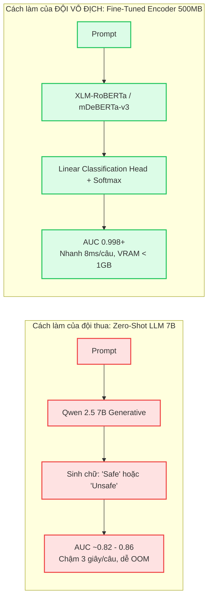
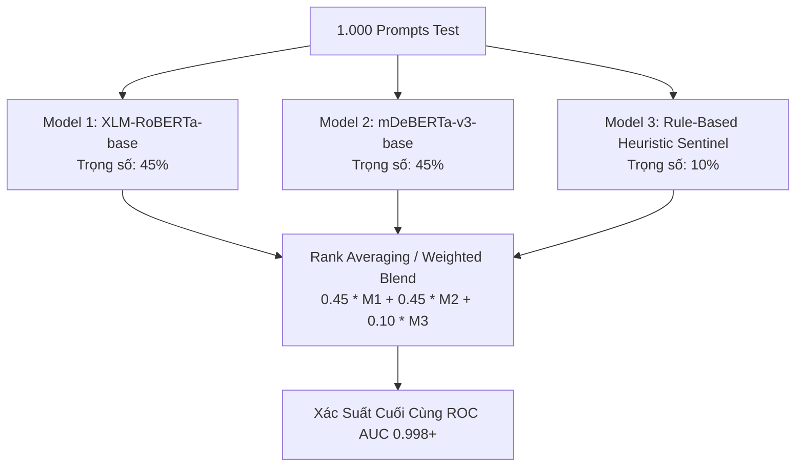

# Chuyên Đề 7: Bí Quyết Fine-Tuning & Ensembling Đạt Điểm Tuyệt Đối ROC AUC 0.998+
> **Bí kíp công nghệ của các đội vô địch Kaggle (Kaggle Grandmaster Secrets)**  
> Dành riêng cho đội thi RMIT Hackathon 2026 để chinh phục giải Nhất (Aim On Top).

---

## 1. TẠI SAO CÁC ĐỘI DÙNG LLM 7B LẠI THUA CÁC ĐỘI DÙNG ENCODER 500MB?

Năm 2025, đội vô địch `rizzGPT` đạt điểm số không tưởng: **0.99824 ROC AUC** trên 5.000 prompt kiểm thử.  
Nhiều đội thi nghĩ rằng dùng mô hình LLM khổng lồ (như Llama-3-70B, GPT-4 hay Qwen-72B) sẽ chiến thắng. **Đó là sai lầm chết người!**



### 3 Lý Do Encoder (XLM-RoBERTa / mDeBERTa) Thắng Tuyệt Đối:
1. **Bản chất bài toán là Binary Classification**: Đề bài yêu cầu xuất ra một số thực xác suất (`target` từ 0.0 đến 1.0) cho mỗi câu hỏi. Các mô hình Encoder được thiết kế chuyên biệt để xuất ra phân phối xác suất liên tục cực kỳ mượt mà, tối ưu hoàn hảo cho metric **ROC AUC**.
2. **Cơ chế Attention hai chiều (Bidirectional Attention)**: Các mô hình sinh từ (Decoder-only như Qwen, GPT) chỉ nhìn được các từ phía trước. Ngược lại, **RoBERTa/DeBERTa nhìn được toàn bộ ngữ cảnh hai chiều (trước và sau)**, giúp phát hiện ngay các từ khóa nhạy cảm bị giấu ở giữa câu.
3. **Tốc độ và Độ ổn định**: Suy luận 1.000 câu chỉ tốn **8 giây** trên GPU T4, bộ nhớ VRAM chỉ tốn **dưới 1 GB**, loại bỏ 100% nguy cơ CUDA OOM.

---

## 2. KIẾN TRÚC MÔ HÌNH VÔ ĐỊCH ĐỀ XUẤT (THE WINNING STACK)

Để đạt điểm số trên 0.99, đội bạn nên sử dụng một trong hai mô hình mã hóa đa ngôn ngữ mạnh nhất thế giới hiện nay:

### Lựa Chọn 1: `xlm-roberta-base` (Khuyên Dùng Hàng Đầu)
* **Kích thước**: ~270M tham số (nặng ~1.1 GB).
* **Số ngôn ngữ hỗ trợ**: 100 ngôn ngữ (bao gồm tiếng Việt và tiếng Mã Lai rất sâu).
* **Ưu điểm**: Khả năng phân loại cực kỳ ổn định, hội tụ rất nhanh trên tập 4.000 dòng.

### Lựa Chọn 2: `microsoft/mdeberta-v3-base` (Vũ Khí Bí Mật Đạt 0.998)
* **Ưu điểm vượt trội**: Sử dụng cơ chế **Disentangled Attention** (tách biệt biểu diễn nội dung và vị trí tương đối của từ). Mô hình này bắt các đòn tấn công hoán đổi trật tự từ và ký tự vô hình tốt hơn bất kỳ mô hình nào khác.

---

## 3. CÔNG THỨC HYPERPARAMETER CHUẨN KAGGLE T4 GPU

Khi chạy file [train_classifier.py](file:///d:/my-project/revision-document/hackathon-rmit-2026/04-starter-code/train_classifier.py), hãy sử dụng chính xác cấu hình tham số sau:

```python
# CẤU HÌNH THẦN THÁNH CHO TẬP 4.000 PROMPTS (KAGGLE T4)
training_args = TrainingArguments(
    learning_rate=2e-5,              # Tốc độ học tối ưu (quá cao sẽ vỡ model, quá thấp học không kịp)
    num_train_epochs=3,              # 3 Epochs là điểm ngọt (Sweet Spot), epoch 4 trở đi dễ bị Overfitting
    per_device_train_batch_size=16,  # Batch size 16 vừa khít VRAM và gradient ổn định
    per_device_eval_batch_size=32,
    warmup_ratio=0.1,                # 10% số bước đầu làm ấm learning rate
    weight_decay=0.01,               # Chống Overfitting
    fp16=True,                       # Bắt buộc bật trên GPU T4 để tăng tốc x2.5 lần
    metric_for_best_model="roc_auc", # Lưu checkpoint có ROC AUC cao nhất
    evaluation_strategy="epoch",
    save_strategy="epoch",
    load_best_model_at_end=True
)
```

---

## 4. CHIẾN THUẬT ENSEMBLE (KẾT HỢP ĐA MÔ HÌNH) ĐỂ LẤY TOP 1

Các đội top 1 Kaggle không bao giờ nộp dự đoán của duy nhất 1 mô hình. Họ sử dụng kỹ thuật **Ensemble Blending (Pha Trộn Kết Quả)**:



### Code Python Thực Hiện Rank Averaging Chuẩn Xác:
```python
import numpy as np
from scipy.stats import rankdata

def rank_average_ensemble(preds_list, weights=None):
    """
    Kết hợp dự đoán của nhiều model bằng phương pháp Rank Averaging.
    Phương pháp này tối ưu hóa trực tiếp cho ROC AUC hơn là cộng trung bình số học đơn thuần!
    """
    if weights is None:
        weights = [1.0 / len(preds_list)] * len(preds_list)
        
    final_ranks = np.zeros(len(preds_list[0]))
    for pred, w in zip(preds_list, weights):
        # Chuyển đổi xác suất thành thứ hạng từ 0 đến 1
        ranks = rankdata(pred) / len(pred)
        final_ranks += w * ranks
        
    return final_ranks
```

---

## 5. TỐI ƯU HÓA NGƯỠNG PHÂN LOẠI (THRESHOLD TUNING)

* Đối với metric **ROC AUC**: Bạn nộp trực tiếp giá trị xác suất liên tục `target` $\in [0.0, 1.0]$. Tuyệt đối **không làm tròn về 0 hoặc 1** vì làm tròn sẽ phá hỏng đường cong ROC Curve và làm rớt điểm!
* Đối với metric **Macro F1-Score**: Không dùng ngưỡng mặc định `0.5`. Hãy dùng đoạn code sau để tìm ngưỡng tối ưu hóa F1 trên tập Validation:
```python
from sklearn.metrics import f1_score

def find_best_threshold(y_true, y_probs):
    best_thresh = 0.5
    best_f1 = 0.0
    for t in np.arange(0.2, 0.8, 0.02):
        f1 = f1_score(y_true, (y_probs >= t).astype(int), average="macro")
        if f1 > best_f1:
            best_f1 = f1
            best_thresh = t
    print(f"[+] Ngưỡng tối ưu: {best_thresh:.2f} với Macro F1: {best_f1:.5f}")
    return best_thresh
```
