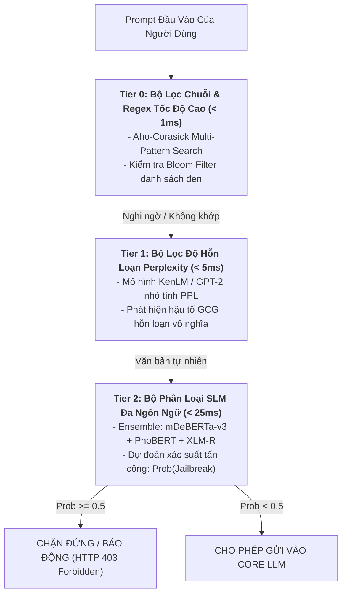

# 10. Advanced Guardrails: SmoothLLM & Multi-Tier Cascade Defense

Trong Task 2 (Blue Teaming) của RMIT Hackathon 2026, mục tiêu là xây dựng hệ thống phòng thủ đa tầng (Defense-in-Depth) có khả năng phát hiện các prompt độc hại đa ngôn ngữ (Tiếng Việt, Tiếng Mã Lai, Tiếng Anh) với **ROC AUC $\ge 0.99$** và độ trễ phản hồi cực thấp (< 50ms) để chạy offline mượt mà trên môi trường Kaggle.

---

## 1. Kiến Trúc Phòng Thủ Xếp Tầng (Multi-Tier Cascade Guardrails)

Không nên đưa toàn bộ mọi câu lệnh vào một mô hình LLM khổng lồ để kiểm tra (vừa chậm, vừa tốn VRAM, vừa dễ bị nghẽn hàng đợi). Thay vào đó, áp dụng kiến trúc **Thác Nước Phân Tầng (Cascade)**:



---

## 2. Vũ Khí Khắc Chế GCG: Thuật Toán SmoothLLM (University of Pennsylvania)

Thuật toán GCG và các hậu tố tối ưu bằng đạo hàm gradient có một điểm yếu chí mạng: **Tính giòn (Extreme Brittleness)**. Chuỗi ký tự hỗn loạn của GCG phụ thuộc vào từng byte đơn lẻ; chỉ cần làm biến dạng $5\% - 10\%$ ký tự ngẫu nhiên, toàn bộ hiệu ứng bẻ khóa sẽ tan vỡ hoàn toàn!

### Cơ Chế Hoạt Động Của SmoothLLM:
1. Nhận prompt đầu vào $x$.
2. Tạo ra $N$ bản sao bị đột biến nhẹ (Perturbed copies $x_1, x_2, \dots, x_N$) bằng 3 thao tác ngẫu nhiên:
   - **Thay thế ký tự (Character Swap):** Tráo đổi vị trí 2 ký tự liền kề.
   - **Chèn ký tự (Character Insertion):** Chèn một ký tự ngẫu nhiên vào câu.
   - **Xóa ký tự (Character Deletion):** Xóa ngẫu nhiên $10\%$ ký tự.
3. Chạy bộ phân loại an toàn trên cả $N$ bản sao.
4. Lấy kết quả theo **Biểu quyết đa số (Majority Voting)**:
   - Nếu đa số các bản sao bị nhận diện là tấn công $\implies$ Kết luận prompt là mã độc.

```python
import random

def smooth_llm_perturb(text: str, perturbation_rate: float = 0.1) -> str:
    chars = list(text)
    num_to_perturb = int(len(chars) * perturbation_rate)
    
    for _ in range(num_to_perturb):
        idx = random.randint(0, len(chars) - 1)
        action = random.choice(['swap', 'insert', 'delete'])
        
        if action == 'swap' and idx < len(chars) - 1:
            chars[idx], chars[idx + 1] = chars[idx + 1], chars[idx]
        elif action == 'insert':
            chars.insert(idx, random.choice('abcdefghijklmnopqrstuvwxyz '))
        elif action == 'delete' and len(chars) > 1:
            chars.pop(idx)
            
    return ''.join(chars)
```

---

## 3. Bộ Lọc Độ Hỗn Loạn Perplexity (PPL Filter)

Các câu lệnh giao tiếp tự nhiên của con người (dù là tiếng Việt, tiếng Anh hay tiếng lóng) đều có cấu trúc ngữ pháp và xác suất chuyển dịch từ (Transition Probability) ổn định, dẫn đến chỉ số **Perplexity (PPL)** thấp:

$$\text{PPL}(W) = \exp \left( -\frac{1}{N} \sum_{i=1}^{N} \ln P(w_i \mid w_1, \dots, w_{i-1}) \right)$$

- **Văn bản người bình thường:** $\text{PPL} \approx 20 - 80$.
- **Hậu tố GCG / Tấn công băm ký tự:** $\text{PPL} > 500 - 2{,}000$ (Do chứa chuỗi ký tự ngẫu nhiên không có ý nghĩa từ vựng).
- **Chiến thuật Blue Team:** Cài đặt một mô hình ngôn ngữ siêu nhỏ (như `KenLM` 3-gram hoặc `gpt2` phiên bản lượng hóa) để tính nhanh điểm PPL:
  - Nếu $\text{PPL} > 400 \implies$ Đánh dấu ngay là **Adversarial Input** mà không cần tốn tài nguyên chạy mô hình sâu!

---

## 4. Công Thức Ensemble Đạt ROC AUC 0.998+ Trong Thi Đấu Kaggle

Đừng bao giờ đặt cược toàn bộ điểm số vào 1 mô hình duy nhất. Mô hình chiến thắng của các Kaggle Grandmasters luôn là sự kết hợp của 3 họ kiến trúc đa dạng:

```
                          +-----------------------------+
                          |      Raw Prompt Input       |
                          +-----------------------------+
                                         |
               +-------------------------+-------------------------+
               |                         |                         |
               v                         v                         v
    +--------------------+    +--------------------+    +--------------------+
    | Model A (40% W)   |    | Model B (35% W)    |    | Model C (25% W)    |
    | mDeBERTa-v3-base   |    | PhoBERT-v2 / XLM-R |    | LightGBM + TF-IDF  |
    | (Đa ngôn ngữ sâu)  |    | (Chuyên sâu Việt)  |    | (Bắt từ khóa hiếm) |
    +--------------------+    +--------------------+    +--------------------+
               |                         |                         |
               +-------------------------+-------------------------+
                                         |
                                         v
                         +-----------------------------+
                         | Weighted Soft Voting        |
                         | Final P = 0.4*A + 0.35*B... |
                         +-----------------------------+
```

### Tại sao cần thêm LightGBM + TF-IDF vào Ensemble?
- Các mô hình Transformer (DeBERTa) đôi khi bị quá khớp (Overfitting) vào ngữ nghĩa của câu mà bỏ qua các từ khóa hiếm hoặc chuỗi ký tự lập dị.
- Bộ trích xuất đặc trưng **Character N-Gram (2 đến 5 ký tự) của TF-IDF** kết hợp với bộ phân loại cây quyết định **LightGBM** là "tấm lưới thép" bắt trọn các mẫu Teencode và Homoglyphs mà Transformer bỏ sót!
