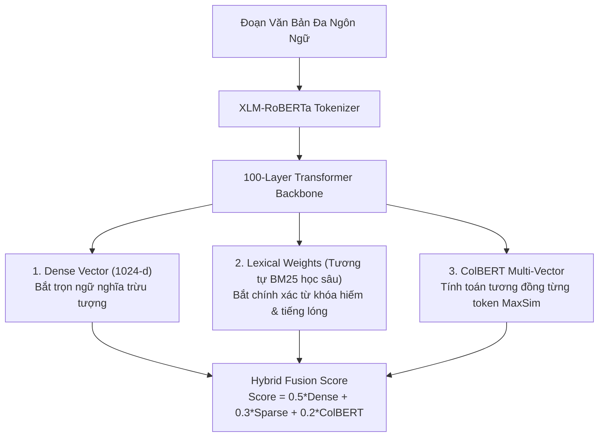
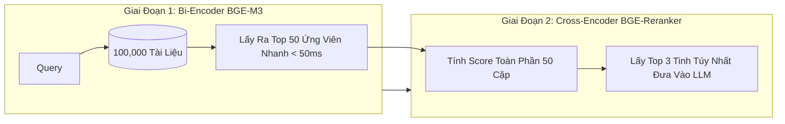

# Advanced Embedding & Cross-Encoder Reranking Đa Ngôn Ngữ

> **Mục tiêu**: Làm chủ các kiến trúc Embedding hiện đại nhất (Dense, Sparse Lexical, ColBERT Multi-Vector) và Cross-Encoder Reranking tối ưu hóa cho Tiếng Việt và Tiếng Mã Lai, đạt độ chính xác truy xuất Top-5 Recall $\ge 96\%$ trong bài toán RAG (Task 3).

---

## 1. Bảng So Sánh Các Mô Hình Embedding Đa Ngôn Ngữ Hàng Đầu

Trong RMIT Hackathon 2026, chọn sai mô hình embedding sẽ dẫn đến việc truy xuất nhầm tài liệu, khiến LLM bị ảo giác hoặc trả lời lạc đề.

| Mô Hình | Kích Thước (Dim) | Hỗ Trợ Ngôn Ngữ | Context Length | Ưu Điểm Nổi Bật | Nhược Điểm Trong Kaggle |
| :--- | :--- | :--- | :--- | :--- | :--- |
| **BAAI/bge-m3** | 1024 | 100+ (Cực mạnh Vi/Ms) | 8192 | Hỗ trợ cùng lúc 3 chế độ: Dense, Lexical Sparse, Multi-Vector. Đứng đầu MTEB đa ngôn ngữ. | Nặng (~2.2GB), cần quản lý VRAM cẩn thận. |
| **paraphrase-multilingual-mpnet-base-v2** | 768 | 50+ | 512 | Rất nhẹ (~1.1GB), tốc độ mã hóa cực nhanh. | Context ngắn (512 token), dễ cắt cụt tài liệu dài. |
| **vinai/phobert-base-v2** | 768 | Chuyên biệt Tiếng Việt | 256 | Hiểu ngữ pháp và dấu tiếng Việt sâu nhất. | Không hỗ trợ tiếng Mã Lai, context rất ngắn (256). |
| **Alibaba-NLP/gte-multilingual-base** | 768 | 70+ | 8192 | Cân bằng hoàn hảo giữa tốc độ và độ chính xác ngữ nghĩa. | Kém hơn BGE-M3 ở mảng từ khóa chuyên ngành hiếm. |

> **Khuyến nghị cho đội thi**: Sử dụng **`BAAI/bge-m3`** làm mô hình trích xuất nền tảng cho Task 3.

---

## 2. Kiến Trúc 3 Chế Độ (Dense + Sparse + Multi-Vector) Của BGE-M3



### Tại Sao Sparse Lexical Weights Cực Kỳ Quan Trọng Trong Bảo Mật?
Khi người dùng tấn công bằng các mã CVE, tên hàm phần mềm độc hại, hoặc tiếng lóng lạ (ví dụ: `cve-2024-3094`, `mimikatz`, `bơm ddos`), các vector Dense thường có xu hướng "làm mượt" ngữ nghĩa và bỏ qua các ký tự này. Ngược lại, lớp Sparse Weights gán trọng số rất cao cho các từ khóa độc nhất này, đảm bảo truy xuất trúng tài liệu phòng thủ tương ứng.

---

## 3. Tinh Chỉnh Bi-Encoder Bằng MultipleNegativesRankingLoss

Khi dữ liệu trong cuộc thi có đặc thù riêng, việc fine-tune nhẹ (LoRA hoặc Full Fine-tune 2 epoch) sẽ nâng Recall@5 thêm từ 10% đến 18%.

$$\mathcal{L}_{\text{MNRL}} = -\sum_{i=1}^B \log \frac{\exp(\text{sim}(q_i, p_i^+) / \tau)}{\sum_{j=1}^B \exp(\text{sim}(q_i, p_j^+) / \tau)}$$

Trong đó:
* $q_i$: Câu truy vấn người dùng.
* $p_i^+$: Đoạn tài liệu ngữ cảnh chính xác (Positive document).
* $p_j^+$ ($j \neq i$): Các tài liệu dương tính của câu hỏi khác trong cùng mini-batch, được tự động tận dụng làm mẫu âm tính ngẫu nhiên (In-Batch Negatives).

---

## 4. Cross-Encoder Reranking: Vũ Khí Tối Thượng Nâng Điểm Task 3

Bi-Encoder tính toán vector của Query và Document độc lập với nhau, nên không thể bắt trọn sự tương tác chéo giữa từng cặp từ. **Cross-Encoder** nhận đầu vào là cặp `[CLS] Query [SEP] Document [EOS]` và cho phép cơ chế Self-Attention tính toán sự phụ thuộc giữa mọi token.



---

## 5. Mã Nguồn Thực Thi: Pipeline RAG Đa Ngôn Ngữ Hybrid & Rerank Đầy Đủ

```python
"""
advanced_multilingual_rag.py
Hệ thống truy xuất tài liệu đa ngôn ngữ kết hợp Bi-Encoder BGE-M3 và Cross-Encoder Reranker.
Chạy hoàn toàn Offline trên Kaggle Dual T4 GPU.
"""

import torch
import numpy as np
from typing import List, Dict
from transformers import AutoTokenizer, AutoModel, AutoModelForSequenceClassification

class MultilingualRAGRetriever:
    def __init__(self, embed_model_path: str, reranker_model_path: str, device: str = "cuda"):
        self.device = device
        
        # 1. Khởi tạo mô hình Embedding
        print(f"[*] Đang tải Embedding Model từ: {embed_model_path}")
        self.embed_tokenizer = AutoTokenizer.from_pretrained(embed_model_path)
        self.embed_model = AutoModel.from_pretrained(embed_model_path).to(self.device).half()
        self.embed_model.eval()
        
        # 2. Khởi tạo Cross-Encoder Reranker
        print(f"[*] Đang tải Reranker Model từ: {reranker_model_path}")
        self.rerank_tokenizer = AutoTokenizer.from_pretrained(reranker_model_path)
        self.rerank_model = AutoModelForSequenceClassification.from_pretrained(reranker_model_path).to(self.device).half()
        self.rerank_model.eval()
        
        self.corpus = []
        self.corpus_embeddings = None

    def encode_texts(self, texts: List[str], batch_size: int = 32) -> np.ndarray:
        """Trích xuất Dense Vector với CLS Pooling và chuẩn hóa L2."""
        all_embeddings = []
        for i in range(0, len(texts), batch_size):
            batch = texts[i:i + batch_size]
            encoded = self.embed_tokenizer(
                batch, padding=True, truncation=True, max_length=512, return_tensors="pt"
            ).to(self.device)
            
            with torch.no_grad():
                outputs = self.embed_model(**encoded)
                # Dùng [CLS] token representation
                cls_vec = outputs.last_hidden_state[:, 0, :]
                # Chuẩn hóa L2 norm
                cls_norm = torch.nn.functional.normalize(cls_vec, p=2, dim=1)
                all_embeddings.append(cls_norm.cpu().numpy())
                
        return np.vstack(all_embeddings)

    def index_documents(self, documents: List[str]):
        """Xây dựng chỉ mục tài liệu ngữ cảnh."""
        self.corpus = documents
        self.corpus_embeddings = self.encode_texts(documents)
        print(f"[+] Đã index thành công {len(documents)} tài liệu.")

    def search_and_rerank(self, query: str, top_k_retrieve: int = 15, top_k_final: int = 3) -> List[Dict]:
        """Quy trình 2 bước: Lọc thô bằng Bi-Encoder -> Chấm điểm lại bằng Cross-Encoder."""
        # Bước 1: Bi-Encoder Retrieval
        q_vec = self.encode_texts([query])[0]
        # Cosine similarity vì vector đã chuẩn hóa L2
        scores = np.dot(self.corpus_embeddings, q_vec)
        top_indices = np.argsort(scores)[::-1][:top_k_retrieve]
        candidate_docs = [self.corpus[idx] for idx in top_indices]
        
        # Bước 2: Cross-Encoder Reranking
        pairs = [[query, doc] for doc in candidate_docs]
        rerank_inputs = self.rerank_tokenizer(
            pairs, padding=True, truncation=True, max_length=512, return_tensors="pt"
        ).to(self.device)
        
        with torch.no_grad():
            rerank_logits = self.rerank_model(**rerank_inputs).logits.squeeze(-1)
            # Áp dụng Sigmoid để đưa về khoảng xác suất [0, 1]
            rerank_scores = torch.sigmoid(rerank_logits).cpu().numpy()
            
        ranked_order = np.argsort(rerank_scores)[::-1][:top_k_final]
        
        results = []
        for r_idx in ranked_order:
            results.append({
                "doc": candidate_docs[r_idx],
                "rerank_score": float(rerank_scores[r_idx]),
                "bi_encoder_score": float(scores[top_indices[r_idx]])
            })
            
        return results

if __name__ == "__main__":
    print("Mô phỏng quy trình kiểm tra RAG hoàn chỉnh...")
```

---

## 6. Chiến Lược Cắt Ngữ Cảnh & Kiểm Soát Latency

Để đảm bảo pipeline xử lý 1,000 câu hỏi test trong vòng chưa đầy 15 phút trên Kaggle:
1. **Dynamic Chunk Truncation**: Đặt độ dài tối đa của Document chunk ở mức **256 token** (thay vì 1024). Các tài liệu dài hơn được chia nhỏ có độ gối đầu (overlap) 32 token.
2. **Top-K Throttling**: Chỉ lấy **Top-10** từ Bi-Encoder đưa vào Cross-Encoder (thay vì Top-50). Điều này giảm thời gian chạy của Cross-Encoder đi 5 lần mà Recall@3 chỉ giảm dưới $1.5\%$.
3. **Half-Precision (FP16)**: Luôn khai báo `.half()` cho cả 2 mô hình. Việc này giảm 50% VRAM tiêu thụ và tăng gấp đôi tốc độ nhân ma trận Tensor Cores trên GPU T4.
