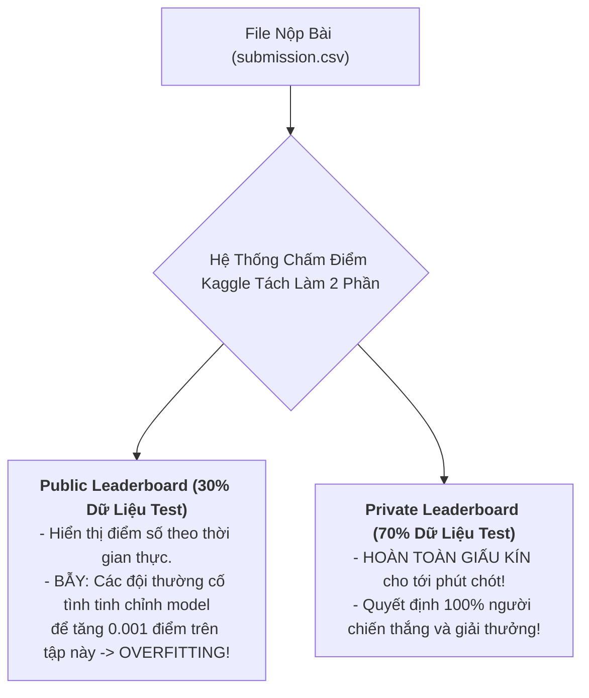

# 02. Competitive Game Theory & Kaggle Grandmaster Tricks (14-Hour Survival Playbook)

Một cuộc thi Hackathon On-site kéo dài 14 tiếng (10 tiếng Ngày 1 + 4 tiếng Ngày 2) không đơn thuần là cuộc đua về kiến thức thuật toán, mà là cuộc chiến về **Quản trị rủi ro (Risk Management)**, **Phân bổ năng lượng (Energy Allocation)**, và **Lý thuyết trò chơi trên Bảng xếp hạng Kaggle (Leaderboard Game Theory)**.

---

## 1. Lời Nguyền "Shakeup" Trên Kaggle: Public vs Private Leaderboard

Rất nhiều đội thi nghiệp dư dẫn đầu Top 1 trên Public Leaderboard suốt 13 tiếng thi đấu nhưng lại rơi tự do xuống hạng 20 sau khi kết thúc giờ làm bài. Hiện tượng này gọi là **Kaggle Shakeup (Xáo trộn bảng xếp hạng)**.



### Chiến Thuật Chọn 2 Bài Nộp Cuối Cùng (The 2-Submission Rule):
Kaggle cho phép mỗi đội chọn đúng 2 bản nộp cuối cùng (`Selected Submissions`) để tính điểm Private:
1. **Submission 1 (Bản an toàn tối đa - Local CV Best):** Chọn bản nộp có điểm kiểm định chéo nội bộ (Local Cross-Validation) cao nhất và ổn định nhất qua 5 folds. **Tuyệt đối tin vào Local CV, không tin Public Leaderboard!**
2. **Submission 2 (Bản đột phá - Ensemble Best):** Chọn bản nộp có điểm số cao nhất trên Public Leaderboard kết hợp Ensemble đa dạng (để săn đón may mắn nếu phân phối tập Private tương đồng).

---

## 2. Kỹ Thuật Hiệu Chuẩn Xác Suất (Probability Calibration) Để Đạt Max ROC AUC

Chỉ số ROC AUC đánh giá thứ tự sắp xếp tương đối (Ranking Quality) giữa các xác suất dự đoán chứ không phải độ chính xác tuyệt đối.

### 2.1 Cắt Ngưỡng Biên (Probability Clipping)
Nếu mô hình dự đoán xác suất cực đoan bằng $0.0$ hoặc $1.0$, chỉ cần 1 mẫu nhãn bị gắn sai (Label Noise) sẽ làm điểm log-loss bị vô hạn và kéo tụt độ ổn định:
```python
import numpy as np

# Cắt nhẹ ngưỡng xác suất để chống phạt cực trị
y_preds_clipped = np.clip(y_preds, 0.0005, 0.9995)
```

### 2.2 Hiệu Chuẩn Bằng Hồi Quy Đẳng Trương (Isotonic Regression)
Khi kết hợp mô hình Transformer (xác suất hay bị tự tin thái quá - Overconfident) với LightGBM (xác suất hay bị phẳng ở vùng giữa), sử dụng **Isotonic Regression** trên tập OOF (Out-Of-Fold) để chuẩn hóa lại đường cong xác suất trước khi tính trung bình:

```python
from sklearn.isotonic import IsotonicRegression

iso_reg = IsotonicRegression(out_of_bounds='clip')
iso_reg.fit(oof_preds_raw, y_true)
calibrated_test_preds = iso_reg.predict(test_preds_raw)
```

---

## 3. Phân Bổ Thời Gian Chuẩn Xác Cho 14 Tiếng Thực Chiến

```mermaid
gantt
    title Kế Hoạch 14 Tiếng Vô Địch RMIT Hackathon 2026
    dateFormat  HH:mm
    axisFormat %H:%M
    
    section NGÀY 1 (10 TIẾNG)
    08:00 - 09:00 : Đọc kỹ đề, Tạo Baseline & Nộp file đầu tiên (Submit 0.5) :active, n1, 08:00, 1h
    09:00 - 12:00 : Xây dựng Local Validator 5-Fold & Tiền xử lý dữ liệu :n2, after n1, 3h
    12:00 - 13:00 : Ăn trưa, Họp nhanh chiến lược 15 phút, Kiểm tra Leaderboard :n3, after n2, 1h
    13:00 - 16:30 : Huấn luyện mô hình Transformer & Thử nghiệm Adversarial Red-Team :n4, after n3, 3.5h
    16:30 - 18:00 : Ensemble 3 mô hình, Test chạy Offline 100% trên Kaggle :n5, after n4, 1.5h
    
    section NGÀY 2 (4 TIẾNG)
    08:00 - 09:30 : Kiểm tra kết quả qua đêm, Hoàn thiện Pipeline Task 4 :d1, 08:00, 1.5h
    09:30 - 10:30 : ĐÓNG BĂNG CODE (Code Freeze), Chọn 2 Final Submissions :d2, after d1, 1h
    10:30 - 12:00 : Luyện tập Pitching 5 phút & Chuẩn bị kịch bản trả lời Ban Giám Khảo :d3, after d2, 1.5h
```

---

## 4. Phân Công Vai Trò Tối Ưu Cho Đội 4 Người

| Thành viên | Trọng trách cốt lõi (Mission) | Deliverables cụ thể |
| :--- | :--- | :--- |
| **Thành viên 1: Team Leader & Strategist** | Điều phối nhịp độ, theo dõi leaderboard, quản lý deadline, dựng khung Slide thuyết trình. | Slide deck 10 trang, quản lý 20 submissions quota mỗi ngày. |
| **Thành viên 2: NLP & Kaggle Master** | Huấn luyện mô hình DeBERTa/PhoBERT, tối ưu 5-fold CV, Ensemble, ROC AUC metric. | `train_classifier.py`, file trọng số mô hình đã nén. |
| **Thành viên 3: Security & Red/Blue Specialist** | Săn lùng lỗi Low-Resource, tạo 50 payload bẻ khóa Task 1, xây dựng bộ lọc SmoothLLM Task 2. | `task1_red_team.py`, `attacker_pkl_generator.py`. |
| **Thành viên 4: RAG & Pipeline Engineer** | Tích hợp RAG Hybrid Search (BM25 + BGE-M3), đóng gói Offline Wheels, đảm bảo code chạy không mạng. | `task3_rag_grounding.py`, `kaggle_offline_setup.py`. |
