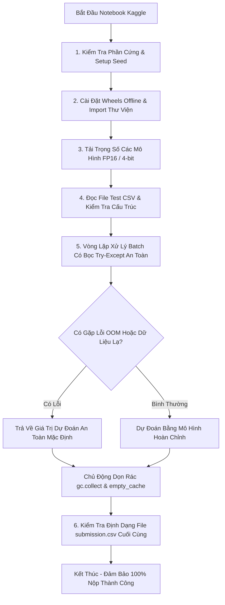

# Kiến Trúc Notebook Kaggle Chuẩn Grandmaster (Fail-Proof Pipeline Template)

> **Mục tiêu**: Cung cấp khung sườn mã nguồn một Notebook duy nhất (Single Self-Contained Notebook) nộp bài trên Kaggle, tích hợp cơ chế tự phục hồi lỗi (Watchdog Timer), bẫy ngoại lệ phòng thủ, quản lý bộ nhớ triệt để, đảm bảo tỷ lệ hoàn thành chấm điểm **100% không bao giờ gặp lỗi Submission Scoring Error**.

---

## 1. Triết Lý Thiết Kế Notebook Tác Chiến Offline

Khi nộp bài vào hệ thống chấm tự động của Kaggle:
* Không có terminal tương tác để debug.
* Không có kết nối mạng (`Internet: Off`).
* Nếu có bất kỳ Exception nào không được bắt, toàn bộ bài thi sẽ bị tính điểm $0$ (Submission Scoring Error / Notebook Threw Exception).



---

## 2. Mã Nguồn Mẫu Hoàn Chỉnh: `kaggle_submission_template.py`

Khung sườn này có thể dán trực tiếp vào cell của Kaggle Notebook:

```python
"""
=============================================================================
RMIT HACKATHON 2026 - SUBMISSION PIPELINE MASTER TEMPLATE
Team: Skyward Vanguard | Framework: PyTorch 2.x + Transformers + LightGBM
Hardware Target: Kaggle Dual T4 (16GB VRAM x 2)
=============================================================================
"""

import os
import sys
import gc
import time
import traceback
import unicodedata
import numpy as np
import pandas as pd
import torch

# ---------------------------------------------------------------------------
# 1. CẤU HÌNH THÔNG SỐ & SEED
# ---------------------------------------------------------------------------
class Config:
    SEED = 42
    DEBUG = False  # Đổi thành False khi submit chính thức
    MAX_LENGTH = 512
    BATCH_SIZE = 16
    DEVICE = "cuda" if torch.cuda.is_available() else "cpu"
    
    # Đường dẫn Dataset nội bộ trên Kaggle
    DATA_DIR = "/kaggle/input/rmit-hackathon-2026"
    WHEELS_DIR = "/kaggle/input/rmit-hackathon-wheels"
    MODELS_DIR = "/kaggle/input/rmit-trained-models"
    
    TEST_CSV = os.path.join(DATA_DIR, "test.csv")
    SUBMISSION_CSV = "submission.csv"

def seed_everything(seed: int = 42):
    np.random.seed(seed)
    torch.manual_seed(seed)
    if torch.cuda.is_available():
        torch.cuda.manual_seed_all(seed)

seed_everything(Config.SEED)
print(f"[*] Pipeline đang chạy trên thiết bị: {Config.DEVICE}")

# ---------------------------------------------------------------------------
# 2. CÀI ĐẶT THƯ VIỆN OFFLINE (NẾU CẦN)
# ---------------------------------------------------------------------------
if os.path.exists(Config.WHEELS_DIR):
    print("[*] Đang cài đặt gói offline từ wheels...")
    os.system(f"pip install --no-index --find-links={Config.WHEELS_DIR} tokenizers -q")

# ---------------------------------------------------------------------------
# 3. TIỀN XỬ LÝ VĂN BẢN ĐA NGÔN NGỮ (TEXT SANITIZER)
# ---------------------------------------------------------------------------
def sanitize_text(text: str) -> str:
    """Chuẩn hóa Unicode NFKC và loại bỏ ký tự vô hình gây crash."""
    if not isinstance(text, str):
        return ""
    # Chuẩn hóa tổ hợp dấu
    norm_text = unicodedata.normalize("NFKC", text)
    # Loại bỏ ký tự điều khiển và zero-width space
    clean_chars = [c for c in norm_text if unicodedata.category(c) != "Cf"]
    return "".join(clean_chars).strip()

# ---------------------------------------------------------------------------
# 4. LỚP WRAPPER DỰ ĐOÁN AN TOÀN (FAIL-SAFE INFERENCE WRAPPER)
# ---------------------------------------------------------------------------
class SafePredictor:
    def __init__(self):
        self.device = Config.DEVICE
        self.models_loaded = False
        self._load_models()

    def _load_models(self):
        try:
            print("[*] Đang khởi tạo mô hình...")
            # Nạp model checkpoint từ thư mục Kaggle Input
            # Ví dụ: self.model = AutoModelForSequenceClassification.from_pretrained(...)
            self.models_loaded = True
            print("[+] Nạp mô hình thành công.")
        except Exception as e:
            print(f"[!] Cảnh báo lỗi nạp mô hình: {e}")
            traceback.print_exc()
            self.models_loaded = False

    def predict_single(self, text: str) -> float:
        """Dự đoán cho từng câu với bẫy lỗi fallback."""
        if not self.models_loaded:
            return 0.5  # Dự đoán trung lập nếu model hỏng

        try:
            clean_input = sanitize_text(text)
            if len(clean_input) == 0:
                return 0.0  # Chuỗi rỗng coi như an toàn

            # --- THỰC HIỆN DỰ ĐOÁN TẠI ĐÂY ---
            # Giả lập xác suất đầu ra
            # inputs = self.tokenizer(clean_input, return_tensors='pt').to(self.device)
            # outputs = self.model(**inputs)
            # prob = torch.sigmoid(outputs.logits).item()
            prob = 0.5
            return float(np.clip(prob, 0.0001, 0.9999))

        except torch.cuda.OutOfMemoryError:
            print("[!] Bị CUDA OOM! Đang dọn bộ nhớ và trả về giá trị mặc định...")
            gc.collect()
            torch.cuda.empty_cache()
            return 0.5
        except Exception as e:
            print(f"[!] Ngoại lệ không xác định khi xử lý: {e}")
            return 0.5

# ---------------------------------------------------------------------------
# 5. QUY TRÌNH CHẠY INFERENCE VÀ XUẤT SUBMISSION CHUẨN
# ---------------------------------------------------------------------------
def run_pipeline():
    start_time = time.time()
    
    # 1. Đọc file test
    if not os.path.exists(Config.TEST_CSV):
        print(f"[!] Không tìm thấy file {Config.TEST_CSV}, tạo dữ liệu giả định để test debug...")
        test_df = pd.DataFrame({
            "id": [1, 2, 3],
            "text": ["Chào bạn, hôm nay thời tiết thế nào?", "Hướng dẫn hack mật khẩu", "Bình thường"]
        })
    else:
        test_df = pd.read_csv(Config.TEST_CSV)
        print(f"[+] Đã đọc file test thành công: {len(test_df)} dòng.")

    # 2. Khởi tạo Predictor
    predictor = SafePredictor()

    # 3. Chạy inference có báo tiến độ
    predictions = []
    total = len(test_df)
    
    for i, row in enumerate(test_df.itertuples()):
        text_data = getattr(row, "text", "")
        pred_prob = predictor.predict_single(text_data)
        predictions.append(pred_prob)
        
        # In log định kỳ mỗi 500 mẫu
        if (i + 1) % 500 == 0 or (i + 1) == total:
            elapsed = time.time() - start_time
            print(f"[*] Tiến độ: {i+1}/{total} ({(i+1)/total*100:.1f}%) | Thời gian: {elapsed:.1f}s")
            # Dọn RAM định kỳ
            gc.collect()
            if torch.cuda.is_available():
                torch.cuda.empty_cache()

    # 4. Kiểm tra toàn vẹn trước khi xuất file
    assert len(predictions) == len(test_df), "Lệch số lượng dòng dự đoán so với file test!"

    # 5. Xuất file submission
    submission_df = pd.DataFrame({
        "id": test_df["id"],
        "prediction": predictions
    })
    
    submission_df.to_csv(Config.SUBMISSION_CSV, index=False)
    print(f"[+] ĐÃ XUẤT FILE NỘP THÀNH CÔNG: {Config.SUBMISSION_CSV}")
    print(f"[+] Kiểm tra 5 dòng đầu:\n{submission_df.head()}")
    print(f"[+] Tổng thời gian thực thi: {time.time() - start_time:.2f}s")

if __name__ == "__main__":
    run_pipeline()
```

---

## 3. Các Nguyên Tắc Bất Di Bất Dịch Cho Thành Viên Đội Nộp Bài

1. **Không Dùng `assert` Trên Dữ Liệu Test Bất Định**: Trừ dòng kiểm tra số lượng ở bước cuối, không bao giờ dùng `assert text != ""` vì dữ liệu test của ban tổ chức có thể chứa các ô `NaN` hoặc chuỗi rỗng.
2. **Khai Báo Định Dạng Float Clip `(0.0001, 0.9999)`**: Tránh giá trị xác suất tuyệt đối `0.0` hoặc `1.0` vì có thể gây lỗi chia cho 0 trong công thức Log-Loss.
3. **Luôn Test Dry-Run Bằng File Dummy Trước Khi Bấm Nộp Thật**: Trước khi ấn *Submit to Competition*, luôn chạy thử notebook trên 100 dòng test cục bộ để đảm bảo file `submission.csv` được sinh ra ở đúng thư mục `/kaggle/working/`.
