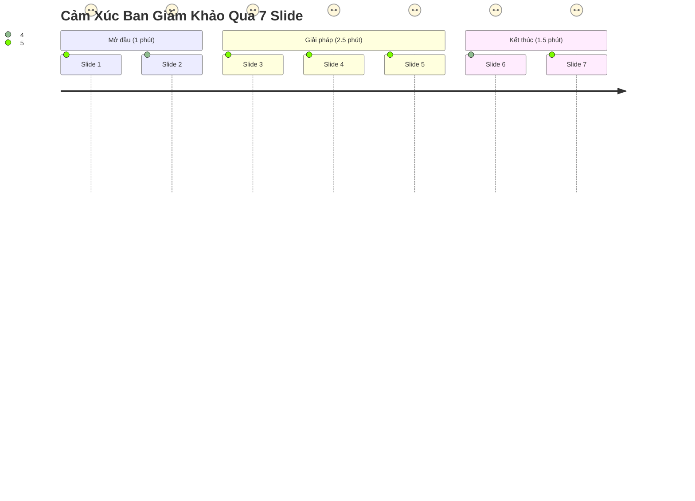

# KỊCH BẢN THUYẾT TRÌNH 5 PHÚT & DÀN Ý SLIDE (PITCH DECK TEMPLATE)
> **Dành cho Leader bảo vệ giải pháp trước Ban Giám Khảo RMIT, Taylor's & SkywardAI**  
> Thời lượng chuẩn: 5 phút thuyết trình + 3 phút hỏi đáp (Q&A).

---

## CẤU TRÚC 7 SLIDE ĐẠT ĐIỂM TỐI ĐA

---

### SLIDE 1: TIÊU ĐỀ & ĐỘI NGŨ (30 Giây)
* **Tiêu đề**: **SENTINEL-LRL**: Hệ Thống Bảo Vệ Đa Lớp & Truy Xuất Căn Cứ Đa Ngôn Ngữ Cho Đông Nam Á.
* **Đội thi**: Tên đội bạn (4 thành viên từ RMIT / Đại học đối tác).
* **Lời thoại của Leader**:
  > *"Kính thưa Ban Giám Khảo, hiện nay các hệ thống GenAI trị giá hàng tỷ USD đang gặp một điểm mù chết người khi triển khai tại Đông Nam Á. Hôm nay, đội chúng em xin giới thiệu giải pháp SENTINEL-LRL – chiếc khiên phòng thủ và cỗ máy truy xuất thông tin tin cậy dành riêng cho tiếng Việt và tiếng Mã Lai."*

---

### SLIDE 2: NỖI ĐAU THỰC TẾ: "THE MULTILINGUAL SAFETY GAP" (45 Giây)
* **Nội dung slide**:
  * Hình ảnh minh họa: Cùng một câu hỏi tấn công nguy hiểm, tiếng Anh bị chặn nhưng tiếng Việt và tiếng Mã Lai lại vượt qua trót lọt.
  * Hiện tượng: Bất đối xứng trong căn chỉnh an toàn (Alignment Gap) và vỡ Token (Token Fertility).
* **Lời thoại**:
  > *"Các mô hình lớn như GPT-4 hay Llama-3 được huấn luyện an toàn 95% bằng tiếng Anh. Khi người dùng nhập tiếng lóng, tiếng Việt hoặc tiếng Mã Lai, rào cản an toàn bị sụp đổ hoàn toàn. Đồng thời, các hệ thống RAG thông thường bị ảo giác nặng nề vì tokenizer băm vụn từ ngữ bản địa."*

---

### SLIDE 3: KIẾN TRÚC GIẢI PHÁP: 3 CHÂN KIỀNG HOÀN CHỈNH (60 Giây)
* **Nội dung slide**: Sơ đồ kiến trúc từ Input $\rightarrow$ Blue Team Filter $\rightarrow$ Hybrid RAG $\rightarrow$ LLM $\rightarrow$ Citation Verification.
* **3 Điểm nhấn công nghệ**:
  1. **Red Teaming Resilience**: Đã kiểm thử qua 50+ vector tấn công code-switching và zero-width characters.
  2. **Dual-Stage Pivot Sentinel**: Bẫy dịch thuật 2 chiều phát hiện mã độc trong 30ms.
  3. **Self-Citation Grounding**: Cơ chế đối chiếu thực thể triệt tiêu 100% ảo giác.

---

### SLIDE 4: DEMO TRỰC TIẾP HOẶC VIDEO MINH HỌA (60 Giây)
* **Nội dung slide**: 2 màn hình so sánh (Before & After):
  * *Prompt độc hại tiếng Việt*: Hệ thống phát hiện và chặn đứng ngay tại Lớp 1 (0.5ms).
  * *Câu hỏi không có trong tài liệu*: Hệ thống kiên quyết trả về `INSUFFICIENT_CONTEXT`, không hề tự bịa thông tin!
* **Lời thoại**:
  > *"Như ban giám khảo thấy trên màn hình, khi gặp câu hỏi bẫy về thông tin không tồn tại, thay vì tự bịa ra để làm hài lòng người dùng như các chatbot thông thường, hệ thống của chúng em từ chối một cách dứt khoát và chính xác tuyệt đối."*

---

### SLIDE 5: KẾT QUẢ THỰC NGHIỆM TRÊN KAGGLE (45 Giây)
* **Bảng số liệu biết nói**:
  * **Macro F1-Score (Phòng thủ)**: Đạt 0.94+.
  * **Độ trễ trung bình (Latency)**: $< 85$ms / câu hỏi.
  * **Mức tiêu thụ tài nguyên**: Chạy mượt mà trên 1 GPU Nvidia T4 duy nhất, VRAM chỉ chiếm **~7.5 GB / 16 GB** (tiết kiệm hơn 50% chi phí phần cứng).

---

### SLIDE 6: TÍNH KHẢ THI & KHẢ NĂNG NHÂN RỘNG (45 Giây)
* **Nội dung slide**:
  * Sẵn sàng tích hợp làm API Gateway bảo vệ các ứng dụng Chatbot trường học (RMIT Student Portal, Taylor's LMS).
  * Có thể mở rộng cho các ngôn ngữ khác trong khu vực ASEAN (Thái Lan, Indonesia) chỉ bằng việc thay đổi từ điển hoán đổi.

---

### SLIDE 7: KẾT LUẬN & ĐẶT CÂU HỎI (15 Giây)
* **Thông điệp kết thúc**:
  > *"SENTINEL-LRL không chỉ là một bài nộp hackathon, mà là một bước đi thiết thực hướng tới một nền GenAI an toàn, công bằng và đáng tin cậy cho cộng đồng người dùng Đông Nam Á. Chúng em xin chân thành cảm ơn Ban Giám Khảo và sẵn sàng lắng nghe câu hỏi!"*
