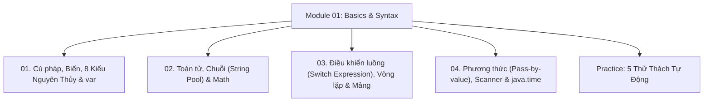

# Module 01: Cú Pháp Nền Tảng, Biến & Luồng Điều Khiển Java

Hệ thống tài liệu ôn tập và kiểm chứng thực nghiệm về Cú pháp Java, Kiến trúc dữ liệu nguyên thủy, Kiểu suy luận `var`, Ép kiểu, Toán tử & Chuỗi bất biến, Cấu trúc rẽ nhánh, Vòng lặp, Mảng, Phương thức, `Scanner` và Thư viện thời gian hiện đại `java.time`.

---

## Danh Mục Bài Học



| Bài học | Trọng tâm kiến thức | File lý thuyết | File Demo |
| :--- | :--- | :--- | :--- |
| **01** | Cấu trúc file Java, hàm `main`, 8 kiểu nguyên thủy, kích thước bit, từ khóa `var`, ép kiểu Widening & Narrowing | [01-syntax-variables-and-types.md](file:///d:/my-project/revision-document/java/01-basics-and-syntax/01-syntax-variables-and-types.md) | [BasicsDemo.java](file:///d:/my-project/revision-document/java/01-basics-and-syntax/BasicsDemo.java) |
| **02** | Toán tử 16 cấp độ ưu tiên, đánh giá ngắt sớm Short-circuit, String Immutability, String Constant Pool, `StringBuilder` | [02-operators-strings-and-math.md](file:///d:/my-project/revision-document/java/01-basics-and-syntax/02-operators-strings-and-math.md) | [BasicsDemo.java](file:///d:/my-project/revision-document/java/01-basics-and-syntax/BasicsDemo.java) |
| **03** | `if/else`, Switch Expressions & `yield` (Java 14+), Labeled `break`/`continue`, Mảng 1D, Mảng 2 chiều răng cưa | [03-control-flow-and-arrays.md](file:///d:/my-project/revision-document/java/01-basics-and-syntax/03-control-flow-and-arrays.md) | [BasicsDemo.java](file:///d:/my-project/revision-document/java/01-basics-and-syntax/BasicsDemo.java) |
| **04** | Bản chất Pass-by-value của tham số, Nạp chồng (Overloading), Đệ quy, Bẫy trôi lệnh `Scanner`, Thư viện `java.time` | [04-methods-scanner-and-datetime.md](file:///d:/my-project/revision-document/java/01-basics-and-syntax/04-methods-scanner-and-datetime.md) | [BasicsDemo.java](file:///d:/my-project/revision-document/java/01-basics-and-syntax/BasicsDemo.java) |

---

## Hướng Dẫn Chạy Kiểm Thử Tự Động

Mọi thử thách đều được thiết kế độc lập, chạy trực tiếp bằng máy ảo Java:
```bash
rtk java java/01-basics-and-syntax/Practice.java
```
Kết quả mong đợi: `5/5 THỬ THÁCH MODULE 01 ĐÃ VƯỢT QUA 100%!`.
