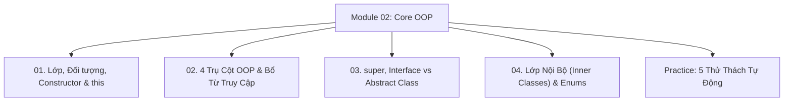

# Module 02: Lập Trình Hướng Đối Tượng (Core OOP)

Hệ thống tài liệu ôn tập và kiểm chứng thực nghiệm về Lập trình hướng đối tượng trong Java: Cấu trúc Lớp & Đối tượng, Chuỗi khởi tạo Constructor Chaining, 4 trụ cột OOP, Bổ từ truy cập & phi truy cập, `this`/`super`, So sánh chuyên sâu Interface vs Abstract Class, Lớp nội bộ & Kiểu liệt kê Enums.

---

## Danh Mục Bài Học



| Bài học | Trọng tâm kiến thức | File lý thuyết | File Demo |
| :--- | :--- | :--- | :--- |
| **01** | Khởi tạo trên Heap, Vòng đời Object, Constructor Chaining, Phân biệt `this()` và `this.field` | [01-classes-objects-and-constructors.md](file:///d:/my-project/revision-document/java/02-core-oop/01-classes-objects-and-constructors.md) | [OopDemo.java](file:///d:/my-project/revision-document/java/02-core-oop/OopDemo.java) |
| **02** | Đóng gói, Kế thừa, Đa hình (Compile-time vs Runtime), Trừu tượng, Ma trận 4 mức Access Modifiers, `static` & `final` | [02-four-oop-pillars.md](file:///d:/my-project/revision-document/java/02-core-oop/02-four-oop-pillars.md) | [OopDemo.java](file:///d:/my-project/revision-document/java/02-core-oop/OopDemo.java) |
| **03** | Gọi cha `super()`, Ghi đè `@Override`, Interface (default/static/private methods) vs Abstract Class, Hợp đồng CAN-DO vs IS-A | [03-super-interfaces-and-abstract-classes.md](file:///d:/my-project/revision-document/java/02-core-oop/03-super-interfaces-and-abstract-classes.md) | [OopDemo.java](file:///d:/my-project/revision-document/java/02-core-oop/OopDemo.java) |
| **04** | Member Inner Class, Static Nested Class, Anonymous Inner Class, Enum có Constructor & Thuộc tính mở rộng | [04-inner-classes-and-enums.md](file:///d:/my-project/revision-document/java/02-core-oop/04-inner-classes-and-enums.md) | [OopDemo.java](file:///d:/my-project/revision-document/java/02-core-oop/OopDemo.java) |

---

## Hướng Dẫn Chạy Kiểm Thử Tự Động

Mọi thử thách đều được thiết kế độc lập, chạy trực tiếp bằng máy ảo Java:
```bash
rtk java -ea java/02-core-oop/Practice.java
```
Kết quả mong đợi: `5/5 THỬ THÁCH MODULE 02 ĐÃ VƯỢT QUA 100%!`.
