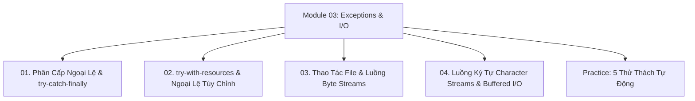

# Module 03: Xử Lý Ngoại Lệ & File I/O Streams

Hệ thống tài liệu ôn tập và kiểm chứng thực nghiệm về Cơ chế xử lý ngoại lệ trong Java, Cây phân cấp `Throwable`, Checked vs Unchecked Exceptions, Cơ chế tự động giải phóng tài nguyên `try-with-resources` (`AutoCloseable`), và Toàn bộ hệ thống luồng nhập xuất File I/O (Byte Streams, Character Streams, Buffered I/O, NIO.2).

---

## Danh Mục Bài Học



| Bài học | Trọng tâm kiến thức | File lý thuyết | File Demo |
| :--- | :--- | :--- | :--- |
| **01** | Cây phân cấp `Throwable`, `Error` vs `Exception`, Checked vs Unchecked (`RuntimeException`), Quy tắc thứ tự các khối `catch` | [01-exception-hierarchy-and-handling.md](file:///d:/my-project/revision-document/java/03-exceptions-and-io/01-exception-hierarchy-and-handling.md) | [ExceptionIoDemo.java](file:///d:/my-project/revision-document/java/03-exceptions-and-io/ExceptionIoDemo.java) |
| **02** | `try-with-resources`, Hợp đồng giao diện `AutoCloseable`, Suppressed Exceptions, Xây dựng Ngoại lệ tùy chỉnh (Custom Exception) | [02-try-with-resources-and-custom-exceptions.md](file:///d:/my-project/revision-document/java/03-exceptions-and-io/02-try-with-resources-and-custom-exceptions.md) | [ExceptionIoDemo.java](file:///d:/my-project/revision-document/java/03-exceptions-and-io/ExceptionIoDemo.java) |
| **03** | Thao tác tập tin với `java.io.File`, Phép ghi/đọc nhị phân qua Byte Streams (`FileInputStream`, `FileOutputStream`) | [03-file-handling-and-byte-streams.md](file:///d:/my-project/revision-document/java/03-exceptions-and-io/03-file-handling-and-byte-streams.md) | [ExceptionIoDemo.java](file:///d:/my-project/revision-document/java/03-exceptions-and-io/ExceptionIoDemo.java) |
| **04** | Luồng ký tự văn bản (`FileReader`, `FileWriter`), Tối ưu bộ đệm RAM với `BufferedReader`/`BufferedWriter`, Thư viện hiện đại `java.nio.file.Files` | [04-character-streams-and-buffered-io.md](file:///d:/my-project/revision-document/java/03-exceptions-and-io/04-character-streams-and-buffered-io.md) | [ExceptionIoDemo.java](file:///d:/my-project/revision-document/java/03-exceptions-and-io/ExceptionIoDemo.java) |

---

## Hướng Dẫn Chạy Kiểm Thử Tự Động

Mọi thử thách đều được thiết kế độc lập, chạy trực tiếp bằng máy ảo Java:
```bash
rtk java -ea java/03-exceptions-and-io/Practice.java
```
Kết quả mong đợi: `5/5 THỬ THÁCH MODULE 03 ĐÃ VƯỢT QUA 100%!`.
