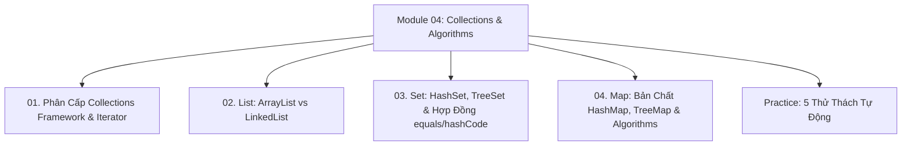

# Module 04: Java Collections Framework & Thuật Toán Cấu Trúc Dữ Liệu

Hệ thống tài liệu ôn tập và kiểm chứng thực nghiệm về Khung cấu trúc dữ liệu Java Collections Framework: Phân cấp `Collection` & `Map`, Cơ chế con trỏ `Iterator`, Ma trận so sánh hiệu năng $O(1)$ vs $O(N)$ vs $O(\log N)$, Kiến trúc bảng băm & Cây Đỏ-Đen trong `HashMap`, và Các thuật toán cốt lõi của lớp tiện ích `Collections`.

---

## Danh Mục Bài Học



| Bài học | Trọng tâm kiến thức | File lý thuyết | File Demo |
| :--- | :--- | :--- | :--- |
| **01** | Cây phân cấp `Iterable` -> `Collection`, `Iterator` vs `ListIterator`, Cơ chế Fail-fast & Bẫy `ConcurrentModificationException` | [01-collections-framework-overview-and-iterator.md](file:///d:/my-project/revision-document/java/04-collections-and-algorithms/01-collections-framework-overview-and-iterator.md) | [CollectionsDemo.java](file:///d:/my-project/revision-document/java/04-collections-and-algorithms/CollectionsDemo.java) |
| **02** | `List` interface: Mảng động `ArrayList` (hệ số tăng trưởng 1.5x) vs Danh sách liên kết đôi `LinkedList`, So sánh độ phức tạp Big-O | [02-list-arraylist-vs-linkedlist.md](file:///d:/my-project/revision-document/java/04-collections-and-algorithms/02-list-arraylist-vs-linkedlist.md) | [CollectionsDemo.java](file:///d:/my-project/revision-document/java/04-collections-and-algorithms/CollectionsDemo.java) |
| **03** | `Set` interface: `HashSet` (bảng băm), `LinkedHashSet` (bảo toàn thứ tự chèn), `TreeSet` (Cây Đỏ-Đen $O(\log N)$), Hợp đồng `equals()` & `hashCode()` | [03-set-hashset-treeset-and-contracts.md](file:///d:/my-project/revision-document/java/04-collections-and-algorithms/03-set-hashset-treeset-and-contracts.md) | [CollectionsDemo.java](file:///d:/my-project/revision-document/java/04-collections-and-algorithms/CollectionsDemo.java) |
| **04** | `Map` interface: Bản chất `HashMap` (Bucket mảng, Xung đột Hashing, Treeification lúc $\ge 8$ phần tử), `TreeMap`, Thuật toán `Collections.sort()`, `binarySearch()` | [04-map-hashmap-internals-and-algorithms.md](file:///d:/my-project/revision-document/java/04-collections-and-algorithms/04-map-hashmap-internals-and-algorithms.md) | [CollectionsDemo.java](file:///d:/my-project/revision-document/java/04-collections-and-algorithms/CollectionsDemo.java) |

---

## Hướng Dẫn Chạy Kiểm Thử Tự Động

Mọi thử thách đều được thiết kế độc lập, chạy trực tiếp bằng máy ảo Java:
```bash
rtk java -ea java/04-collections-and-algorithms/Practice.java
```
Kết quả mong đợi: `5/5 THỬ THÁCH MODULE 04 ĐÃ VƯỢT QUA 100%!`.
