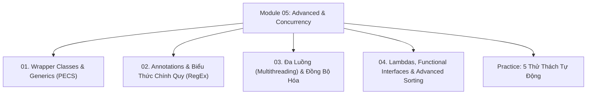

# Module 05: Java Nâng Cao, Lập Trình Đa Luồng & Functional Programming

Hệ thống tài liệu ôn tập và kiểm chứng thực nghiệm về Lớp bao đóng (Wrapper Classes), Integer Cache, Cơ chế Generics & Nguyên tắc PECS, Siêu dữ liệu Annotations, Biểu thức chính quy RegEx, Lập trình đa luồng (Multithreading & Concurrency), Biểu thức Lambda, Tham chiếu phương thức và Sắp xếp nâng cao (`Comparable` vs `Comparator`).

---

## Danh Mục Bài Học



| Bài học | Trọng tâm kiến thức | File lý thuyết | File Demo |
| :--- | :--- | :--- | :--- |
| **01** | Lớp bao đóng, Autoboxing/Unboxing, Bẫy Integer Cache [-128..127], Tham số hóa kiểu dữ liệu Generics, Type Erasure, Nguyên tắc PECS | [01-wrapper-classes-and-generics.md](file:///d:/my-project/revision-document/java/05-advanced-and-concurrency/01-wrapper-classes-and-generics.md) | [AdvancedDemo.java](file:///d:/my-project/revision-document/java/05-advanced-and-concurrency/AdvancedDemo.java) |
| **02** | Built-in Annotations, Tự định nghĩa Custom Annotation (`@Target`, `@Retention`), Biểu thức chính quy qua `java.util.regex.Pattern` & `Matcher` | [02-annotations-and-regex.md](file:///d:/my-project/revision-document/java/05-advanced-and-concurrency/02-annotations-and-regex.md) | [AdvancedDemo.java](file:///d:/my-project/revision-document/java/05-advanced-and-concurrency/AdvancedDemo.java) |
| **03** | `Thread` vs `Runnable`, Vòng đời luồng (NEW, RUNNABLE, BLOCKED, WAITING, TIMED_WAITING, TERMINATED), `synchronized`, từ khóa `volatile` | [03-multithreading-and-concurrency.md](file:///d:/my-project/revision-document/java/05-advanced-and-concurrency/03-multithreading-and-concurrency.md) | [AdvancedDemo.java](file:///d:/my-project/revision-document/java/05-advanced-and-concurrency/AdvancedDemo.java) |
| **04** | Biểu thức Lambda, Method References `::`, Bộ tứ `@FunctionalInterface` (`Predicate`, `Consumer`, `Function`, `Supplier`), `Comparable` vs `Comparator` | [04-lambdas-and-functional-interfaces.md](file:///d:/my-project/revision-document/java/05-advanced-and-concurrency/04-lambdas-and-functional-interfaces.md) | [AdvancedDemo.java](file:///d:/my-project/revision-document/java/05-advanced-and-concurrency/AdvancedDemo.java) |

---

## Hướng Dẫn Chạy Kiểm Thử Tự Động

Mọi thử thách đều được thiết kế độc lập, chạy trực tiếp bằng máy ảo Java:
```bash
rtk java -ea java/05-advanced-and-concurrency/Practice.java
```
Kết quả mong đợi: `5/5 THỬ THÁCH MODULE 05 ĐÃ VƯỢT QUA 100%!`.
