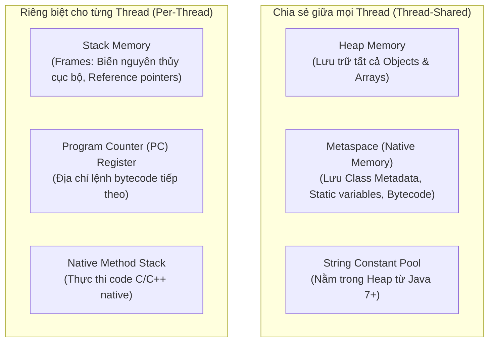
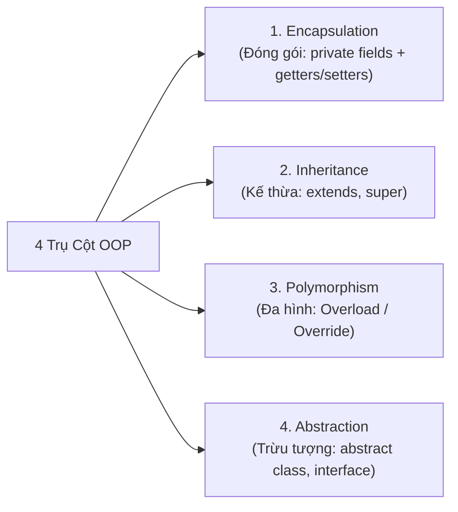
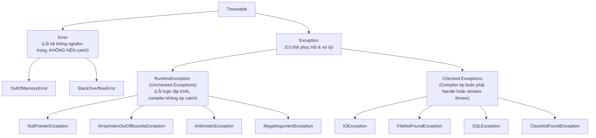
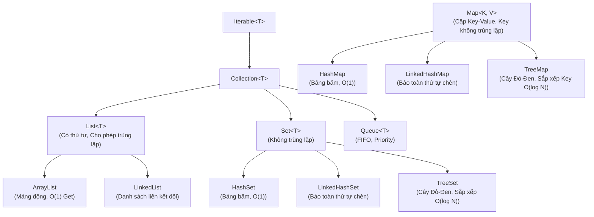

# Bảng Tra Cứu Toàn Diện Java Core & OOP (Master Java Cheat Sheet)

Bảng tổng hợp toàn diện hơn 80+ chủ đề Java theo chuẩn giáo trình W3Schools và kiến trúc hệ thống thực tế: Cú pháp nền tảng, Kiến trúc bộ nhớ JVM (Heap/Stack/Metaspace), 4 tính chất OOP, Ngoại lệ & `try-with-resources`, I/O Streams & File Handling, Java Collections Framework (List, Set, Map), Concurrency đa luồng, Generics, Lambdas & Functional Interfaces, và Bẫy phỏng vấn kinh điển.

---

## Mục Lục

1. [Kiến Trúc Nền Tảng & Bộ Nhớ JVM](#1-kiến-trúc-nền-tảng--bộ-nhớ-jvm)
2. [Cú Pháp Cốt Lõi, Biến & Kiểu Dữ Liệu](#2-cú-pháp-cốt-lõi-biến--kiểu-dữ-liệu)
3. [Toán Tử & Độ Ưu Tiên Toán Tử](#3-toán-tử--độ-ưu-tiên-toán-tử)
4. [Chuỗi Ký Tự (Strings) & Xử Lý Văn Bản](#4-chuỗi-ký-tự-strings--xử-lý-văn-bản)
5. [Cấu Trúc Điều Khiển & Mảng](#5-cấu-trúc-điều-khiển--mảng)
6. [Phương Thức, Tham Số & Đệ Quy](#6-phương-thức-tham-số--đệ-quy)
7. [Lập Trình Hướng Đối Tượng (OOP Deep Dive)](#7-lập-trình-hướng-đối-tượng-oop-deep-dive)
8. [Ngày Tháng & Nhập Xuất Dữ Liệu (Date & Scanner)](#8-ngày-tháng--nhập-xuất-dữ-liệu-date--scanner)
9. [Xử Lý Ngoại Lệ & Gỡ Lỗi (Errors & Exceptions)](#9-xử-lý-ngoại-lệ--gỡ-lỗi-errors--exceptions)
10. [File Handling & I/O Streams](#10-file-handling--io-streams)
11. [Java Collections Framework & Cấu Trúc Dữ Liệu](#11-java-collections-framework--cấu-trúc-dữ-liệu)
12. [Java Nâng Cao: Generics, Concurrency & Lambdas](#12-java-nâng-cao-generics-concurrency--lambdas)
13. [Từ Điển Từ Khóa (Java Keywords Catalog)](#13-từ-điển-từ-khóa-java-keywords-catalog)
14. [Bẫy Phỏng Vấn Kinh Điển (Top Java Gotchas)](#14-bẫy-phỏng-vấn-kinh-điển-top-java-gotchas)

---

## 1. Kiến Trúc Nền Tảng & Bộ Nhớ JVM

### 1.1. Phân Biệt JDK vs JRE vs JVM
- **JVM (Java Virtual Machine)**: Máy ảo thực thi mã bytecode (`.class`). Có tính chất phụ thuộc nền tảng hệ điều hành (Platform-dependent), giúp hiện thực hóa triết lý *"Write Once, Run Anywhere"* (WORA).
- **JRE (Java Runtime Environment)**: Chứa `JVM` + Thư viện cốt lõi (Core Libraries / Java Class Library) cần thiết để chạy ứng dụng Java.
- **JDK (Java Development Kit)**: Chứa `JRE` + Bộ công cụ phát triển (`javac` - trình biên dịch, `jdb` - gỡ lỗi, `jar` - đóng gói, `javadoc`).

```
+-------------------------------------------------------------+
|                            JDK                              |
|  +---------------------------------------+  +------------+  |
|  |                 JRE                   |  | Dev Tools  |  |
|  |  +------------------+  +-----------+  |  | javac, jar |  |
|  |  |       JVM        |  | Core Libs |  |  | jdb, etc.  |  |
|  |  +------------------+  +-----------+  |  +------------+  |
|  +---------------------------------------+                  |
+-------------------------------------------------------------+
```

### 1.2. Mô Hình Phân Bổ Bộ Nhớ JVM (Runtime Data Areas)



| Vùng Bộ Nhớ | Đặc Điểm | Cơ Chế Thu Hồi | Lỗi Quá Tải |
| :--- | :--- | :--- | :--- |
| **Stack** | Cấp phát theo từng Lời gọi hàm (Frame LIFO). Nhanh, kích thước cố định hoặc động. | Tự động giải phóng khi hàm kết thúc. | `java.lang.StackOverflowError` |
| **Heap** | Lưu trữ toàn bộ Object được tạo bằng từ khóa `new`. Kích thước lớn. | Được quản lý tự động bởi Garbage Collector (GC). | `java.lang.OutOfMemoryError: Java heap space` |
| **Metaspace** | Cấp phát trên bộ nhớ Native OS (thay thế PermGen từ Java 8). | GC thu hồi khi ClassLoader bị dọn sạch. | `java.lang.OutOfMemoryError: Metaspace` |

---

## 2. Cú Pháp Cốt Lõi, Biến & Kiểu Dữ Liệu

### 2.1. Cấu Trúc Khung Một Chương Trình Java
```java
package com.example.app; // Khai báo package (nếu có)

import java.util.Scanner; // Khai báo thư viện

public class Main {
    // Điểm khởi đầu (Entry point) của ứng dụng
    public static void main(String[] args) {
        System.out.println("Hello, World!");
    }
}
```
> [!IMPORTANT]
> Tên file chứa `public class` phải **trùng khớp chính xác 100%** với tên của class đó (ví dụ: file `Main.java` chứa `public class Main`).

### 2.2. Ma Trận 8 Kiểu Dữ Liệu Nguyên Thủy (Primitive Types)

| Kiểu Dữ Liệu | Kích Thước | Giá Trị Mặc Định | Miền Giá Trị (Range) | Wrapper Class |
| :--- | :--- | :--- | :--- | :--- |
| `byte` | 1 byte (8 bits) | `0` | $-128$ đến $127$ ($-2^7$ đến $2^7-1$) | `Byte` |
| `short` | 2 bytes (16 bits) | `0` | $-32,768$ đến $32,767$ ($-2^{15}$ đến $2^{15}-1$) | `Short` |
| `int` | 4 bytes (32 bits) | `0` | $-2,147,483,648$ đến $2,147,483,647$ ($-2^{31}$ đến $2^{31}-1$) | `Integer` |
| `long` | 8 bytes (64 bits) | `0L` | $-2^{63}$ đến $2^{63}-1$ (Hậu tố `L` hoặc `l`) | `Long` |
| `float` | 4 bytes (32 bits) | `0.0f` | IEEE 754 32-bit (Hậu tố `F` hoặc `f`, độ chính xác 6-7 chữ số) | `Float` |
| `double` | 8 bytes (64 bits) | `0.0d` | IEEE 754 64-bit (Độ chính xác 15-16 chữ số, chuẩn mặc định) | `Double` |
| `boolean` | JVM-dependent | `false` | Chỉ có 2 giá trị: `true` hoặc `false` | `Boolean` |
| `char` | 2 bytes (16 bits) | `'\u0000'` | Unicode $0$ đến $65,535$ (`'A'`, `'z'`, `'\u0041'`) | `Character` |

### 2.3. Kiểu Suy Luận Cục Bộ (`var` - Java 10+)
- Chỉ áp dụng cho **biến cục bộ (local variables)** có giá trị khởi tạo ngay tại dòng khai báo.
- Không thể dùng cho: tham số hàm, thuộc tính class (field), kiểu trả về hàm, hoặc gán giá trị `null`.
```java
var count = 10;                     // Suy luận thành int
var message = "Hello";              // Suy luận thành String
var list = new ArrayList<String>(); // Suy luận thành ArrayList<String>
```

### 2.4. Ép Kiểu (Type Casting)
1. **Ép kiểu ngầm định (Widening / Nới rộng)**: Tự động, an toàn, không mất dữ liệu:
   `byte` $\rightarrow$ `short` $\rightarrow$ `char` $\rightarrow$ `int` $\rightarrow$ `long` $\rightarrow$ `float` $\rightarrow$ `double`
2. **Ép kiểu tường minh (Narrowing / Thu hẹp)**: Có nguy cơ tràn số (overflow) hoặc mất phần thập phân:
   ```java
   double d = 9.78;
   int i = (int) d; // i = 9 (mất phần thập phân)
   
   int big = 130;
   byte b = (byte) big; // b = -126 (tràn bit có dấu)
   ```

---

## 3. Toán Tử & Độ Ưu Tiên Toán Tử

### 3.1. Bảng Thứ Tự Ưu Tiên (Precedence) Từ Cao Đến Thấp

| Cấp | Nhóm Toán Tử | Ký Hiệu | Chiều Kết Hợp (Associativity) |
| :---: | :--- | :--- | :---: |
| **1** | Truy xuất thuộc tính, Mảng, Gọi hàm | `.`, `[]`, `()` | Trái qua Phải |
| **2** | Hậu tố (Postfix) | `expr++`, `expr--` | Phải qua Trái |
| **3** | Tiền tố (Prefix) & Đơn nguyên | `++expr`, `--expr`, `+`, `-`, `!`, `~` | Phải qua Trái |
| **4** | Ép kiểu & Khởi tạo | `(type)`, `new` | Phải qua Trái |
| **5** | Nhân, Chia, Chia dư | `*`, `/`, `%` | Trái qua Phải |
| **6** | Cộng, Trừ, Nối chuỗi | `+`, `-` | Trái qua Phải |
| **7** | Dịch bit | `<<`, `>>`, `>>>` (dịch phải chèn 0) | Trái qua Phải |
| **8** | So sánh quan hệ, Kiểm tra kiểu | `<`, `<=`, `>`, `>=`, `instanceof` | Trái qua Phải |
| **9** | So sánh bằng | `==`, `!=` | Trái qua Phải |
| **10**| Phép AND bit | `&` | Trái qua Phải |
| **11**| Phép XOR bit | `^` | Trái qua Phải |
| **12**| Phép OR bit | `\|` | Trái qua Phải |
| **13**| Phép AND logic (Ngắt sớm) | `&&` | Trái qua Phải |
| **14**| Phép OR logic (Ngắt sớm) | `\|\|` | Trái qua Phải |
| **15**| Toán tử 3 ngôi (Ternary) | `? :` | Phải qua Trái |
| **16**| Gán giá trị | `=`, `+=`, `-=`, `*=`, `/=`, `%=`, v.v. | Phải qua Trái |

> [!TIP]
> **Đánh giá ngắt sớm (Short-Circuit Evaluation)**:
> - `expr1 && expr2`: Nếu `expr1 == false`, `expr2` sẽ **không bao giờ được chạy**.
> - `expr1 || expr2`: Nếu `expr1 == true`, `expr2` sẽ **không bao giờ được chạy**.
> Dùng kỹ thuật này để bảo vệ khỏi lỗi `NullPointerException`: `if (user != null && user.isActive())`.

---

## 4. Chuỗi Ký Tự (Strings) & Xử Lý Văn Bản

### 4.1. Bản Chất Bất Biến (Immutability) & String Constant Pool
- Trong Java, `String` là **bất biến (immutable)**: Mỗi khi bạn thay đổi chuỗi, JVM sẽ tạo một đối tượng chuỗi mới trong bộ nhớ.
- **String Constant Pool (SCP)**: Nằm trong Heap. Lưu trữ các chuỗi literal để tái sử dụng, tiết kiệm RAM.

```java
String s1 = "Java";               // Tạo trong String Pool
String s2 = "Java";               // Tái sử dụng s1 từ String Pool -> s1 == s2 là TRUE
String s3 = new String("Java");   // Ép tạo đối tượng mới trên Heap -> s1 == s3 là FALSE
String s4 = s3.intern();          // Đưa chuỗi vào Pool thủ công -> s1 == s4 là TRUE
```

```
           STACK                       HEAP
      +-------------+        +--------------------------+
      |  s1, s2     |=======>|   String Constant Pool   |
      +-------------+        |        ["Java"]          |
                             +--------------------------+
      +-------------+                     ^
      |     s3      |=======> [ String Object: "Java" ]
      +-------------+          (Trên Heap thông thường)
```

### 4.2. So Sánh `String` vs `StringBuilder` vs `StringBuffer`

| Tiêu Chí | `String` | `StringBuilder` | `StringBuffer` |
| :--- | :--- | :--- | :--- |
| **Tính biến đổi (Mutability)** | Bất biến (Immutable) | Biến đổi (Mutable) | Biến đổi (Mutable) |
| **An toàn luồng (Thread-Safety)** | Tuyệt đối an toàn (Thread-safe) | **Không an toàn (Not thread-safe)** | **An toàn (Thread-safe - synchronized)** |
| **Tốc độ xử lý** | Chậm khi nối chuỗi nhiều lần | **Nhanh nhất** | Chậm hơn StringBuilder do lock sync |
| **Sử dụng khi** | Chuỗi hằng số, ít thay đổi | Ghép chuỗi trong hàm đơn luồng | Ghép chuỗi trong môi trường đa luồng |

### 4.3. Các Phương Thức String Thường Dùng
- `length()`: Số ký tự.
- `charAt(int index)`: Lấy ký tự tại vị trí index.
- `substring(int begin, int end)`: Cắt chuỗi từ `begin` đến `end - 1`.
- `contains(CharSequence s)`, `startsWith(String prefix)`, `endsWith(String suffix)`.
- `indexOf(String str)`, `lastIndexOf(String str)`: Tìm vị trí chuỗi con.
- `toUpperCase()`, `toLowerCase()`, `trim()` / `strip()` (Java 11+ xử lý Unicode whitespace).
- `replace(old, new)`, `replaceAll(regex, replacement)`: Thay thế chuỗi.
- `split(String regex)`: Cắt chuỗi thành mảng `String[]`.

---

## 5. Cấu Trúc Điều Khiển & Mảng

### 5.1. Câu Lệnh Rẽ Nhánh (`if-else` & `switch`)

#### Switch Cổ Điển vs Switch Expression (Java 14+)
```java
// Java 14+ Switch Expression: Không cần break, không sợ fall-through, trả về giá trị
int day = 3;
String dayType = switch (day) {
    case 1, 7 -> "Weekend";
    case 2, 3, 4, 5, 6 -> "Weekday";
    default -> {
        System.out.println("Invalid day: " + day);
        yield "Unknown"; // Trả về giá trị trong khối block phức tạp
    }
};
```

### 5.2. Vòng Lặp & Labeled Break / Continue
```java
// Vòng lặp với nhãn (Labeled loop) để thoát khỏi vòng lặp lồng nhau
outerLoop:
for (int i = 0; i < 5; i++) {
    for (int j = 0; j < 5; j++) {
        if (i * j == 6) {
            break outerLoop; // Thoát hẳn cả vòng lặp ngoài
        }
    }
}
```

### 5.3. Mảng (Arrays)
- Mảng có kích thước cố định sau khi khởi tạo, lưu trữ các phần tử cùng kiểu liên tiếp trên Heap.
```java
int[] numbers = {10, 20, 30, 40}; // Khởi tạo nhanh
int[] emptyArr = new int[5];       // Khởi tạo mảng 5 phần tử mặc định là 0

// Mảng 2 chiều (Mảng của các mảng - Ragged/Jagged Arrays)
int[][] matrix = new int[3][];
matrix[0] = new int[2];
matrix[1] = new int[4];
matrix[2] = new int[1];

// Sao chép mảng nhanh cấp độ hệ thống
int[] copy = new int[numbers.length];
System.arraycopy(numbers, 0, copy, 0, numbers.length);
```

---

## 6. Phương Thức, Tham Số & Đệ Quy

### 6.1. Bản Chất Truyền Tham Số: Luôn Luôn là Pass-By-Value
> [!CAUTION]
> Trong Java, **100% là Pass-By-Value (Truyền theo giá trị)**.
> - Đối với **Kiểu nguyên thủy**: Bản sao giá trị thực tế được truyền vào hàm.
> - Đối với **Kiểu đối tượng (Object Reference)**: Bản sao của **con trỏ tham chiếu (Reference address)** được truyền vào hàm.

```java
public static void modify(Person p, int x) {
    x = 99;                 // Không ảnh hưởng đến biến x ở hàm gọi
    p.setName("Alice");     // THAY ĐỔI thuộc tính của Object gốc (cùng trỏ chung 1 Heap object)
    p = new Person("Bob");  // Gán p trỏ tới vùng nhớ mới -> KHÔNG ảnh hưởng tham chiếu gốc ngoài hàm!
}
```

### 6.2. Nạp Chồng Phương Thức (Method Overloading)
- Các phương thức trong cùng một class có **cùng tên**, nhưng **khác nhau về chữ ký tham số (Parameter list)** (số lượng, thứ tự hoặc kiểu tham số).
- **Lưu ý**: Kiểu trả về (`return type`) **không** được tính là một phần của chữ ký để phân biệt nạp chồng!

### 6.3. Đệ Quy (Recursion)
```java
// Tính giai thừa với điều kiện dừng an toàn
public static long factorial(int n) {
    if (n <= 1) return 1; // Base case (Điều kiện dừng)
    return n * factorial(n - 1); // Recursive call
}
```
- Nếu không có điều kiện dừng hoặc đệ quy quá sâu $\rightarrow$ Tràn bộ nhớ Call Stack: `StackOverflowError`.

---

## 7. Lập Trình Hướng Đối Tượng (OOP Deep Dive)

### 7.1. 4 Trụ Cột Hướng Đối Tượng (The 4 OOP Pillars)



1. **Encapsulation (Tính đóng gói)**: Che giấu trạng thái bên trong đối tượng bằng `private`, chỉ cho phép tương tác qua các phương thức công khai (`public getters/setters`), đảm bảo toàn vẹn dữ liệu.
2. **Inheritance (Tính kế thừa)**: Class con tái sử dụng thuộc tính/phương thức từ class cha qua từ khóa `extends`. Java hỗ trợ **đơn kế thừa class** (Single inheritance).
3. **Polymorphism (Tính đa hình)**:
   - *Đa hình lúc biên dịch (Compile-time / Static)*: Method Overloading.
   - *Đa hình lúc thực thi (Runtime / Dynamic)*: Method Overriding (`@Override`, Virtual Method Invocation).
4. **Abstraction (Tính trừu tượng)**: Ẩn đi chi tiết cài đặt phức tạp, chỉ hiển thị giao diện tính năng cốt lõi cho người dùng thông qua `abstract class` và `interface`.

### 7.2. Bảng Ma Trận Quyền Truy Cập (Access Modifiers)

| Phạm Vi Truy Cập | `private` | Không khai báo (`default`/`package-private`) | `protected` | `public` |
| :--- | :---: | :---: | :---: | :---: |
| **Cùng trong Class** | ✅ | ✅ | ✅ | ✅ |
| **Cùng Package** | ❌ | ✅ | ✅ | ✅ |
| **Class con ngoài Package** | ❌ | ❌ | ✅ | ✅ |
| **Bất kỳ đâu ngoài Project** | ❌ | ❌ | ❌ | ✅ |

### 7.3. Các Từ Khóa Phi Truy Cập (Non-Access Modifiers)
- **`static`**: Thuộc về lớp (Class level), dùng chung cho mọi đối tượng. Được nạp vào Metaspace khi class được tải.
- **`final`**:
  - Biến `final`: Hằng số, chỉ gán giá trị một lần duy nhất.
  - Phương thức `final`: Không thể bị ghi đè (`@Override`).
  - Lớp `final`: Không thể bị kế thừa (ví dụ: `java.lang.String`).
- **`abstract`**: Lớp trừu tượng không thể khởi tạo trực tiếp bằng `new`. Phương thức trừu tượng không có thân hàm.
- **`synchronized`**: Khóa đồng bộ hóa tài nguyên cho đa luồng (Multi-threading).
- **`volatile`**: Đảm bảo giá trị của biến luôn được đọc/ghi trực tiếp từ Main Memory (bỏ qua CPU Cache).
- **`transient`**: Bỏ qua trường này khi tuần tự hóa đối tượng (Serialization).

### 7.4. Từ Khóa `this` và `super`
```java
class Animal {
    String name;
    Animal(String name) { this.name = name; }
    void makeSound() { System.out.println("Animal sound"); }
}

class Dog extends Animal {
    String breed;
    Dog(String name, String breed) {
        super(name); // Gọi constructor của class cha (phải nằm ở DÒNG ĐẦU TIÊN)
        this.breed = breed;
    }

    @Override
    void makeSound() {
        super.makeSound(); // Gọi lại phương thức của cha
        System.out.println("Bark!");
    }
}
```

### 7.5. So Sánh Abstract Class vs Interface (Java 8+)

| Tiêu Chí | Abstract Class | Interface |
| :--- | :--- | :--- |
| **Cơ chế kế thừa** | Đơn kế thừa (`extends`) | Đa hiện thực (`implements I1, I2, I3`) |
| **Trường dữ liệu (Fields)**| Có thể có biến trạng thái (state), biến thường mọi modifier | Mặc định là `public static final` (Hằng số) |
| **Constructor** | Có constructor (được gọi từ `super()`) | **Không có constructor** |
| **Phương thức có thân hàm** | Phương thức bình thường, concrete methods | `default` methods (Java 8), `static` methods (Java 8), `private` methods (Java 9) |
| **Tốc độ gọi hàm** | Nhanh hơn một chút (Virtual Table) | Chậm hơn đôi chút (Interface Table) |
| **Mục đích thiết kế** | Quan hệ bản chất *"IS-A"* (chia sẻ code chung giữa các class có quan hệ mật thiết) | Quan hệ năng lực *"CAN-DO"* (hợp đồng cam kết chức năng giữa các class không liên quan) |

### 7.6. Inner Classes & Lớp Ẩn Danh (Anonymous Class)
1. **Member Inner Class**: Nằm trong class khác, cần đối tượng Outer Class để khởi tạo: `outer.new Inner()`.
2. **Static Nested Class**: Class tĩnh lồng nhau, khởi tạo độc lập: `new Outer.StaticNested()`.
3. **Anonymous Inner Class**: Lớp không tên, thường dùng để hiện thực nhanh 1 interface hoặc abstract class:
   ```java
   Runnable r = new Runnable() {
       @Override
       public void run() {
           System.out.println("Running in anonymous class");
       }
   };
   ```

### 7.7. Enums (Kiểu Liệt Kê) Với Constructor & Thuộc Tính
```java
public enum HttpStatus {
    OK(200, "Success"),
    NOT_FOUND(404, "Resource Not Found"),
    INTERNAL_SERVER_ERROR(500, "Server Error");

    private final int code;
    private final String description;

    // Constructor của enum luôn là private ngầm định
    HttpStatus(int code, String description) {
        this.code = code;
        this.description = description;
    }

    public int getCode() { return code; }
    public String getDescription() { return description; }
}
```

---

## 8. Ngày Tháng & Nhập Xuất Dữ Liệu (Date & Scanner)

### 8.1. Nhập Dữ Liệu Bằng `Scanner`
```java
import java.util.Scanner;

Scanner sc = new Scanner(System.in);
System.out.print("Enter age: ");
int age = sc.nextInt();
sc.nextLine(); // QUAN TRỌNG: Nuốt ký tự xuống dòng (\n) còn sót lại trong bộ đệm

System.out.print("Enter name: ");
String name = sc.nextLine();
```

> [!WARNING]
> Sau khi gọi `nextInt()`, `nextDouble()`, dấu `\n` người dùng nhấn Enter vẫn nằm lại trong buffer. Phải gọi thêm một lệnh `sc.nextLine()` để xóa bộ đệm trước khi đọc chuỗi tiếp theo.

### 8.2. Xử Lý Ngày Tháng Với Modern `java.time` API (Java 8+)
- Không bao giờ dùng `java.util.Date` hoặc `Calendar` cũ (do lỗi thiết kế và không thread-safe).

```java
import java.time.LocalDate;
import java.time.LocalDateTime;
import java.time.format.DateTimeFormatter;

LocalDate today = LocalDate.now(); // 2026-09-18
LocalDateTime now = LocalDateTime.now();

// Định dạng ngày theo pattern
DateTimeFormatter formatter = DateTimeFormatter.ofPattern("dd/MM/yyyy HH:mm:ss");
String formatted = now.format(formatter);

// Thao tác cộng trừ thời gian (Bất biến - Immutable)
LocalDate nextWeek = today.plusDays(7);
```

---

## 9. Xử Lý Ngoại Lệ & Gỡ Lỗi (Errors & Exceptions)

### 9.1. Cây Phân Cấp Ngoại Lệ (Exception Hierarchy)



### 9.2. Checked vs Unchecked Exceptions

| Tiêu Chí | Checked Exception | Unchecked Exception (`RuntimeException`) |
| :--- | :--- | :--- |
| **Kế thừa từ** | Trực tiếp từ `java.lang.Exception` | Kế thừa từ `java.lang.RuntimeException` |
| **Kiểm tra lúc biên dịch**| Trình biên dịch **bắt buộc** phải có `try-catch` hoặc khai báo `throws` ở signature của hàm | Trình biên dịch không bắt buộc |
| **Ý nghĩa** | Các tình huống ngoại cảnh có thể dự đoán và phục hồi (file không tồn tại, rớt mạng CSDL) | Lỗi do lập trình viên viết code cẩu thả (truy cập null, chia cho 0, vượt chỉ số mảng) |

### 9.3. Cú Pháp `try-catch-finally`, Multi-catch & `try-with-resources`

```java
// 1. Multi-catch (Java 7+): Bắt nhiều loại exception cùng cấp
try {
    int val = Integer.parseInt("abc");
} catch (NumberFormatException | NullPointerException e) {
    System.err.println("Input error: " + e.getMessage());
} finally {
    // Khối này LUÔN LUÔN chạy (kể cả khi có return trong try), ngoại trừ System.exit(0)
    System.out.println("Cleanup work");
}

// 2. Try-with-resources (Java 7+): Tự động đóng tài nguyên thực thi interface AutoCloseable
try (FileInputStream fis = new FileInputStream("data.txt");
     BufferedReader br = new BufferedReader(new InputStreamReader(fis))) {
    String line = br.readLine();
} catch (IOException e) {
    e.printStackTrace();
} // Không cần khối finally fis.close() thủ công!
```

---

## 10. File Handling & I/O Streams

### 10.1. Thao Tác Cơ Bản Với `java.io.File`
```java
import java.io.File;
import java.io.IOException;

File file = new File("demo.txt");
if (file.createNewFile()) {
    System.out.println("File created: " + file.getAbsolutePath());
}
boolean exists = file.exists();
long size = file.length(); // Kích thước byte
boolean deleted = file.delete();
```

### 10.2. Luồng Byte (Byte Streams) vs Luồng Ký Tự (Character Streams)

| Tiêu Chí | Byte Streams (Đơn vị: 8-bit byte) | Character Streams (Đơn vị: 16-bit char) |
| :--- | :--- | :--- |
| **Class gốc** | `InputStream` / `OutputStream` | `Reader` / `Writer` |
| **Phù hợp cho** | File nhị phân: hình ảnh, video, PDF, audio, socket raw | File văn bản (Text), xử lý đúng bảng mã UTF-8 / UTF-16 |
| **Hiện thực** | `FileInputStream`, `FileOutputStream` | `FileReader`, `FileWriter` |
| **Tối ưu bộ đệm** | `BufferedInputStream`, `BufferedOutputStream` | `BufferedReader`, `BufferedWriter` |

### 10.3. Đọc Ghi File Hiệu Năng Cao Với `BufferedReader` & `BufferedWriter`
```java
// Ghi file text với BufferedWriter
try (BufferedWriter writer = new BufferedWriter(new FileWriter("output.txt"))) {
    writer.write("Dòng thứ nhất");
    writer.newLine();
    writer.write("Dòng thứ hai");
}

// Đọc từng dòng với BufferedReader
try (BufferedReader reader = new BufferedReader(new FileReader("output.txt"))) {
    String line;
    while ((line = reader.readLine()) != null) {
        System.out.println(line);
    }
}
```

---

## 11. Java Collections Framework & Cấu Trúc Dữ Liệu

### 11.1. Cây Phân Cấp Collections Framework



### 11.2. Ma Trận So Sánh Các Cấu Trúc Dữ Liệu Java

| Collection | Cấu Trúc Dữ Liệu Ngầm | Thứ Tự (Order) | Cho Phép `null`? | Truy Xuất (Get) | Thêm/Xóa (Insert/Delete) | Thread-Safe? |
| :--- | :--- | :--- | :---: | :---: | :---: | :---: |
| **`ArrayList`** | Dynamic Array (Mảng động) | Bảo toàn thứ tự chèn | ✅ Nhiều | $O(1)$ | $O(N)$ (do dịch chuyển mảng) | ❌ |
| **`LinkedList`** | Doubly-Linked List (Liên kết đôi) | Bảo toàn thứ tự chèn | ✅ Nhiều | $O(N)$ | $O(1)$ (nếu đã có Node) | ❌ |
| **`HashSet`** | Hash Table (Dựa trên `HashMap`) | Không xác định | ✅ 1 null | $O(1)$ | $O(1)$ | ❌ |
| **`LinkedHashSet`** | Hash Table + Doubly-Linked List | Bảo toàn thứ tự chèn | ✅ 1 null | $O(1)$ | $O(1)$ | ❌ |
| **`TreeSet`** | Red-Black Tree (Cây nhị phân Đỏ-Đen) | Sắp xếp tăng dần | ❌ Ném NPE | $O(\log N)$ | $O(\log N)$ | ❌ |
| **`HashMap`** | Array of Nodes (Bucket) + LinkedList/Tree | Không xác định | ✅ 1 null key, nhiều null val | $O(1)$ | $O(1)$ | ❌ |
| **`LinkedHashMap`** | HashMap + Linked List | Thứ tự chèn hoặc truy cập (LRU) | ✅ 1 null key | $O(1)$ | $O(1)$ | ❌ |
| **`TreeMap`** | Red-Black Tree theo Key | Sắp xếp theo Key | ❌ Key không null | $O(\log N)$ | $O(\log N)$ | ❌ |
| **`ConcurrentHashMap`** | Phân đoạn Lock / CAS lock-free | Không xác định | ❌ Cấm null key & val | $O(1)$ | $O(1)$ | ✅ |

### 11.3. Bản Chất Hoạt Động Của `HashMap` (Cơ Chế Hashing)
1. **Tính chỉ số Bucket**: `index = (n - 1) & hash(key)`.
2. **Xử lý xung đột (Collision Resolution)**: Khi 2 key khác nhau sinh ra cùng hash bucket:
   - Dưới 8 phần tử: Lưu thành danh sách liên kết đơn (LinkedList).
   - Từ 8 phần tử trở lên (và mảng bảng băm $\ge 64$): Chuyển đổi thành **Cây Đỏ-Đen (Red-Black Tree)** để hạ độ phức tạp từ $O(N)$ xuống $O(\log N)$.
3. **Quy tắc Hợp Đồng `equals()` và `hashCode()`**:
   - Nếu `a.equals(b) == true` $\rightarrow$ Bắt buộc `a.hashCode() == b.hashCode()`.
   - Nếu `a.hashCode() == b.hashCode()` $\rightarrow$ Chưa chắc `a.equals(b)` đã là true (đây là va chạm hash).

### 11.4. Cơ Chế `Iterator` & Bẫy `ConcurrentModificationException`
```java
List<String> list = new ArrayList<>(List.of("A", "B", "C"));

// ❌ SAI: Gây ConcurrentModificationException vì can thiệp cấu trúc trong vòng lặp for-each
for (String item : list) {
    if (item.equals("B")) list.remove(item);
}

// ✅ ĐÚNG Cách 1: Sử dụng Iterator.remove()
Iterator<String> it = list.iterator();
while (it.hasNext()) {
    if (it.next().equals("B")) {
        it.remove(); // Xóa an toàn, cập nhật expectedModCount
    }
}

// ✅ ĐÚNG Cách 2: Sử dụng removeIf() (Java 8+)
list.removeIf(item -> item.equals("B"));
```

---

## 12. Java Nâng Cao: Generics, Concurrency & Lambdas

### 12.1. Lớp Bao Đóng (Wrapper Classes) & Integer Cache
- Autoboxing: Tự động chuyển kiểu nguyên thủy sang Object (ví dụ: `int` $\rightarrow$ `Integer`).
- Unboxing: Tự động chuyển Object sang nguyên thủy (ví dụ: `Integer` $\rightarrow$ `int`).
```java
Integer a = 127;
Integer b = 127;
System.out.println(a == b); // TRUE (Do Integer Cache từ -128 đến 127)

Integer c = 128;
Integer d = 128;
System.out.println(c == d); // FALSE (Tạo 2 đối tượng mới trên Heap, phải dùng c.equals(d))
```

### 12.2. Generics & Nguyên Tắc PECS
- **Type Erasure**: Trình biên dịch xóa bỏ thông tin kiểu Generic lúc runtime để tương thích ngược với Java cũ (ví dụ: `List<String>` trở thành `List` raw).
- **PECS (Producer Extends, Consumer Super)**:
  - Muốn **lấy dữ liệu ra** (Producer) $\rightarrow$ Dùng `<? extends T>`.
  - Muốn **ghi dữ liệu vào** (Consumer) $\rightarrow$ Dùng `<? super T>`.

```java
// Generic Class
public class Box<T> {
    private T value;
    public void set(T val) { this.value = val; }
    public T get() { return value; }
}
```

### 12.3. Đa Luồng (Multithreading) & Vòng Đời Thread
- 2 cách tạo luồng cơ bản:
  1. Kế thừa `class Thread`.
  2. Hiện thực `interface Runnable` (Ưu tiên cách này vì Java không hỗ trợ đa kế thừa class).

```java
// Tạo thread bằng Lambda Runnable
Thread thread = new Thread(() -> {
    System.out.println("Thread running: " + Thread.currentThread().getName());
});
thread.start(); // Bắt buộc gọi .start(), KHÔNG gọi .run()!
```

- **Từ khóa `synchronized`**: Đảm bảo tại một thời điểm chỉ có 1 thread được thực thi khối code (sử dụng Monitor Lock của Object).

### 12.4. Lambda Expressions & Functional Interfaces
Functional Interface là Interface chỉ có **duy nhất 1 phương thức trừu tượng** (đánh dấu bằng `@FunctionalInterface`):

| Functional Interface | Signature Phương Thức | Mục Đích Sử Dụng | Ví Dụ Lambda |
| :--- | :--- | :--- | :--- |
| **`Predicate<T>`** | `boolean test(T t)` | Kiểm tra điều kiện (Lọc dữ liệu) | `x -> x > 0` |
| **`Function<T, R>`** | `R apply(T t)` | Biến đổi dữ liệu kiểu T sang R | `s -> s.length()` |
| **`Consumer<T>`** | `void accept(T t)` | Tiêu thụ giá trị, không trả về gì | `x -> System.out.println(x)` |
| **`Supplier<T>`** | `T get()` | Cung cấp giá trị mới, không nhận input | `() -> Math.random()` |

### 12.5. Sắp Xếp Nâng Cao: `Comparable` vs `Comparator`

| Tiêu Chí | `Comparable<T>` | `Comparator<T>` |
| :--- | :--- | :--- |
| **Gói (Package)** | `java.lang` | `java.util` |
| **Phương thức** | `int compareTo(T o)` | `int compare(T o1, T o2)` |
| **Vị trí cài đặt** | Cài đặt trực tiếp bên trong Class đối tượng | Tạo ra một class riêng biệt hoặc dùng Lambda |
| **Thứ tự sắp xếp** | Định nghĩa thứ tự tự nhiên duy nhất (Natural ordering) | Tùy biến linh hoạt nhiều tiêu chí sắp xếp khác nhau |

```java
// Sử dụng Comparator với cú pháp Lambda cực ngắn
List<Student> students = getStudents();
students.sort(Comparator.comparing(Student::getGpa).reversed()
                        .thenComparing(Student::getName));
```

---

## 13. Từ Điển Từ Khóa (Java Keywords Catalog)

Toàn bộ các từ khóa dành riêng trong Java (Reserved Words - không thể dùng làm tên biến hay hàm):

| Từ Khóa | Mục Đích Sử Dụng |
| :--- | :--- |
| `abstract` | Khai báo class hoặc method trừu tượng. |
| `assert` | Kiểm tra giả định lúc debug (chạy kèm `-ea`). |
| `boolean`, `byte`, `char`, `double`, `float`, `int`, `long`, `short` | 8 kiểu dữ liệu nguyên thủy. |
| `break`, `continue` | Điều khiển vòng lặp và switch (ngắt hoặc nhảy qua vòng lặp). |
| `case`, `default`, `switch` | Cấu trúc rẽ nhánh đa trường hợp. |
| `catch`, `finally`, `throw`, `throws`, `try` | Khối xử lý ngoại lệ. |
| `class`, `interface`, `enum`, `record` (Java 16+) | Khai báo kiểu dữ liệu tham chiếu. |
| `extends`, `implements` | Kế thừa class và hiện thực giao diện. |
| `final` | Khóa giá trị biến, chặn override method, chặn kế thừa class. |
| `import`, `package` | Quản lý không gian tên và nạp thư viện. |
| `instanceof` | Kiểm tra một đối tượng có phải kiểu của một class/interface hay không. |
| `native` | Khai báo phương thức thực thi bằng mã máy native C/C++ (JNI). |
| `new` | Cấp phát bộ nhớ Heap và khởi tạo đối tượng. |
| `private`, `protected`, `public` | 3 bổ từ kiểm soát phạm vi truy cập. |
| `return` | Trả về giá trị từ một phương thức. |
| `static` | Khai báo thành phần tĩnh thuộc về cấp độ class. |
| `super`, `this` | Tham chiếu tới đối tượng cha và đối tượng hiện tại. |
| `synchronized`, `volatile` | Đồng bộ hóa và kiểm soát hiển thị bộ nhớ cho đa luồng. |
| `transient` | Bỏ qua trường khi Serialize đối tượng. |
| `void` | Khai báo phương thức không có giá trị trả về. |

---

## 14. Bẫy Phỏng Vấn Kinh Điển (Top Java Gotchas)

### Bẫy 1: So sánh `==` vs `.equals()` trên Object
- `==`: So sánh **địa chỉ vùng nhớ** (tham chiếu) của hai đối tượng.
- `.equals()`: So sánh **nội dung giá trị logic** bên trong đối tượng (cần được override trong class).
```java
String a = new String("test");
String b = new String("test");
System.out.println(a == b);      // FALSE (2 địa chỉ Heap khác nhau)
System.out.println(a.equals(b));  // TRUE (Cùng nội dung "test")
```

### Bẫy 2: Nối chuỗi bằng toán tử `+` trong vòng lặp lớn
```java
// ❌ RẤT CHẬM & LÃNG PHÍ BỘ NHỚ (Độ phức tạp O(N^2))
String res = "";
for (int i = 0; i < 100_000; i++) {
    res += i; // Mỗi vòng lặp tạo ra một StringBuilder và một đối tượng String mới trên Heap!
}

// ✅ TỐI ƯU (Độ phức tạp O(N))
StringBuilder sb = new StringBuilder();
for (int i = 0; i < 100_000; i++) {
    sb.append(i);
}
String res = sb.toString();
```

### Bẫy 3: Rò Rỉ Bộ Nhớ (Memory Leak) Với Trường `static`
- Biến `static` sống suốt vòng đời của ClassLoader (thường là suốt thời gian chạy ứng dụng).
- Nếu đưa các object lớn vào `static Collection` mà không chủ động `clear()`, Garbage Collector sẽ **không bao giờ thu hồi được**, dẫn đến `OutOfMemoryError`.

### Bẫy 4: Thao Tác Số Thực (`float`, `double`) Gây Sai Số Tiền Tệ
```java
System.out.println(0.1 + 0.2); // In ra: 0.30000000000000004 do sai số nhị phân IEEE 754!
// ✅ Luôn dùng BigDecimal cho các bài toán tài chính, ngân hàng:
BigDecimal b1 = new BigDecimal("0.1");
BigDecimal b2 = new BigDecimal("0.2");
System.out.println(b1.add(b2)); // 0.3 chuẩn xác
```
