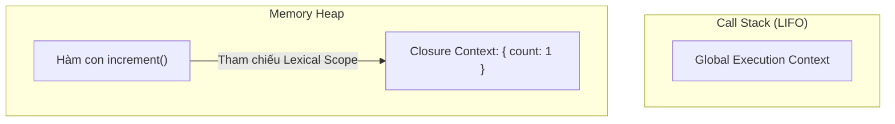

# Ngữ Cảnh Thực Thi, Chuỗi Phạm Vi & Closure (Execution Context, Scope Chain & Closures)

Tài liệu ôn tập toàn diện về cơ chế chạy của JavaScript Engine: Ngữ cảnh thực thi (Execution Context), Call Stack, Lexical Scope, Chuỗi phạm vi (Scope Chain), và bản chất Closure dưới tầng Memory Heap kèm cạm bẫy rò rỉ bộ nhớ (Memory Leak).

---

## 1. Bản Đồ Liên Kết (Knowledge Links)

- **Tiên quyết (Prerequisites):**
  - [01-fundamentals/07-let-and-block-scope.md](file:///d:/my-project/revision-document/javascript/01-fundamentals/07-let-and-block-scope.md) (Block scope & TDZ).
  - [01-function-declarations-vs-expressions.md](file:///d:/my-project/revision-document/javascript/02-functions-and-scope/01-function-declarations-vs-expressions.md) (Creation Phase vs Execution Phase).
- **Mở rộng tiếp theo (Next Steps):**
  - [04-async-javascript/](file:///d:/my-project/revision-document/javascript/04-async-javascript/) (Event Loop, Microtask Queue, Macrotask Queue).
  - Memory Management & Garbage Collection (Mark-and-Sweep Algorithm).
- **Khái niệm liên quan (Related):**
  - Lexical Environment (Môi trường từ vựng).
  - Variable Environment & Outer Environment Reference.

---

## 2. Bản Chất Hoạt Động (Mental Model: Call Stack & Heap)

### 1. Vòng Đời Của Execution Context (Ngữ Cảnh Thực Thi)
Mỗi khi một hàm được gọi, một Execution Context mới được tạo và đẩy (push) vào đỉnh của **Call Stack**:
1. **Creation Phase (Pha khởi tạo):**
   - Thiết lập liên kết con trỏ `this`.
   - Tạo **Lexical Environment** và **Variable Environment**.
   - Tạo tham chiếu tới môi trường bên ngoài (**Outer Reference / Parent Lexical Environment**) ➔ Cơ sở hình thành **Scope Chain**.
   - Quét mã nguồn để hoist Function Declarations và cấp phát biến (`var` là `undefined`, `let`/`const` là uninitialized trong TDZ).
2. **Execution Phase (Pha chạy mã):** Gán giá trị thực tế và chạy logic.
3. Khi hàm thực thi xong (`return`), Execution Context của nó bị **pop khỏi Call Stack**.

### 2. Lexical Scope (Phạm Vi Từ Vựng)
- "Lexical" có nghĩa là: **Phạm vi của một biến được quyết định bởi VỊ TRÍ NÓ ĐƯỢC VIẾT trong mã nguồn**, chứ hoàn toàn không phụ thuộc vào nơi hàm được gọi!
- Khi tìm kiếm một biến, JS Engine tìm trong Lexical Environment hiện tại. Nếu không thấy, nó lần theo con trỏ `outer` lên phạm vi cha, tiếp tục cho tới Global Environment (gọi là **Scope Chain Lookup**). Nếu chạm tới Global mà vẫn không thấy ➔ ném `ReferenceError`.

### 3. Bản Chất Thực Sự Của Closure Dưới Memory Heap
- **Định nghĩa chuẩn:** Closure là sự kết hợp giữa một hàm và môi trường từ vựng bao quanh nó (nơi hàm được khai báo).
- **Cơ chế dưới tầng bộ nhớ:**
  - Thông thường, khi hàm cha chạy xong và pop khỏi Call Stack, các biến cục bộ trên Stack sẽ bị giải phóng.
  - Nhưng nếu có một hàm con **vẫn còn duy trì tham chiếu** tới một biến của hàm cha (ví dụ: hàm con được return ra ngoài), V8 Engine sẽ **không giải phóng biến đó**.
  - Thay vào đó, V8 Engine chuyển biến này từ Stack sang lưu trữ lâu dài trên **Memory Heap** (trong một đối tượng nội bộ gọi là `Closure (outerFunctionName)`).
  - Biến này sẽ tồn tại chừng nào hàm con còn có thể được gọi.



---

## 3. Ứng Dụng Thực Tiễn & Bẫy Kinh Điển (Common Pitfalls)

### 1. Các Ứng Dụng Cốt Lõi Của Closure
1. **Đóng gói dữ liệu riêng tư (Data Privacy):** Giả lập thuộc tính `private` mà không cho code bên ngoài can thiệp trực tiếp.
2. **Kỹ thuật Currying / Partial Application:** Biến đổi hàm nhiều tham số thành chuỗi các hàm 1 tham số: `const multiply = a => b => a * b`.
3. **Memoization / Caching:** Lưu giữ cache tính toán nặng giữa các lần gọi hàm mà không cần dùng biến toàn cục.

### 2. Bẫy Vòng Lặp Bất Đồng Bộ (`var` vs `let`)
```javascript
// SAI VỚI VAR:
for (var i = 0; i < 3; i++) {
  setTimeout(() => console.log(i), 100); // In ra: 3, 3, 3!
}
// Giải thích: 'var' có function scope, cả 3 callback closure cùng trỏ vào MỘT biến i duy nhất trên heap!

// ĐÚNG VỚI LET:
for (let i = 0; i < 3; i++) {
  setTimeout(() => console.log(i), 100); // In ra: 0, 1, 2!
}
// Giải thích: 'let' có block scope, mỗi vòng lặp tạo ra một Lexical Environment RIÊNG BIỆT chứa biến i mới.
```

### 3. Cạm Bẫy Rò Rỉ Bộ Nhớ (Memory Leak Do Closure Vô Ý)
- Nếu closure vô tình giữ tham chiếu tới một đối tượng lớn (Buffer, DOM Tree, mảng hàng triệu phần tử) mà đối tượng đó không bao giờ được Garbage Collector thu hồi vì hàm closure vẫn còn sống (ví dụ: gán vào global event listener hoặc interval).
- ➔ **Khắc phục:** Huỷ gán tham chiếu `eventHandler = null` hoặc gỡ bỏ listener khi không còn dùng (`removeEventListener`).

---

## 4. File Code Thực Hành

- [04-scope-closures-demo.js](file:///d:/my-project/revision-document/javascript/02-functions-and-scope/04-scope-closures-demo.js): Code thực nghiệm Lexical Scope, Closure Data Privacy, Currying & Memoization Cache, và kiểm chứng cơ chế giải phóng bộ nhớ. Chạy bằng: `node 04-scope-closures-demo.js`.

---

## 5. Câu Hỏi Tự Kiểm Tra (Self-Test Quiz)

1. **Tại sao các biến được bao bọc trong Closure không bị thu hồi bộ nhớ (Garbage Collected) ngay cả khi hàm cha đã chạy xong và bị xóa khỏi Call Stack?**
   *Đáp án:* Vì thuật toán Garbage Collection của V8 (Mark-and-Sweep) phát hiện hàm con vẫn đang giữ tham chiếu trực tiếp tới môi trường từ vựng (Lexical Environment) của hàm cha trên Memory Heap, khiến cho biến đó vẫn là "Reachable" (có thể tiếp cận được) từ Root.
2. **Scope của một hàm trong JavaScript được xác định tại thời điểm định nghĩa hàm (Definition Time) hay thời điểm gọi hàm (Call Time)? Điều này dẫn đến tính chất gì?**
   *Đáp án:* Được xác định tại thời điểm định nghĩa hàm (Definition Time). Tính chất này gọi là Lexical Scoping (Phạm vi từ vựng).
