# Module 02: Hàm, Ngữ Cảnh & Phạm Vi (JavaScript Functions & Scope)

Mục lục tài liệu ôn tập chuyên sâu về hàm, ngữ cảnh thực thi, quản lý bộ nhớ và các kỹ thuật lập trình hàm trong JavaScript.

---

## 1. Tổng Quan Module

Hàm trong JavaScript là **Công Dân Hạng Nhất (First-Class Citizens)**: Có thể được lưu vào biến, truyền qua tham số hàm khác (Callbacks/Higher-Order Functions), và được trả về từ hàm khác. Hiểu rõ cơ chế Call Stack, Lexical Scope, Hoisting và Closure là nền tảng tối quan trọng để làm chủ JavaScript hiện đại, React Hooks, và kiến trúc ứng dụng phức tạp.

---

## 2. Bản Đồ Tư Duy (Mindmap)

```mermaid
graph TD
  Functions["Hàm & Ngữ Cảnh (Functions & Scope)"] --> Def["Định Nghĩa Hàm"]
  Functions --> Params["Tham Số & Đối Số"]
  Functions --> Arrow["Arrow Functions"]
  Functions --> Engine["Động Cơ V8 & Bộ Nhớ"]

  Def --> Dec["Function Declarations (Hoisted Toàn Bộ)"]
  Def --> Exp["Function Expressions (TDZ)"]
  Def --> NFE["Named Function Expressions (Stack Trace)"]
  Def --> IIFE["IIFE (Module Pattern)"]

  Params --> DefVal["Default Parameters (Chỉ kích hoạt bởi undefined)"]
  Params --> Rest["Rest Parameters (...args - Mảng Thật)"]
  Params --> Destruct["Safe Destructuring Fallback = {}"]

  Arrow --> LexThis["Lexical this (Kế Thừa Từ Cha)"]
  Arrow --> NoCons["Không Có [[Construct]] (Không dùng new)"]
  Arrow --> NoProto["Không Có prototype"]

  Engine --> CallStack["Call Stack & Execution Context"]
  Engine --> ScopeChain["Lexical Environment & Scope Chain"]
  Engine --> Heap["Closure Trên Memory Heap"]
```

---

## 3. Các Cơ Chế Cốt Lõi (Core Mental Models)

1. **Hoisting:** Function Declarations được hoist toàn bộ cả tên lẫn thân hàm lên đầu phạm vi trong pha Creation Phase. Trong khi Function Expressions gán vào `const`/`let` nằm trong Temporal Dead Zone.
2. **Lexical `this` vs Dynamic `this`:**
   - Regular Function: `this` xác định động tùy theo cách hàm được gọi.
   - Arrow Function: `this` xác định tĩnh dựa vào vị trí định nghĩa, miễn nhiễm với `call()`, `apply()`, `bind()`.
3. **Closure & Memory Heap:** Biến của hàm cha không bị giải phóng khi hàm cha kết thúc nếu hàm con vẫn duy trì tham chiếu đến nó. V8 chuyển các biến này từ Stack sang Heap để phục vụ Closure.

---

## 4. Danh Sách Tài Liệu & Code Thực Hành

- [01-function-declarations-vs-expressions.md](file:///d:/my-project/revision-document/javascript/02-functions-and-scope/01-function-declarations-vs-expressions.md): Khai báo hàm vs biểu thức hàm, Hoisting, NFE và IIFE.
- [01-functions-demo.js](file:///d:/my-project/revision-document/javascript/02-functions-and-scope/01-functions-demo.js): Code thực nghiệm Declaration Hoisting, TDZ Expression, NFE recursion, và Block Scoped Functions.
- [02-parameters-arguments-and-rest.md](file:///d:/my-project/revision-document/javascript/02-functions-and-scope/02-parameters-arguments-and-rest.md): Tham số mặc định, cạm bẫy TDZ tham số, Rest Parameters vs `arguments`, và Destructuring an toàn.
- [02-parameters-demo.js](file:///d:/my-project/revision-document/javascript/02-functions-and-scope/02-parameters-demo.js): Code thực nghiệm Default Parameters (undefined vs null), Rest array, và Safe Destructuring.
- [03-arrow-functions-and-this.md](file:///d:/my-project/revision-document/javascript/02-functions-and-scope/03-arrow-functions-and-this.md): Arrow Functions, Lexical `this`, cạm bẫy Object Method, và không thể làm constructor.
- [03-arrow-this-demo.js](file:///d:/my-project/revision-document/javascript/02-functions-and-scope/03-arrow-this-demo.js): Code thực nghiệm Object Literal return `() => ({})`, bẫy method, và tính miễn nhiễm với `call/bind`.
- [04-execution-context-scope-and-closures.md](file:///d:/my-project/revision-document/javascript/02-functions-and-scope/04-execution-context-scope-and-closures.md): Ngữ cảnh thực thi, Call Stack, Scope Chain, và bản chất Closure trên Memory Heap.
- [04-scope-closures-demo.js](file:///d:/my-project/revision-document/javascript/02-functions-and-scope/04-scope-closures-demo.js): Code thực nghiệm Data Privacy, Currying, Memoization Cache, và Loop Closure Binding.
- [practice.js](file:///d:/my-project/revision-document/javascript/02-functions-and-scope/practice.js): Bộ bài tập tổng hợp kiểm tra `once()`, `curry()`, `createSafeCounter()`, và `pipe()`.

---

## 5. Câu Hỏi Ôn Tập Phỏng Vấn (Self-Test Quiz)

1. **Điều gì xảy ra khi truyền `null` vào hàm có tham số mặc định `function f(x = 10)`?**
   *Đáp án:* `x` sẽ nhận giá trị `null` mà không nhận `10`. Tham số mặc định chỉ được kích hoạt khi đối số là `undefined` hoặc bị bỏ qua.
2. **Tại sao không thể dùng Arrow Function làm constructor với từ khóa `new`?**
   *Đáp án:* Vì trong đặc tả ECMAScript, Arrow Function không có phương thức nội bộ `[[Construct]]` và không có thuộc tính `prototype`.
3. **Tại sao vòng lặp `for (var i = 0; i < 3; i++) { setTimeout(() => console.log(i), 100); }` in ra 3, 3, 3 còn `let` lại in ra 0, 1, 2?**
   *Đáp án:* Biến `var` có function scope, toàn bộ các hàm callback đều chia sẻ chung một địa chỉ biến `i` duy nhất trên Heap (khi timeout chạy thì `i` đã thành 3). Biến `let` có block scope, mỗi vòng lặp tạo ra một Lexical Environment riêng biệt chứa giá trị `i` riêng, closure giữ lại đúng giá trị của từng vòng lặp.
