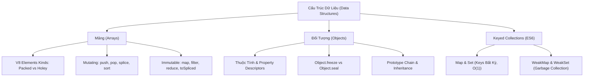

# Module 03: Cấu Trúc Dữ Liệu & Mảng (JavaScript Data Structures & Arrays)

Mục lục tài liệu ôn tập chuyên sâu về cấu trúc dữ liệu trong JavaScript: Mảng, Đối tượng, Set, Map, WeakMap, và các kỹ thuật xử lý mảng biến đổi (Mutating) vs bất biến (Immutable).

---

## 1. Tổng Quan Module

Trong JavaScript, mảng và đối tượng là hai cấu trúc dữ liệu nền tảng nhất. Nắm vững bản chất V8 Engine quản lý mảng (Packed vs Holey Elements), sự khác biệt giữa các phương thức làm thay đổi mảng gốc (`splice`, `sort`, `reverse`) và các phương thức trả về mảng mới (`toSpliced`, `toSorted`, `map`, `filter`) là điều kiện tiên quyết khi làm việc với State Management trong React/Redux và kiến trúc ứng dụng hiện đại.

---

## 2. Bản Đồ Tư Duy (Mindmap)

---

## 3. Danh Sách Tài Liệu & Code Thực Hành

- [01-arrays-fundamentals.md](file:///d:/my-project/revision-document/javascript/03-data-structures/01-arrays-fundamentals.md): Mảng cơ bản, bản chất Object, V8 Packed vs Holey, cạm bẫy `delete`, và thao tác với `length`.
- [01-arrays-demo.js](file:///d:/my-project/revision-document/javascript/03-data-structures/01-arrays-demo.js): Code thực nghiệm `Array.isArray`, cạm bẫy `delete`, so sánh holes vs undefined, `Array.of`/`Array.from`, và `arr.at()`.
- [practice.js](file:///d:/my-project/revision-document/javascript/03-data-structures/practice.js): Bộ bài tập tổng hợp tự động kiểm tra `compact()`, `chunk()`, `flatten()` đệ quy, và `unique()`.

---

## 4. Câu Hỏi Ôn Tập Phỏng Vấn (Self-Test Quiz)

1. **Tại sao `delete arr[index]` lại bị coi là Bad Practice trong JavaScript?**
   *Đáp án:* Vì toán tử `delete` chỉ xoá thuộc tính mà không làm giảm `length`, để lại một lỗ hổng (Hole) trong mảng và biến mảng từ dạng tối ưu `PACKED_ELEMENTS` thành `HOLEY_ELEMENTS` (làm giảm hiệu năng do phải tra cứu prototype chain). Nên dùng `splice()` hoặc `toSpliced()`.
2. **Làm thế nào để dọn sạch toàn bộ phần tử của một mảng mà vẫn giữ nguyên địa chỉ tham chiếu ô nhớ ban đầu?**
   *Đáp án:* Gán `arr.length = 0`. Điều này làm rỗng mảng gốc trực tiếp (in-place), khiến mọi biến đang trỏ tới mảng đó đều nhận thấy mảng rỗng mà không cần cấp phát object mới.
