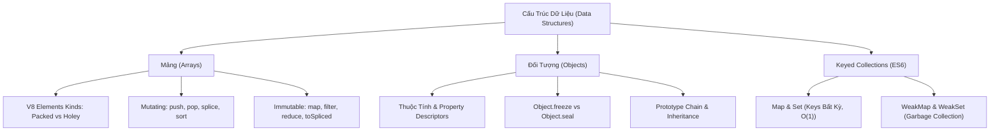

# Module 03: Cấu Trúc Dữ Liệu & Mảng (JavaScript Data Structures & Arrays)

Mục lục tài liệu ôn tập chuyên sâu về cấu trúc dữ liệu trong JavaScript: Mảng, Đối tượng, Set, Map, WeakMap, và các kỹ thuật xử lý mảng biến đổi (Mutating) vs bất biến (Immutable).

---

## 1. Tổng Quan Module

Trong JavaScript, mảng và đối tượng là hai cấu trúc dữ liệu nền tảng nhất. Nắm vững bản chất V8 Engine quản lý mảng (Packed vs Holey Elements), sự khác biệt giữa các phương thức làm thay đổi mảng gốc (`splice`, `sort`, `reverse`) và các phương thức trả về mảng mới (`toSpliced`, `toSorted`, `map`, `filter`) là điều kiện tiên quyết khi làm việc với State Management trong React/Redux và kiến trúc ứng dụng hiện đại.

---

## 2. Bản Đồ Tư Duy (Mindmap)

---

## 3. Danh Sách Tài Liệu & Code Thực Hành

- [01-arrays-fundamentals.md](file:///d:/my-project/revision-document/javascript/03-data-structures/01-arrays-fundamentals.md): Mảng cơ bản, bản chất Object, V8 Packed vs Holey, cạm bẫy `delete`, và thao tác với `length`.
- [01-arrays-demo.js](file:///d:/my-project/revision-document/javascript/03-data-structures/01-arrays-demo.js): Code thực nghiệm `Array.isArray`, cạm bẫy `delete`, so sánh holes vs undefined, `Array.of`/`Array.from`, và `arr.at()`.
- [02-array-constructor-and-type-checking.md](file:///d:/my-project/revision-document/javascript/03-data-structures/02-array-constructor-and-type-checking.md): Hàm tạo `Array()`, `RangeError`, bẫy `map()` trên empty slots, bẫy tham chiếu `.fill({})`, và nhận diện kiểu Cross-Realm.
- [02-array-constructor-demo.js](file:///d:/my-project/revision-document/javascript/03-data-structures/02-array-constructor-demo.js): Code thực nghiệm phân nhánh `new Array`, bẫy `map()` trên holes, bẫy tham chiếu `.fill({})`, và mô phỏng Iframe/Cross-Realm bằng Node.js `vm`.
- [03-array-methods-mutating-vs-immutable.md](file:///d:/my-project/revision-document/javascript/03-data-structures/03-array-methods-mutating-vs-immutable.md): Phương thức mảng biến đổi vs bất biến, hiệu năng $O(1)$ vs $O(n)$, `splice` vs `toSpliced` (ES2023), và `flat(Infinity)`.
- [03-array-methods-demo.js](file:///d:/my-project/revision-document/javascript/03-data-structures/03-array-methods-demo.js): Code thực nghiệm giá trị trả về của `push/pop/shift/unshift`, `splice` vs `toSpliced`, `slice()`, và `flat()`.
- [04-array-search-and-predicates.md](file:///d:/my-project/revision-document/javascript/03-data-structures/04-array-search-and-predicates.md): Tìm kiếm trong mảng, `indexOf` vs `includes` (SameValueZero), bẫy tìm kiếm Object theo tham chiếu, và `findLast` (ES2023).
- [04-array-search-demo.js](file:///d:/my-project/revision-document/javascript/03-data-structures/04-array-search-demo.js): Code thực nghiệm `indexOf` vs `includes` với NaN, bẫy truthy của -1, bẫy tìm object, và duyệt ngược bằng `findLast`/`findLastIndex`.
- [05-array-sort-and-timsort.md](file:///d:/my-project/revision-document/javascript/03-data-structures/05-array-sort-and-timsort.md): Thuật toán sắp xếp TimSort, cạm bẫy sắp xếp chuỗi mặc định, `toSorted`/`toReversed` (ES2023), `localeCompare("vi")`, và xáo trộn Fisher-Yates.
- [05-array-sort-demo.js](file:///d:/my-project/revision-document/javascript/03-data-structures/05-array-sort-demo.js): Code thực nghiệm bẫy Unicode sort, `toSorted`, TimSort stability, sắp xếp tiếng Việt có dấu, và Fisher-Yates shuffle.
- [06-array-iteration-and-higher-order.md](file:///d:/my-project/revision-document/javascript/03-data-structures/06-array-iteration-and-higher-order.md): Phương thức lặp mảng, cạm bẫy `reduce` mảng rỗng, `flatMap` 1-pass, bẫy Async forEach, và `with()` (ES2023).
- [06-array-iteration-demo.js](file:///d:/my-project/revision-document/javascript/03-data-structures/06-array-iteration-demo.js): Code thực nghiệm `reduce` TypeError, `flatMap` filter+map, chân lý rỗng `[].every()`, `arr.with()`, và compose bằng `reduceRight`.
- [07-array-reference-cheatsheet.md](file:///d:/my-project/revision-document/javascript/03-data-structures/07-array-reference-cheatsheet.md): Bảng tra cứu toàn tập (Master Cheatsheet), ma trận độ phức tạp Big-O, và danh sách 5 cạm bẫy lớn nhất.
- [07-array-reference-demo.js](file:///d:/my-project/revision-document/javascript/03-data-structures/07-array-reference-demo.js): Code thực nghiệm duyệt Iterators (`entries`, `keys`, `values`), bộ tứ ES2023 Change-by-Copy, và `copyWithin()`.
- [08-const-arrays-and-immutability.md](file:///d:/my-project/revision-document/javascript/03-data-structures/08-const-arrays-and-immutability.md): Mảng `const`, Immutable Binding vs Value, Block Scope Shadowing, `Object.freeze` nông, và `deepFreeze` đệ quy.
- [08-const-arrays-demo.js](file:///d:/my-project/revision-document/javascript/03-data-structures/08-const-arrays-demo.js): Code thực nghiệm gán lại const ném TypeError, mutate nội dung, block scope shadowing, và hàm `deepFreeze`.
- [09-sets-and-weaksets.md](file:///d:/my-project/revision-document/javascript/03-data-structures/09-sets-and-weaksets.md): Tập hợp duy nhất Set & WeakSet, cấu trúc `OrderedHashSet` V8, thuật toán `SameValueZero`, các phương thức đại số tập hợp ES2024 (`union`, `intersection`, `difference`), và phòng ngừa rò rỉ bộ nhớ với WeakSet.
- [09-sets-demo.js](file:///d:/my-project/revision-document/javascript/03-data-structures/09-sets-demo.js): Code thực nghiệm thao tác Set, SameValueZero, các phép toán ES2024, bẫy tham chiếu object, và Brand Checking với WeakSet.
- [practice.js](file:///d:/my-project/revision-document/javascript/03-data-structures/practice.js): Bộ bài tập tổng hợp tự động kiểm tra 9 bài toán cấu trúc dữ liệu cốt lõi.

---

## 4. Câu Hỏi Ôn Tập Phỏng Vấn (Self-Test Quiz)

1. **Tại sao `delete arr[index]` lại bị coi là Bad Practice trong JavaScript?**
   *Đáp án:* Vì toán tử `delete` chỉ xoá thuộc tính mà không làm giảm `length`, để lại một lỗ hổng (Hole) trong mảng và biến mảng từ dạng tối ưu `PACKED_ELEMENTS` thành `HOLEY_ELEMENTS` (làm giảm hiệu năng do phải tra cứu prototype chain). Nên dùng `splice()` hoặc `toSpliced()`.
2. **Làm thế nào để dọn sạch toàn bộ phần tử của một mảng mà vẫn giữ nguyên địa chỉ tham chiếu ô nhớ ban đầu?**
   *Đáp án:* Gán `arr.length = 0`. Điều này làm rỗng mảng gốc trực tiếp (in-place), khiến mọi biến đang trỏ tới mảng đó đều nhận thấy mảng rỗng mà không cần cấp phát object mới.
