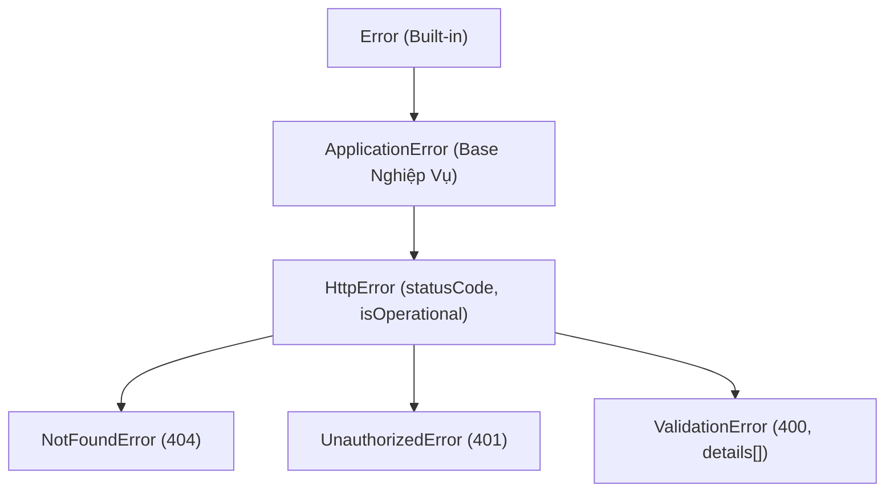

# Đối Tượng Error & Phân Cấp Lỗi Nghiệp Vụ (JavaScript Error Object & Custom Hierarchy)

Tài liệu ôn tập toàn diện về cấu trúc của đối tượng `Error` trong JavaScript: Cặp thuộc tính cốt lõi `name` và `message`, thuộc tính `stack` của V8 Engine, kỹ thuật làm sạch dấu vết với `Error.captureStackTrace`, và kiến trúc xây dựng phân cấp lỗi nghiệp vụ (Custom Error Hierarchy) chuẩn Enterprise.

---

## 1. Bản Đồ Liên Kết (Knowledge Links)

- **Tiên quyết (Prerequisites):**
  - [01-js-errors-and-built-in-types.md](file:///d:/my-project/revision-document/javascript/04-error-handling-and-debugging/01-js-errors-and-built-in-types.md) (Hệ thống lỗi tích hợp).
  - [03-error-statements-and-handling.md](file:///d:/my-project/revision-document/javascript/04-error-handling-and-debugging/03-error-statements-and-handling.md) (Kỹ thuật Rethrowing và `cause`).
- **Mở rộng tiếp theo (Next Steps):**
  - [05-debugging-and-devtools.md](file:///d:/my-project/revision-document/javascript/04-error-handling-and-debugging/05-debugging-and-devtools.md) (Phân tích Call Stack trong DevTools).
  - Thiết kế Middleware tập trung xử lý lỗi trong Express / NestJS / Next.js.
- **Khái niệm liên quan (Related):**
  - Kế thừa lớp (Class Inheritance & `super()`).
  - V8 Stack Trace API (`Error.captureStackTrace`).
  - Mã trạng thái HTTP (HTTP Status Codes) và Serialization lỗi thành JSON.

---

## 2. Bản Chất Hoạt Động (Mental Model: Giải Phẫu Đối Tượng Error)

### 1. Các Thuộc Tính Cốt Lõi Của Một Instance Error
Mọi đối tượng tạo từ `new Error("msg")` đều sở hữu 3 thuộc tính quan trọng:
1. **`name`**: Tên định danh của loại lỗi (Mặc định là `"Error"`).
2. **`message`**: Chuỗi mô tả lỗi chi tiết do người lập trình cung cấp.
3. **`stack`**: Chuỗi văn bản chứa thông tin về toàn bộ danh sách các hàm và số dòng tệp tin tại thời điểm lỗi được khởi tạo (Call Stack Snapshot).

```javascript
const err = new Error("Tài khoản không đủ số dư!");
console.log(err.name);    // "Error"
console.log(err.message); // "Tài khoản không đủ số dư!"
console.log(err.stack);   // "Error: Tài khoản không đủ số dư!\n    at Object.<anonymous>..."
```

---

### 2. V8 Engine: `Error.captureStackTrace` Làm Sạch Dấu Vết
Trong Node.js và V8 Engine, khi bạn tạo một Custom Error class, hàm khởi tạo (constructor) của lớp lỗi thường sẽ tự động xuất hiện ở dòng đầu tiên của `stack`. 

Để loại bỏ các dòng nội bộ của constructor và giúp Stack Trace chỉ trỏ thẳng vào dòng mã nơi lỗi thực sự bị ném ra, V8 cung cấp API:
```javascript
Error.captureStackTrace(this, CustomErrorClass);
```

---

### 3. Kiến Trúc Phân Cấp Lỗi Nghiệp Vụ Chuẩn Enterprise



```javascript
class ApplicationError extends Error {
  constructor(message, options = {}) {
    super(message, options);
    this.name = this.constructor.name;
    this.timestamp = new Date().toISOString();
    // V8 API làm sạch stack trace:
    if (Error.captureStackTrace) {
      Error.captureStackTrace(this, this.constructor);
    }
  }
}

class HttpError extends ApplicationError {
  constructor(statusCode, message, options = {}) {
    super(message, options);
    this.statusCode = statusCode;
    this.isOperational = true; // Phân biệt lỗi nghiệp vụ dự liệu trước vs bug hệ thống
  }
}

class ValidationError extends HttpError {
  constructor(message, errors = []) {
    super(400, message);
    this.errors = errors; // Danh sách chi tiết các field bị validate fail
  }
}
```

---

## 3. Bẫy & Lỗi Kinh Điển (Common Pitfalls)

### 1. Bẫy quên gọi `super(message)` trong Constructor
- Khi kế thừa từ `Error`, nếu không gọi `super(message)`:
  - Trong JavaScript hiện đại sẽ ném ngay `ReferenceError: Must call super constructor in derived class before accessing 'this'`.
  - Nếu thiếu đối số `message`, thuộc tính `this.message` sẽ rỗng.

### 2. Bẫy đứt gãy Prototype Chain khi biên dịch qua Babel/TypeScript cũ
- Trong các bản build ES5 cũ, việc kế thừa trực tiếp từ `Error` có thể khiến `err instanceof CustomError` trả về `false`.
- ➔ **Khắc phục trong TypeScript:** Luôn gọi `Object.setPrototypeOf(this, new.target.prototype)`.

### 3. Bẫy JSON.stringify(err) trả về chuỗi rỗng `{}`
- Các thuộc tính `message`, `stack`, `name` của `Error` được đánh dấu là **Non-enumerable (`enumerable: false`)** trong chuẩn ECMAScript.
- Do đó: `JSON.stringify(new Error("test"))` sẽ trả về **`"{}"`**!
- ➔ **Giải pháp:** Phải viết phương thức `toJSON()` tùy biến trên Custom Error class:
  ```javascript
  toJSON() {
    return {
      name: this.name,
      message: this.message,
      statusCode: this.statusCode,
      stack: this.stack
    };
  }
  ```

---

## 4. File Code Thực Hành

- [04-custom-errors-demo.js](file:///d:/my-project/revision-document/javascript/04-error-handling-and-debugging/04-custom-errors-demo.js): Code thực nghiệm cấu trúc thuộc tính của `Error`, phân cấp lớp lỗi đa tầng (`ApplicationError`, `HttpError`, `ValidationError`), kiểm chứng `instanceof`, kỹ thuật làm sạch `Error.captureStackTrace`, và giải quyết bẫy `JSON.stringify()` trả về `{}`. Chạy bằng: `node 04-custom-errors-demo.js`.

---

## 5. Câu Hỏi Tự Kiểm Tra (Self-Test Quiz)

1. **Tại sao khi gọi `JSON.stringify(new Error("Lỗi mạng"))` lại nhận về chuỗi rỗng `"{}"`?**
   *Đáp án:* Vì trong đặc tả ECMAScript, các thuộc tính chuẩn của `Error` như `name`, `message`, `stack` đều được định nghĩa với Property Descriptor `enumerable: false`. Hàm `JSON.stringify()` chỉ tuần tự hóa các thuộc tính đếm được (enumerable properties), do đó nó bỏ qua toàn bộ các thuộc tính này và trả về object rỗng.

2. **Mục đích của việc phân biệt `isOperational: true` trên các lớp lỗi nghiệp vụ trong Node.js/Backend là gì?**
   *Đáp án:* Giúp phân biệt ranh giới giữa Lỗi Vận Hành (Operational Errors - các lỗi đã dự trù trước như sai mật khẩu, thiếu param, không tìm thấy ID) và Lỗi Lập Trình (Programmer Errors / Bugs - như ném TypeError, đọc thuộc tính của undefined). Khi gặp bug hệ thống (`isOperational !== true`), server có thể ghi log khẩn cấp và chủ động khởi động lại tiến trình worker để tránh rò rỉ trạng thái hỏng.
