# Module 04: Xử Lý Lỗi & Kỹ Thuật Debug (JavaScript Error Handling & Debugging)

Mục lục tài liệu ôn tập toàn diện về cơ chế kiểm soát ngoại lệ, bẫy lỗi im lặng (Silent Errors), đối tượng Error, câu lệnh điều khiển, và nghệ thuật gỡ lỗi trong JavaScript hiện đại.

---

## 1. Tổng Quan Module

Một ứng dụng JavaScript chuyên nghiệp không chỉ chạy đúng khi có dữ liệu hoàn hảo, mà phải có khả năng ứng biến bền bỉ (resilient) trước mọi tình huống hỏng hóc: Dữ liệu mạng sai format, lỗi logic lập trình viên, hoặc giới hạn tài nguyên hệ thống.

Module này cung cấp nền tảng kiến trúc vững chắc từ cơ chế Call Stack Unwinding của V8 Engine, bộ kiểu lỗi chuẩn ECMAScript, kỹ thuật phòng thủ lỗi im lặng với `"use strict"`, phân cấp lỗi nghiệp vụ (Custom Error Hierarchy), đến việc làm chủ công cụ DevTools và xử lý ngoại lệ bất đồng bộ.

---

## 2. Bản Đồ Tư Duy (Mindmap)

```mermaid
graph TD
  ErrorsModule["Xử Lý Lỗi & Debugging (Module 04)"] --> BuiltinErrors["Kiểu Lỗi Tích Hợp (Built-in Errors)"]
  ErrorsModule --> SilentErrors["Lỗi Im Lặng (Silent Errors)"]
  ErrorsModule --> Statements["Câu Lệnh Điều Khiển (try / catch / finally)"]
  ErrorsModule --> Hierarchy["Phân Cấp Lỗi (Custom Error Hierarchy)"]
  ErrorsModule --> DevTools["Công Cụ Gỡ Lỗi (DevTools & Console)"]

  BuiltinErrors --> Ref["ReferenceError (TDZ, Undefined Var)"]
  BuiltinErrors --> Type["TypeError (Wrong Type, Non-function)"]
  BuiltinErrors --> Range["RangeError (Stack Overflow, Negative Length)"]
  BuiltinErrors --> Syntax["SyntaxError (Runtime JSON / Eval Parse)"]

  SilentErrors --> NanInf["NaN Propagation & 1 / 0 = Infinity"]
  SilentErrors --> AssignIf["if (x = true) Assignment Bug"]
  SilentErrors --> StrictMode["'use strict' Elimination"]

  Statements --> TryCatch["try...catch (Optional Catch Binding)"]
  Statements --> FinallyTrap["finally Override return Trap"]
  Statements --> ErrorCause["Error Cause Chaining (ES2022)"]

  Hierarchy --> CaptureStack["Error.captureStackTrace (V8)"]
  Hierarchy --> JsonTrap["JSON.stringify({}) non-enumerable trap"]

  DevTools --> Breakpoints["Line, Conditional, DOM Breakpoints"]
  DevTools --> ConsoleApi["table, trace, time/timeEnd"]
  DevTools --> AsyncStack["Zero-Cost Async Stack Traces"]
```

---

## 3. Danh Sách Tài Liệu & Code Thực Hành

- [01-js-errors-and-built-in-types.md](file:///d:/my-project/revision-document/javascript/04-error-handling-and-debugging/01-js-errors-and-built-in-types.md): Cơ chế Call Stack Unwinding V8, 7 kiểu lỗi chuẩn (`ReferenceError`, `TypeError`, `RangeError`, `SyntaxError`, `URIError`, `AggregateError`), và cạm bẫy TDZ.
- [01-js-errors-demo.js](file:///d:/my-project/revision-document/javascript/04-error-handling-and-debugging/01-js-errors-demo.js): Code thực nghiệm kích hoạt và bắt toàn bộ các kiểu lỗi, kiểm chứng Stack Unwinding qua 3 tầng hàm.
- [02-silent-errors-and-defensive-coding.md](file:///d:/my-project/revision-document/javascript/04-error-handling-and-debugging/02-silent-errors-and-defensive-coding.md): Căn nguyên lịch sử "ngôn ngữ vị tha" năm 1995, 6 bẫy lỗi im lặng (`NaN`, `Infinity`, gán trong `if`, ép kiểu), và vũ khí `"use strict"`.
- [02-silent-errors-demo.js](file:///d:/my-project/revision-document/javascript/04-error-handling-and-debugging/02-silent-errors-demo.js): Code thực nghiệm lan truyền NaN, chia cho 0, gán nhầm trong `if`, Optional Chaining `?.`, và Nullish Coalescing `??`.
- [03-error-statements-and-handling.md](file:///d:/my-project/revision-document/javascript/04-error-handling-and-debugging/03-error-statements-and-handling.md): Luồng `try-catch-finally`, bẫy `return` trong `finally`, Optional Catch Binding (ES2019), Rethrowing, và Error Cause Chaining (ES2022).
- [03-error-statements-demo.js](file:///d:/my-project/revision-document/javascript/04-error-handling-and-debugging/03-error-statements-demo.js): Code thực nghiệm thứ tự thực thi, bẫy ghi đè `return`, kỹ thuật ném lại lỗi có chọn lọc, và chuỗi nguyên nhân lỗi `cause`.
- [04-custom-error-objects-and-hierarchy.md](file:///d:/my-project/revision-document/javascript/04-error-handling-and-debugging/04-custom-error-objects-and-hierarchy.md): Cấu trúc đối tượng `Error`, `Error.captureStackTrace` làm sạch stack, phân cấp lỗi nghiệp vụ Enterprise, và bẫy `JSON.stringify({})`.
- [04-custom-errors-demo.js](file:///d:/my-project/revision-document/javascript/04-error-handling-and-debugging/04-custom-errors-demo.js): Code thực nghiệm kế thừa đa tầng `ApplicationError -> HttpError -> NotFoundError/ValidationError`, và viết đè `toJSON()`.
- [05-debugging-and-devtools.md](file:///d:/my-project/revision-document/javascript/04-error-handling-and-debugging/05-debugging-and-devtools.md): Câu lệnh `debugger`, các loại Breakpoint trong DevTools, Console API chuyên dụng (`table`, `trace`, `time`), và Async Call Stacks.
- [05-debugging-demo.js](file:///d:/my-project/revision-document/javascript/04-error-handling-and-debugging/05-debugging-demo.js): Code thực nghiệm console nâng cao, theo dõi Call Stack với `console.trace`, và bắt `unhandledRejection` toàn cục.
- [06-error-and-debugging-reference.md](file:///d:/my-project/revision-document/javascript/04-error-handling-and-debugging/06-error-and-debugging-reference.md): Bảng tra cứu ma trận lỗi toàn tập, phím tắt DevTools, và 7 quy tắc vàng xử lý lỗi.
- [06-error-reference-demo.js](file:///d:/my-project/revision-document/javascript/04-error-handling-and-debugging/06-error-reference-demo.js): Code thực nghiệm quy trình Error Handling Pipeline hoàn chỉnh từ Controller đến Service.
- [practice.js](file:///d:/my-project/revision-document/javascript/04-error-handling-and-debugging/practice.js): Bộ bài tập thực hành tự động kiểm tra 5 kỹ năng xử lý lỗi cốt lõi.

---

## 4. Câu Hỏi Ôn Tập Phỏng Vấn (Self-Test Quiz)

1. **Điều gì xảy ra khi bạn gọi `return` bên trong cả hai khối `try` và `finally`?**
   *Đáp án:* Câu lệnh `return` trong khối `finally` sẽ ghi đè và hủy bỏ hoàn toàn giá trị trả về của khối `try`. Trình biên dịch V8 sẽ hoàn tất khối `finally` trước khi rời khỏi hàm và lấy giá trị cuối cùng từ `finally`.

2. **Tại sao việc ném một chuỗi văn bản (`throw "Error"`) lại bị xem là Anti-pattern nghiêm trọng trong JavaScript?**
   *Đáp án:* Vì chỉ có các đối tượng kế thừa từ lớp `Error` mới được V8 Engine đính kèm thuộc tính `stack` (Call Stack Trace) ghi lại chính xác dòng mã và tệp tin nơi lỗi phát sinh. Việc ném chuỗi nguyên thủy khiến các công cụ giám sát (Sentry, Datadog) không thể theo dõi nguồn gốc lỗi, gây khó khăn cho việc debug.
