# Module 05: Chuẩn Mực Viết Mã, Sai Lầm Thường Gặp & Tối Ưu Hiệu Năng (JavaScript Style Guide, Mistakes & Performance)

Mục lục tài liệu ôn tập toàn diện về quy chuẩn lập trình chuyên nghiệp, phân tích căn nguyên các lỗi sai kinh điển, và kỹ thuật tối ưu hóa tốc độ thực thi với V8 Engine.

---

## 1. Tổng Quan Module

Viết mã JavaScript chạy được là chưa đủ; viết mã dễ đọc, dễ bảo trì, tránh bẫy ngữ pháp của ngôn ngữ và đạt hiệu năng tối đa trên V8 Engine mới là mục tiêu của lập trình viên cấp cao.

Module này hệ thống hóa các quy ước phong cách chuẩn công nghiệp (Airbnb / Google Style Guides), giải mã cơ chế tự động chèn chấm phẩy ASI, phân tích bẫy số thực IEEE 754, và đào sâu vào kiến trúc tối ưu hóa động cơ V8 (Hidden Classes, De-optimizations, DOM Bridge C++).

---

## 2. Bản Đồ Tư Duy (Mindmap)

```mermaid
graph TD
  StyleModule["Quy Chuẩn Mã & Hiệu Năng (Module 05)"] --> Conventions["Quy Ước Viết Mã (Conventions)"]
  StyleModule --> BestPractices["Thực Hành Tốt Nhất (Best Practices)"]
  StyleModule --> Mistakes["Sai Lầm Thường Gặp (Common Mistakes)"]
  StyleModule --> Performance["Tối Ưu Hiệu Năng (Performance)"]

  Conventions --> Naming["camelCase, PascalCase, #Private"]
  Conventions --> ASI["ASI (return on newline trap)"]
  Conventions --> Style1TBS["1TBS Bracing Style"]

  BestPractices --> NoGlobal["Zero Global Pollution & IIFE"]
  BestPractices --> NoWrappers["Cấm new String / new Boolean"]
  BestPractices --> StrictEquality["Luôn dùng === thay vì =="]
  BestPractices --> BanEvalWith["Cấm eval() & with (Tránh De-opt)"]

  Mistakes --> FloatBug["0.1 + 0.2 !== 0.3 (Number.EPSILON)"]
  Mistakes --> NamedArray["Named Indexes in Array (Phá vỡ length)"]
  Mistakes --> NullVsUndef["Phân biệt rõ null vs undefined"]

  Performance --> V8HiddenClass["V8 Hidden Classes & Tác hại của delete"]
  Performance --> LoopCache["Cached Length in Loops"]
  Performance --> DomBridge["DOM C++ Bridge & DocumentFragment Batching"]
  Performance --> ScriptLoading["defer vs async Script Loading"]
```

---

## 3. Danh Sách Tài Liệu & Code Thực Hành

- [01-conventions-and-style-guide.md](file:///d:/my-project/revision-document/javascript/05-style-guide-and-best-practices/01-conventions-and-style-guide.md): Quy ước đặt tên chuẩn, cơ chế tự động chèn dấu chấm phẩy ASI của V8, cạm bẫy `return` ngắt dòng, và phong cách khối lệnh 1TBS.
- [01-conventions-demo.js](file:///d:/my-project/revision-document/javascript/05-style-guide-and-best-practices/01-conventions-demo.js): Code thực nghiệm cạm bẫy ASI return trả về `undefined`, bug dòng mới bắt đầu bằng `[`, và trường riêng tư `#privateField`.
- [02-best-practices-and-clean-code.md](file:///d:/my-project/revision-document/javascript/05-style-guide-and-best-practices/02-best-practices-and-clean-code.md): Phòng chống ô nhiễm phạm vi toàn cục, cạm bẫy `new Boolean(false)` là truthy, lý do V8 cấm tuyệt đối `eval()` và `with`.
- [02-best-practices-demo.js](file:///d:/my-project/revision-document/javascript/05-style-guide-and-best-practices/02-best-practices-demo.js): Code thực nghiệm wrapper object truthy trap, so sánh lỏng vs chặt chẽ, đóng gói IIFE, và cấm lệnh `with` trong Strict Mode.
- [03-common-mistakes-and-anti-patterns.md](file:///d:/my-project/revision-document/javascript/05-style-guide-and-best-practices/03-common-mistakes-and-anti-patterns.md): Sai số số thực IEEE 754 `0.1 + 0.2`, so sánh an toàn bằng `Number.EPSILON`, cạm bẫy mảng Named Index, và phân biệt `null` vs `undefined`.
- [03-common-mistakes-demo.js](file:///d:/my-project/revision-document/javascript/05-style-guide-and-best-practices/03-common-mistakes-demo.js): Code thực nghiệm sai số số thực, kiểm chứng `arr["name"]` không tăng length, và so sánh bản chất `null` vs `undefined`.
- [04-performance-optimization-and-v8.md](file:///d:/my-project/revision-document/javascript/05-style-guide-and-best-practices/04-performance-optimization-and-v8.md): Chi phí cầu nối C++ và DOM, V8 Hidden Classes & Inline Caching, tác hại suy giảm hiệu năng của `delete`, và chiến lược nạp script `defer` vs `async`.
- [04-performance-demo.js](file:///d:/my-project/revision-document/javascript/05-style-guide-and-best-practices/04-performance-demo.js): Code thực nghiệm đo đạc hiệu năng vòng lặp, benchmark tác hại làm chậm gấp đôi của `delete` đối với Hidden Class, và kỹ thuật gom nhóm Batching.
- [practice.js](file:///d:/my-project/revision-document/javascript/05-style-guide-and-best-practices/practice.js): Bộ bài tập kiểm tra tự động 5 kỹ năng: `areFloatsEqual`, `omitProperties`, `memoize`, `safeToNumber`, và `chunkArray`.

---

## 4. Câu Hỏi Ôn Tập Phỏng Vấn (Self-Test Quiz)

1. **Tại sao `0.1 + 0.2 === 0.3` lại trả về `false` trong JavaScript và hầu hết các ngôn ngữ hiện đại?**
   *Đáp án:* Vì JavaScript tuân theo chuẩn biểu diễn số thực dấu phẩy động nhị phân 64-bit IEEE 754. Trong hệ nhị phân (cơ số 2), các phân số thập phân như $1/10$ ($0.1$) và $1/5$ ($0.2$) là các số vô hạn tuần hoàn. Khi cộng lại và làm tròn ở bit thứ 53, kết quả lưu trữ trong bộ nhớ thực tế là `0.30000000000000004`, khác với giá trị lý thuyết `0.3`.

2. **Tại sao việc thay thế `delete obj.prop` bằng cách tạo bản sao hoặc gán `undefined` lại giúp ứng dụng chạy nhanh hơn?**
   *Đáp án:* Khi gọi `delete`, V8 Engine phải thay đổi cấu trúc định hình Hidden Class của đối tượng, biến đối tượng thành Dictionary Mode (tra cứu bằng băm chậm). Bằng cách gán `undefined` hoặc dùng hàm lọc tạo bản sao mới, Hidden Class gốc được bảo toàn nguyên vẹn, giúp V8 tận dụng tối đa cơ chế tối ưu Inline Caching (IC) cực nhanh.
