# Module 06: DOM, HTML Events & HTML-First

## 🎯 Mục Tiêu Học Tập
Module này cung cấp nền tảng kiến trúc chuyên sâu về tương tác giữa JavaScript và trình duyệt web (Browser Engine):
1. Thấu suốt bản chất cây DOM phân cấp và sự khác biệt cốt tử giữa `Node` và `Element`.
2. Phân biệt Live `HTMLCollection` và Static `NodeList` để tránh bẫy dịch chuyển chỉ mục (Index Shifting).
3. Thao tác DOM an toàn, phòng chống lỗ hổng Cross-Site Scripting (XSS) và tối ưu hóa hiệu năng chèn phần tử với `DocumentFragment`.
4. Nắm vững 3 giai đoạn truyền sự kiện (Capturing, Target, Bubbling), kỹ thuật Ủy quyền sự kiện (Event Delegation) và dọn dẹp bộ nhớ hiện đại bằng `AbortController`.
5. Ứng dụng triết lý HTML-First, Constraint Validation API native của trình duyệt và mô hình Tăng cường lũy tiến (Progressive Enhancement).
6. Hiểu rõ chu trình hiển thị (Critical Rendering Path), hiện tượng Layout Thrashing (Forced Synchronous Layout) và hoạt họa chuẩn nhịp V-Sync với `requestAnimationFrame`.

---

## 🗺️ Bản Đồ Kiến Trúc Module (Architecture Mindmap)

```mermaid
graph TD
    A["JavaScript & Web Platform"] --> B["DOM Core Architecture"]
    A --> C["Event Engine"]
    A --> D["Rendering & Performance"]
    A --> E["HTML-First & Web Standards"]

    B --> B1["Node vs Element Hierarchy"]
    B --> B2["Live Collection vs Static NodeList"]
    B --> B3["Closest & Traversal API"]
    B --> B4["DOM Sanitization & Fragment Batching"]

    C --> C1["3 Phases: Capture -> Target -> Bubble"]
    C --> C2["Event Delegation (e.target.closest)"]
    C --> C3["stopPropagation vs preventDefault"]
    C --> C4["Modern Cleanup: AbortController Signal"]

    D --> D1["Pipeline: DOM -> CSSOM -> Layout -> Paint -> Composite"]
    D --> D2["Layout Thrashing: Avoid Read/Write Interleaving"]
    D --> D3["requestAnimationFrame: Delta Time Physics"]
    D --> D4["FastDOM Pattern: Read-Batch / Write-Batch"]

    E --> E1["Native Semantic State (<details>, <dialog>)"]
    E --> E2["Constraint Validation API (validity, checkValidity)"]
    E --> E3["FormData API Native"]
    E --> E4["Progressive Enhancement Fallback"]
```



---

## 📚 Danh Mục Bài Học & File Thực Hành

| STT | Chủ Đề Chi Tiết | Tài Liệu Lý Thuyết (.md) | Code Kiểm Chứng (.js) | Trọng Tâm Kiến Thức |
| :---: | :--- | :--- | :--- | :--- |
| **01** | **Cấu Trúc Cây DOM & Bộ Chọn** | [01-html-dom-architecture-and-selectors.md](file:///d:/my-project/revision-document/javascript/06-dom-and-web-apis/01-html-dom-architecture-and-selectors.md) | [01-dom-selectors-demo.js](file:///d:/my-project/revision-document/javascript/06-dom-and-web-apis/01-dom-selectors-demo.js) | Node vs Element, Live HTMLCollection vs Static NodeList, `closest()` |
| **02** | **Thao Tác Phần Tử, Style & Chống XSS** | [02-dom-manipulation-and-styles.md](file:///d:/my-project/revision-document/javascript/06-dom-and-web-apis/02-dom-manipulation-and-styles.md) | [02-dom-manipulation-demo.js](file:///d:/my-project/revision-document/javascript/06-dom-and-web-apis/02-dom-manipulation-demo.js) | `innerHTML` XSS risk, `textContent`, `classList`, `DocumentFragment`, `dataset` |
| **03** | **Cơ Chế Sự Kiện & Event Delegation** | [03-html-events-and-delegation.md](file:///d:/my-project/revision-document/javascript/06-dom-and-web-apis/03-html-events-and-delegation.md) | [03-events-delegation-demo.js](file:///d:/my-project/revision-document/javascript/06-dom-and-web-apis/03-events-delegation-demo.js) | 3 Pha lan truyền, `target` vs `currentTarget`, Ủy quyền sự kiện, `{ once: true }` |
| **04** | **HTML-First & Progressive Enhancement** | [04-html-first-and-progressive-enhancement.md](file:///d:/my-project/revision-document/javascript/06-dom-and-web-apis/04-html-first-and-progressive-enhancement.md) | [04-html-first-demo.js](file:///d:/my-project/revision-document/javascript/06-dom-and-web-apis/04-html-first-demo.js) | Semantic State Machine, Constraint Validation API, `FormData`, NoScript Fallback |
| **05** | **Hoạt Họa DOM & Rendering Pipeline** | [05-dom-animations-and-raf.md](file:///d:/my-project/revision-document/javascript/06-dom-and-web-apis/05-dom-animations-and-raf.md) | [05-dom-animations-demo.js](file:///d:/my-project/revision-document/javascript/06-dom-and-web-apis/05-dom-animations-demo.js) | Reflow/Repaint, Layout Thrashing, `requestAnimationFrame`, Delta Time $\Delta t$ |
| **06** | **Sổ Tay Tra Cứu Toàn Diện DOM & Events** | [06-dom-and-events-reference.md](file:///d:/my-project/revision-document/javascript/06-dom-and-web-apis/06-dom-and-events-reference.md) | [06-dom-reference-demo.js](file:///d:/my-project/revision-document/javascript/06-dom-and-web-apis/06-dom-reference-demo.js) | Cheatsheet Tra cứu nhanh, Bảng phân loại Event Taxonomy, Hủy listener với `AbortController` |

---

## 🧪 Bài Thực Hành Tổng Hợp (Module Test Suite)

Toàn bộ 5 thử thách nâng cao được đóng gói độc lập trong file:
👉 **[practice.js](file:///d:/my-project/revision-document/javascript/06-dom-and-web-apis/practice.js)**

### Cách chạy kiểm tra:
```bash
node javascript/06-dom-and-web-apis/practice.js
```
Kết quả kiểm thử tự động xác minh 100% assertions thành công không cần cài thêm thư viện ngoại vi.
