# Module 07: Dự Án Thực Hành Ứng Dụng DOM & Web APIs (Practical Projects)

## 🎯 Mục Tiêu Học Tập
Module này chuyển hóa các kiến thức lý thuyết về JavaScript, DOM, Event và Web APIs thành **5 dự án ứng dụng thực chiến chuẩn Enterprise**:
1. **Interactive Counter**: Xây dựng máy trạng thái hướng dữ liệu (State Reducer), giới hạn biên an toàn (Bounds Clamping), hỗ trợ Undo/Redo với mẫu Memento và tiếp cận a11y với `aria-live`.
2. **Event Listener Playground**: Làm chủ hệ tọa độ chuột (`clientX`, `pageX`, `offsetX`), phân tích phím tắt (`e.key` vs `e.code`), tối ưu hiệu năng với Debounce & Throttle và kiểm soát bộ nhớ qua Circular Buffer.
3. **Production Todo App**: Áp dụng luồng dữ liệu 1 chiều (Unidirectional Data Flow), cập nhật bất biến (Immutable State), phòng chống triệt để lỗ hổng XSS và tối ưu bộ nhớ bằng Event Delegation.
4. **Accessible Modal Dialog**: So sánh chuyên sâu thẻ `<dialog>` native (Top Layer, Backdrop) và Custom Modal, giải thuật bẫy tiêu điểm (Focus Trap) và khôi phục tiêu điểm (Focus Restoration).
5. **Enterprise Form Validation**: Đo lường độ mạnh mật khẩu theo Entropy, xây dựng Validation Pipeline kết hợp Constraint Validation API và thu thập payload sạch với `FormData`.

---

## 🗺️ Bản Đồ Kiến Trúc Dự Án (Architecture Mindmap)

```mermaid
graph TD
    A["Thực Hành Ứng Dụng DOM"] --> B["Dự Án 01: Interactive Counter"]
    A --> C["Dự Án 02: Event Playground"]
    A --> D["Dự Án 03: Production Todo App"]
    A --> E["Dự Án 04: Accessible Modal"]
    A --> F["Dự Án 05: Enterprise Form"]

    B --> B1["State Reducer & Clamping"]
    B --> B2["Memento Undo/Redo"]
    B --> B3["aria-live='polite'"]

    C --> C1["Mouse: client vs page vs offset"]
    C --> C2["Keyboard: e.key vs e.code"]
    C --> C3["Debounce & Throttle Engine"]

    D --> D1["Unidirectional Data Flow"]
    D --> D2["XSS Sanitization Engine"]
    D --> D3["Event Delegation & LocalStorage"]

    E --> E1["Native <dialog> Top Layer"]
    E --> E2["Focus Trapping Algorithm"]
    E --> E3["Backdrop Hit-Testing & Esc Key"]

    F --> F1["Password Entropy Meter"]
    F --> F2["Realtime Debounced Validation"]
    F --> F3["FormData Payload Extraction"]
```



---

## 📚 Danh Mục Bài Học & File Thực Hành

| STT | Tên Dự Án Chi Tiết | Tài Liệu Hướng Dẫn (.md) | Code Kiểm Chứng (.js) | Trọng Tâm Kỹ Thuật |
| :---: | :--- | :--- | :--- | :--- |
| **01** | **Bộ Đếm Tương Tác Doanh Nghiệp** | [01-interactive-counter.md](file:///d:/my-project/revision-document/javascript/07-practical-projects/01-interactive-counter.md) | [01-counter-demo.js](file:///d:/my-project/revision-document/javascript/07-practical-projects/01-counter-demo.js) | State Reducer, Clamping, Memento History, LocalStorage Sync, `aria-live` |
| **02** | **Phòng Thí Nghiệm Sự Kiện** | [02-event-listener-playground.md](file:///d:/my-project/revision-document/javascript/07-practical-projects/02-event-listener-playground.md) | [02-event-listener-demo.js](file:///d:/my-project/revision-document/javascript/07-practical-projects/02-event-listener-demo.js) | Tọa độ chuột (`clientX/pageX/offsetX`), Phím tắt, Debounce vs Throttle, Circular Buffer |
| **03** | **Quản Lý Công Việc Todo App** | [03-production-todo-app.md](file:///d:/my-project/revision-document/javascript/07-practical-projects/03-production-todo-app.md) | [03-todo-app-demo.js](file:///d:/my-project/revision-document/javascript/07-practical-projects/03-todo-app-demo.js) | CRUD Bất biến, Phòng chống XSS, Event Delegation trên list, LocalStorage Schema |
| **04** | **Hộp Thoại Modal Chuẩn Tiếp Cận** | [04-accessible-modal-dialog.md](file:///d:/my-project/revision-document/javascript/07-practical-projects/04-accessible-modal-dialog.md) | [04-modal-dialog-demo.js](file:///d:/my-project/revision-document/javascript/07-practical-projects/04-modal-dialog-demo.js) | Native `<dialog>` Top Layer, Focus Trap (Tab/Shift+Tab), Focus Restoration, Backdrop Click |
| **05** | **Xác Thực Biểu Mẫu Doanh Nghiệp** | [05-enterprise-form-validation.md](file:///d:/my-project/revision-document/javascript/07-practical-projects/05-enterprise-form-validation.md) | [05-form-validation-demo.js](file:///d:/my-project/revision-document/javascript/07-practical-projects/05-form-validation-demo.js) | Password Entropy, Validation Pipeline, Constraint Validation API, `FormData` |

---

## 🧪 Bộ Kiểm Thử Tự Động (Module Test Suite)

Tất cả 5 thử thách nâng cao được kiểm chứng tự động trong file:
👉 **[practice.js](file:///d:/my-project/revision-document/javascript/07-practical-projects/practice.js)**

### Cách chạy kiểm tra:
```bash
node javascript/07-practical-projects/practice.js
```
100% assertions được xác minh tự động bằng `node:assert/strict` không cần cài đặt thêm thư viện.
