# Module 08: Tra Cứu Toàn Cục & Cú Pháp Ngôn Ngữ (Language Reference)

## 🎯 Mục Tiêu Học Tập
Module này cung cấp tài liệu tra cứu chuẩn mực và chuyên sâu về cú pháp cốt lõi của JavaScript theo đặc tả ECMAScript:
1. **Statements & Declarations**: Phân biệt bản chất Statement vs Expression, hiểu cấu trúc Completion Record (`[[Type]]`, `[[Value]]`, `[[Target]]`), sử dụng Labeled Statements để tối ưu vòng lặp đa tầng và cơ chế ASI.
2. **Reserved Words & Identifiers**: Nắm vững danh sách từ khóa cấm, từ khóa nghiêm ngặt (Strict Mode), từ khóa theo ngữ cảnh (`await`, `yield`, `using`), quy chuẩn ký tự định danh Unicode và bẫy che khuất biến toàn cục (Shadowing).
3. **Operators & Expressions**: Làm chủ toàn bộ hệ thống toán tử từ Số học, Dịch bit 32-bit (`ToInt32`, `ToUint32`), Ngắn mạch (`||` vs `??`), Phép gán logic hiện đại (`&&=`, `||=`, `??=`), Toán tử dấu phẩy `,` và tương thích BigInt.
4. **Operator Precedence & Associativity**: Nắm chắc bảng 18 cấp độ ưu tiên của ECMAScript, chiều kết hợp từ phải qua trái (Right-to-Left Associativity của `**` và `=`), phân biệt thứ tự gom nhóm và thứ tự thực thi tuần tự từ trái qua phải.

---

## 🗺️ Bản Đồ Kiến Trúc Ngôn Ngữ (Language Reference Mindmap)

```mermaid
graph TD
    A["ECMAScript Language Reference"] --> B["Statements & Declarations"]
    A --> C["Keywords & Identifiers"]
    A --> D["Operators & Expressions"]
    A --> E["Precedence & Associativity"]

    B --> B1["Expression vs Statement"]
    B --> B2["Completion Record ([[Type]], [[Value]])"]
    B --> B3["Labeled Loops (break / continue label)"]
    B --> B4["ASI Automatic Semicolon Insertion"]

    C --> C1["Reserved Keywords (class, delete, return...)"]
    C --> C2["Strict Mode Restrictions (eval, arguments)"]
    C --> C3["Contextual Keywords (await, yield, using)"]
    C --> C4["Unicode Identifier Grammar (\p{ID_Start})"]

    D --> D1["Bitwise ToInt32 & >>> 0 ToUint32"]
    D --> D2["Nullish (??) vs Falsy (||)"]
    D --> D3["Logical Assignments (&&=, ||=, ??=)"]
    D --> D4["Relational (in vs Object.hasOwn)"]

    E --> E1["18-Level Precedence Table"]
    E --> E2["Right-to-Left (**, =, ?: )"]
    E --> E3["Syntax Guard: Disallow ?? with &&/||"]
    E --> E4["Left-to-Right Evaluation Order"]
```



---

## 📚 Danh Mục Bài Học & File Thực Hành

| STT | Tên Chủ Đề Chi Tiết | Tài Liệu Hướng Dẫn (.md) | Code Kiểm Chứng (.js) | Trọng Tâm Kỹ Thuật |
| :---: | :--- | :--- | :--- | :--- |
| **01** | **Bản Chất Câu Lệnh & Khai Báo** | [01-statements-and-declarations.md](file:///d:/my-project/revision-document/javascript/08-language-reference/01-statements-and-declarations.md) | [01-statements-demo.js](file:///d:/my-project/revision-document/javascript/08-language-reference/01-statements-demo.js) | Statement vs Expression, Completion Record, Labeled loops, ASI |
| **02** | **Từ Khóa Dự Trữ & Tên Định Danh** | [02-reserved-words-and-identifiers.md](file:///d:/my-project/revision-document/javascript/08-language-reference/02-reserved-words-and-identifiers.md) | [02-reserved-words-demo.js](file:///d:/my-project/revision-document/javascript/08-language-reference/02-reserved-words-demo.js) | Reserved Words, Strict Mode, Contextual Keywords (`await`, `using`), Unicode Scanner |
| **03** | **Toàn Cảnh Toán Tử & Biểu Thức** | [03-operators-and-expressions.md](file:///d:/my-project/revision-document/javascript/08-language-reference/03-operators-and-expressions.md) | [03-operators-demo.js](file:///d:/my-project/revision-document/javascript/08-language-reference/03-operators-demo.js) | Bitwise ToInt32, `??` vs `\|\|`, Logical Assignments `??=`, Toán tử `,`, BigInt |
| **04** | **Thứ Tự Ưu Tiên & Chiều Kết Hợp** | [04-operator-precedence-and-associativity.md](file:///d:/my-project/revision-document/javascript/08-language-reference/04-operator-precedence-and-associativity.md) | [04-precedence-demo.js](file:///d:/my-project/revision-document/javascript/08-language-reference/04-precedence-demo.js) | Bảng 18 cấp độ ưu tiên, Right-to-Left `**`, Cấm trộn `??` với `&&`, Thứ tự thực thi |

---

## 🧪 Bộ Kiểm Thử Tự Động (Module Test Suite)

Toàn bộ 5 thử thách nâng cao được kiểm thử tự động tại file:
👉 **[practice.js](file:///d:/my-project/revision-document/javascript/08-language-reference/practice.js)**

### Cách chạy kiểm tra:
```bash
node javascript/08-language-reference/practice.js
```
100% assertions được kiểm định tự động với thư viện `node:assert/strict`.
