# Module 09: Lập Trình Bất Đồng Bộ & Vòng Lặp Sự Kiện (Asynchronous JavaScript)

## 🎯 Mục Tiêu Học Tập
Module này cung cấp kiến trúc chuyên sâu về mô hình đồng thời (Concurrency Model) và cơ chế xử lý bất đồng bộ trong JavaScript:
1. **Callbacks & Event Loop**: Hiểu rõ chu trình điều phối giữa Call Stack, Memory Heap, Web APIs/Libuv, phân biệt độ ưu tiên sống còn giữa Microtask Queue và Macrotask Queue, phòng ngừa Event Loop Starvation.
2. **Promises & Combinators**: Nắm vững cỗ máy 3 trạng thái của Promise (`Pending`, `Fulfilled`, `Rejected`), bộ tứ Combinators (`Promise.all`, `Promise.allSettled`, `Promise.race`, `Promise.any`) và thuật toán tự viết Polyfill chuẩn ECMAScript.
3. **Async / Await**: Bản chất Coroutine kết hợp giữa Generator (`function*` / `yield`) và Promise Runner, phân biệt thực thi Tuần tự (Sequential) vs Song song (Parallel), xử lý lỗi toàn diện với `try..catch..finally` và Top-level await trong ES Modules.
4. **Fetch API & AbortController**: Nắm vững 2 tầng Promise của `fetch()`, quy tắc khóa luồng `bodyUsed`, tự động ngắt kết nối với `AbortSignal.timeout(ms)` và triệt tiêu lỗi bất đồng bộ Race Condition trong giao diện tìm kiếm.

---

## 🗺️ Bản Đồ Kiến Trúc Bất Đồng Bộ (Async Architecture Mindmap)

```mermaid
graph TD
    A["Asynchronous JavaScript"] --> B["Event Loop & Concurrency"]
    A --> C["Promise Ecosystem"]
    A --> D["Async / Await Patterns"]
    A --> E["Network & Stream Control"]

    B --> B1["Call Stack vs Web APIs / Libuv"]
    B --> B2["Microtasks (Promise.then, queueMicrotask)"]
    B --> B3["Macrotasks (setTimeout, I/O)"]
    B --> B4["Starvation Prevention & Render Hook"]

    C --> C1["3 States: Pending -> Fulfilled / Rejected"]
    C --> C2["Promise.all (Fail-Fast)"]
    C --> C3["Promise.allSettled (Resilient)"]
    C --> C4["Promise.race (Timeout) & Promise.any"]

    D --> D1["Syntactic Sugar over Coroutines"]
    D --> D2["Parallelism (Promise.all vs for..of await)"]
    D --> D3["Top-Level Await in ES Modules"]
    D --> D4["Exponential Backoff Retry Pipeline"]

    E --> E1["Two-Stage Fetch (Headers -> ReadableStream)"]
    E --> E2["Response.ok & bodyUsed Stream Lock"]
    E --> E3["AbortController & Signal Lifecycle"]
    E --> E4["Race Condition Defense in Search"]
```



---

## 📚 Danh Mục Bài Học & File Thực Hành

| STT | Tên Chủ Đề Chi Tiết | Tài Liệu Hướng Dẫn (.md) | Code Kiểm Chứng (.js) | Trọng Tâm Kỹ Thuật |
| :---: | :--- | :--- | :--- | :--- |
| **01** | **Bản Chất Bất Đồng Bộ & Vòng Lặp Sự Kiện** | [01-callbacks-and-event-loop.md](file:///d:/my-project/revision-document/javascript/09-asynchronous-javascript/01-callbacks-and-event-loop.md) | [01-callbacks-demo.js](file:///d:/my-project/revision-document/javascript/09-asynchronous-javascript/01-callbacks-demo.js) | Call Stack, Microtasks vs Macrotasks, Event Loop Starvation, Promisify Pattern |
| **02** | **Lời Hứa & Bộ Tứ Gom Tụ Bất Đồng Bộ** | [02-promises-and-combinators.md](file:///d:/my-project/revision-document/javascript/09-asynchronous-javascript/02-promises-and-combinators.md) | [02-promises-demo.js](file:///d:/my-project/revision-document/javascript/09-asynchronous-javascript/02-promises-demo.js) | Promise States, `all`, `allSettled`, `race`, `any`, `AggregateError`, Polyfill |
| **03** | **Cú Pháp Async / Await & Xử Lý Lỗi** | [03-async-await-and-error-handling.md](file:///d:/my-project/revision-document/javascript/09-asynchronous-javascript/03-async-await-and-error-handling.md) | [03-async-await-demo.js](file:///d:/my-project/revision-document/javascript/09-asynchronous-javascript/03-async-await-demo.js) | Coroutine Runner, Tuần tự vs Song song, `try..catch..finally`, Top-level await |
| **04** | **Giao Thức Mạng Fetch API & Hủy Tác Vụ** | [04-fetch-and-abort-controller.md](file:///d:/my-project/revision-document/javascript/09-asynchronous-javascript/04-fetch-and-abort-controller.md) | [04-fetch-abort-demo.js](file:///d:/my-project/revision-document/javascript/09-asynchronous-javascript/04-fetch-abort-demo.js) | Hai tầng Fetch, `res.ok`, `bodyUsed`, `AbortController`, `AbortSignal.timeout` |

---

## 🧪 Bộ Kiểm Thử Tự Động (Module Test Suite)

Toàn bộ 5 thử thách nâng cao được kiểm thử tự động tại:
👉 **[practice.js](file:///d:/my-project/revision-document/javascript/09-asynchronous-javascript/practice.js)**

### Cách chạy kiểm tra:
```bash
node javascript/09-asynchronous-javascript/practice.js
```
100% assertions được kiểm định tự động với `node:assert/strict`.
