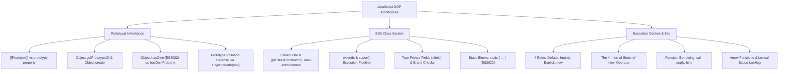

# Module 10: Lập Trình Hướng Đối Tượng & Chuỗi Nguyên Mẫu (OOP & Prototypes)

## 🎯 Mục Tiêu Học Tập
Module này cung cấp nền tảng chuyên sâu về mô hình hướng đối tượng độc nhất vô nhị của JavaScript:
1. **Prototypes & Inheritance**: Thấu suốt bản chất chuỗi nguyên mẫu `[[Prototype]]`, quy trình tra cứu thuộc tính (Property Lookup), cạm bẫy phá vỡ Inline Caches của `Object.setPrototypeOf()` và phòng vệ tuyệt đối trước lỗ hổng Prototype Pollution.
2. **Classes & Encapsulation**: Bản chất Syntactic Sugar của ES6 Class, cơ chế kế thừa với `extends` và `super()`, bảo mật cấp mã máy với trường riêng tư `#privateField` (ES2022) và khối khởi tạo tĩnh `static { ... }`.
3. **This Binding & Call/Apply/Bind**: Làm chủ 4 quy tắc ràng buộc con trỏ `this`, hiểu thấu 4 bước thực thi ngầm của toán tử `new`, tránh bẫy mất ngữ cảnh khi truyền callback và tính chất Lexical bất biến của Arrow Functions.

---

## 🗺️ Bản Đồ Kiến Trúc Hướng Đối Tượng (OOP Mindmap)



---

## 📚 Danh Mục Bài Học & File Thực Hành

| STT | Tên Chủ Đề Chi Tiết | Tài Liệu Hướng Dẫn (.md) | Code Kiểm Chứng (.js) | Trọng Tâm Kỹ Thuật |
| :---: | :--- | :--- | :--- | :--- |
| **01** | **Bản Chất Chuỗi Nguyên Mẫu & Kế Thừa** | [01-prototypes-and-inheritance.md](file:///d:/my-project/revision-document/javascript/10-oop-and-prototypes/01-prototypes-and-inheritance.md) | [01-prototypes-demo.js](file:///d:/my-project/revision-document/javascript/10-oop-and-prototypes/01-prototypes-demo.js) | `[[Prototype]]`, Chuỗi kế thừa, Prototype Pollution, `Object.hasOwn()` |
| **02** | **Lớp ES6 & Tính Đóng Gói** | [02-classes-and-encapsulation.md](file:///d:/my-project/revision-document/javascript/10-oop-and-prototypes/02-classes-and-encapsulation.md) | [02-classes-demo.js](file:///d:/my-project/revision-document/javascript/10-oop-and-prototypes/02-classes-demo.js) | `extends`, `super()`, Trường riêng tư `#field`, Khối `static { ... }`, Bắt buộc `new` |
| **03** | **Bản Chất Con Trỏ this & call/apply/bind** | [03-this-binding-and-call-apply-bind.md](file:///d:/my-project/revision-document/javascript/10-oop-and-prototypes/03-this-binding-and-call-apply-bind.md) | [03-this-demo.js](file:///d:/my-project/revision-document/javascript/10-oop-and-prototypes/03-this-demo.js) | 4 Quy tắc `this`, 4 bước của toán tử `new`, Mất `this` callback, Lexical Arrow |

---

## 🧪 Bộ Kiểm Thử Tự Động (Module Test Suite)

Toàn bộ 5 thử thách nâng cao được kiểm thử tự động tại:
👉 **[practice.js](file:///d:/my-project/revision-document/javascript/10-oop-and-prototypes/practice.js)**

### Cách chạy kiểm tra:
```bash
node javascript/10-oop-and-prototypes/practice.js
```
100% assertions được kiểm định tự động với `node:assert/strict`.
