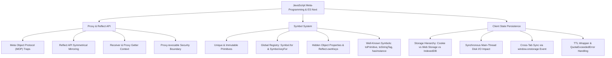

# Module 11: Siêu Lập Trình & Tính Năng ES Next (Meta-Programming & ES Next)

## 🎯 Mục Tiêu Học Tập
Module này trang bị tư duy và kỹ thuật can thiệp sâu vào các hành vi nội tại của V8 Engine và JavaScript Runtime:
1. **Proxy & Reflect API**: Thấu suốt Meta Object Protocol (MOP), can thiệp bẫy (Traps) đọc/ghi/gọi hàm, giải quyết cạm bẫy con trỏ `this` trong Proxy với tham số `receiver`, xây dựng hệ thống Reactivity và bảo mật với Revocable Proxy.
2. **Symbols & Well-Known Symbols**: Làm chủ kiểu nguyên thủy duy nhất `Symbol`, phân biệt Local Symbol và Global Symbol Registry (`Symbol.for`), can thiệp các hành vi gốc của ngôn ngữ thông qua Well-Known Symbols (`Symbol.iterator`, `Symbol.toPrimitive`, `Symbol.toStringTag`, `Symbol.hasInstance`).
3. **Web Storage & State Persistence**: Khai thác chuẩn xác `localStorage` và `sessionStorage`, phân biệt cơ chế đồng bộ (Synchronous disk block), lắng nghe đồng bộ đa tab qua sự kiện `storage`, xây dựng Smart Storage bọc ngoài chống tràn hạn mức (`QuotaExceededError`) và hỗ trợ thời gian sống (TTL).

---

## 🗺️ Bản Đồ Kiến Trúc Meta-Programming (Mindmap)



---

## 📚 Danh Mục Bài Học & File Thực Hành

| STT | Tên Chủ Đề Chi Tiết | Tài Liệu Hướng Dẫn (.md) | Code Kiểm Chứng (.js) | Trọng Tâm Kỹ Thuật |
| :---: | :--- | :--- | :--- | :--- |
| **01** | **Siêu Lập Trình Với Proxy & Reflect** | [01-proxy-and-reflect.md](file:///d:/my-project/revision-document/javascript/11-meta-programming-and-es-next/01-proxy-and-reflect.md) | [01-proxy-demo.js](file:///d:/my-project/revision-document/javascript/11-meta-programming-and-es-next/01-proxy-demo.js) | Proxy traps, `Reflect` receiver, Reactivity, Revocable Proxy, V8 Map slot trap |
| **02** | **Symbol & Well-Known Symbols** | [02-symbols-and-well-known-symbols.md](file:///d:/my-project/revision-document/javascript/11-meta-programming-and-es-next/02-symbols-and-well-known-symbols.md) | [02-symbols-demo.js](file:///d:/my-project/revision-document/javascript/11-meta-programming-and-es-next/02-symbols-demo.js) | `Symbol.for`, `Symbol.toPrimitive`, `Symbol.toStringTag`, `Symbol.hasInstance`, Semi-private properties |
| **03** | **Web Storage & Quản Lý Trạng Thái Bền Vững** | [03-web-storage-and-state-persistence.md](file:///d:/my-project/revision-document/javascript/11-meta-programming-and-es-next/03-web-storage-and-state-persistence.md) | [03-storage-demo.js](file:///d:/my-project/revision-document/javascript/11-meta-programming-and-es-next/03-storage-demo.js) | `localStorage` vs `sessionStorage`, Quota limits, TTL wrapper, Cross-tab sync |

---

## 🧪 Bộ Kiểm Thử Tự Động (Module Test Suite)

Toàn bộ 5 thử thách nâng cao được kiểm thử tự động tại:
👉 **[practice.js](file:///d:/my-project/revision-document/javascript/11-meta-programming-and-es-next/practice.js)**

### Cách chạy kiểm tra:
```bash
node javascript/11-meta-programming-and-es-next/practice.js
```
100% assertions được kiểm định tự động với `node:assert/strict`.
