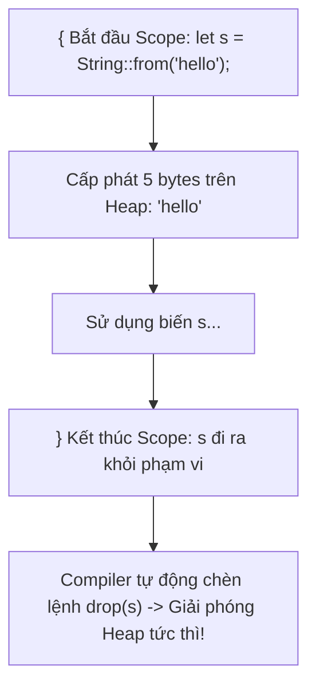

# Ownership & RAII (Resource Acquisition Is Initialization)

Các ngôn ngữ lập trình thường quản lý bộ nhớ theo hai trường phái:
1. **Quản lý thủ công (C/C++)**: Lập trình viên tự gọi `malloc()` / `free()` hoặc `new` / `delete`. Rất nhanh nhưng dễ gây ra lỗi rò rỉ bộ nhớ (Memory Leak), giải phóng 2 lần (Double Free), hoặc con trỏ lơ lửng (Dangling Pointer).
2. **Bộ thu gom rác tự động (Java, Go, C#, Python)**: Dùng Garbage Collector (GC) quét bộ nhớ định kỳ. An toàn nhưng gây tốn thêm RAM và tạo ra các đợt dừng hệ thống ngẫu nhiên (GC Pauses / Stop-The-World).

**Rust phát minh ra con đường thứ ba**: Quản lý bộ nhớ an toàn tuyệt đối ở thời điểm biên dịch (**Compile-Time Memory Safety**) thông qua **Hệ thống Sở Hữu (Ownership System)**.

---

## 1. Ba Nguyên Tắc Sở Hữu Vàng (The Three Golden Rules)

> [!IMPORTANT]
> 1. **Mỗi giá trị trong Rust đều có một biến làm chủ sở hữu (Owner) của nó.**
> 2. **Tại một thời điểm, chỉ có DUY NHẤT MỘT chủ sở hữu.**
> 3. **Khi chủ sở hữu đi ra khỏi phạm vi (Scope), giá trị đó sẽ tự động bị hủy (Dropped).**

---

## 2. Quản Lý Bộ Nhớ RAII & Trait `Drop`

Rust áp dụng triệt để mô hình **RAII**: Tài nguyên (bộ nhớ Heap, file handles, kết nối socket, mutex locks) được cấp phát khi biến được khởi tạo và **tự động được giải phóng ngay khi biến ra khỏi dấu ngoặc nhọn `{}` kết thúc scope**.



### Hàm `drop` Tự Động Trong Rust
```rust
{
    let s = String::from("hello"); // s bắt đầu hợp lệ từ đây
    // thực hiện tính toán với s
} // phạm vi kết thúc, Rust tự động gọi hàm drop() giải phóng bộ nhớ của s ngay lập tức!
```

### Tại Sao Không Bao Giờ Bị Double Free?
Vì mỗi giá trị chỉ có đúng **1 chủ sở hữu duy nhất**, Rust biết chính xác thời điểm nào biến ra khỏi scope để giải phóng. Không thể có chuyện hai tiến trình hoặc hai biến cùng cố gắng giải phóng một vùng nhớ hai lần!
