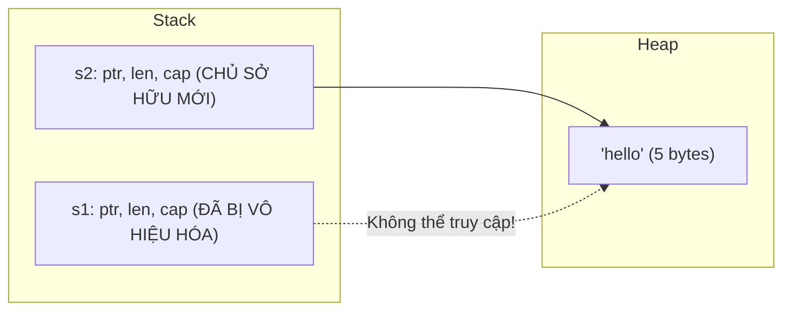

# Move Semantics vs The Copy Trait

Khi gán một biến này cho một biến khác trong Rust (ví dụ: `let y = x;`), hành vi bộ nhớ phụ thuộc hoàn toàn vào việc kiểu dữ liệu của `x` có thực thi trait `Copy` hay không.

---

## 1. Move Semantics (Ngữ Nghĩa Chuyển Giao Quyền Sở Hữu)

Với các kiểu dữ liệu cấp phát bộ nhớ trên Heap (như `String`, `Vec<T>`, `Box<T>`):
- Một biến `String` trên Stack bao gồm 3 trường: Con trỏ tới vùng nhớ Heap (`ptr`), độ dài (`len`), và dung lượng (`capacity`).
- Khi ta thực hiện:
```rust
let s1 = String::from("hello");
let s2 = s1; // Quyền sở hữu bị CHUYỂN GIAO (MOVE) sang s2!
```



### Điều Gì Xảy Ra Ở Tầng Biên Dịch?
- Rust thực hiện phép sao chép nông (Shallow Copy) 3 trường `ptr`, `len`, `cap` từ `s1` sang `s2`.
- Nhưng thay vì để cả hai biến cùng trỏ vào 1 vùng nhớ Heap (nguy cơ Double Free khi hết scope), **Rust lập tức đánh dấu `s1` là không còn hợp lệ (Invalidated)**!
- Nếu bạn cố gắng sử dụng `s1`:
```rust
println!("{}", s1); // ❌ LỖI BIÊN DỊCH: borrow of moved value: `s1`
```

---

## 2. Trait `Copy` (Sao Chép Bitwise Trên Stack)

Nếu một kiểu dữ liệu nằm **hoàn toàn trên Stack** và kích thước của nó được xác định cố định ở thời điểm biên dịch:
- Việc sao chép dữ liệu chỉ đơn giản là copy các bit trên Stack với chi phí cực rẻ ($O(1)$).
- Kiểu dữ liệu này có thể thực thi trait `Copy`.
- Khi gán biến hoặc truyền vào hàm, dữ liệu được tự động sao chép; biến cũ **vẫn hoàn toàn hợp lệ**!

```rust
let x = 42;
let y = x; // Copy bitwise giá trị 42
println!("x = {}, y = {}", x, y); // ✅ HỢP LỆ! x vẫn còn sống
```

### Các Kiểu Mặc Định Thực Thi Trait `Copy`:
- Tất cả các kiểu số nguyên (`i8`, `i32`, `i64`, `u8`, `u32`, `usize`...).
- Kiểu số thực (`f32`, `f64`).
- Kiểu Boolean (`bool`).
- Kiểu ký tự (`char`).
- Tuple chứa toàn các kiểu có `Copy` (ví dụ: `(i32, i32)` có `Copy`, nhưng `(i32, String)` thì **KHÔNG**).
- Mảng có kích thước cố định chứa kiểu `Copy` (ví dụ: `[i32; 4]`).

---

## 3. Trait `Clone` (Sao Chép Sâu Tường Minh)

Nếu bạn thực sự muốn nhân bản một vùng nhớ Heap (Deep Copy) để cả hai biến đều sở hữu hai vùng nhớ độc lập:
- Bạn phải gọi phương thức `.clone()` một cách tường minh:
```rust
let s1 = String::from("hello");
let s2 = s1.clone(); // Cấp phát thêm 1 vùng nhớ Heap mới!

println!("s1 = {}, s2 = {}", s1, s2); // ✅ HỢP LỆ! Cả 2 đều có vùng nhớ riêng
```
- **Triết lý của Rust**: Mọi thao tác tốn kém tài nguyên Heap đều phải hiển thị rõ ràng trong mã nguồn (Explicit over implicit).
