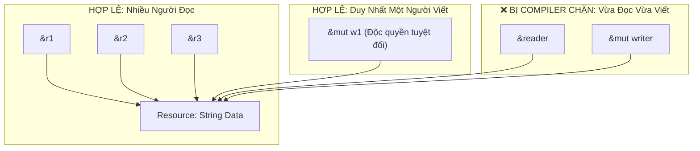

# Borrowing & The Aliasing XOR Mutability Invariant

Nếu mỗi lần muốn truyền một biến vào hàm, chúng ta đều phải chuyển quyền sở hữu (Move) rồi hàm lại phải trả về biến đó để ta dùng tiếp, code sẽ cực kỳ rườm rà.

Rust cung cấp cơ chế **Mượn (Borrowing)** thông qua các **Tham chiếu (References)**.

---

## 1. Tham Chiếu Bất Biến (`&T`) vs Khả Biến (`&mut T`)

- **Tham chiếu bất biến (`&T`)**: Cho phép đọc dữ liệu nhưng tuyệt đối không được sửa đổi.
- **Tham chiếu khả biến (`&mut T`)**: Cho phép vừa đọc vừa sửa đổi dữ liệu gốc.

```rust
let mut s = String::from("hello");

// Mượn bất biến:
fn calculate_len(text: &String) -> usize {
    text.len()
}

// Mượn khả biến:
fn append_world(text: &mut String) {
    text.push_str(", world!");
}
```

---

## 2. Định Lý Bất Biến Tối Thượng: Aliasing XOR Mutability

Borrow Checker của Rust thực thi một định lý toán học bất biến tại mọi thời điểm trong chương trình:

> [!IMPORTANT]
> **Tại một phạm vi (scope) nhất định của một biến, bạn chỉ có thể có:**
> - **HOẶC bất kỳ số lượng tham chiếu bất biến nào (`&T`) (Nhiều người đọc),**
> - **HOẶC duy nhất một tham chiếu khả biến (`&mut T`) (Chỉ 1 người viết).**
>
> *(Bạn TUYỆT ĐỐI KHÔNG BAO GIỜ được phép có cả hai tồn tại cùng một lúc!).*



### Tại Sao Quy Tắc Này Triệt Tiêu 100% Data Races?
Một lỗi tranh chấp dữ liệu (**Data Race**) chỉ có thể xảy ra khi:
1. Có từ hai con trỏ trở lên cùng truy cập vào một vùng nhớ tại một thời điểm (**Aliasing**).
2. Có ít nhất một con trỏ đang thực hiện ghi dữ liệu (**Mutability**).
3. Không có cơ chế đồng bộ hóa (Synchronization).

Định lý **Aliasing XOR Mutability** ngăn chặn điều kiện (1) và (2) xảy ra đồng thời ngay từ khi biên dịch. Nếu có người đang viết (`&mut T`), không ai khác được phép đọc (`&T`). Nếu có người đang đọc, không ai được phép viết!

---

## 3. Non-Lexical Lifetimes (NLL)

Trước phiên bản Rust 2018, một lượt mượn kéo dài cho đến dấu ngoặc nhọn `{}` cuối cùng của scope. Kể từ Rust 2018, compiler áp dụng kỹ thuật **Non-Lexical Lifetimes (NLL)**:
- Phạm vi của một tham chiếu kết thúc tại **dòng lệnh cuối cùng mà nó được sử dụng thực tế**, chứ không cần chờ hết scope:

```rust
let mut s = String::from("hello");

let r1 = &s; // Bắt đầu mượn bất biến
let r2 = &s;
println!("{} and {}", r1, r2);
// 💡 r1 và r2 KHÔNG CÒN ĐƯỢC DÙNG NỮA TỪ ĐÂY! (NLL giải phóng mượn bất biến)

let r3 = &mut s; // ✅ HOÀN TOÀN HỢP LỆ!
r3.push_str("!");
println!("{}", r3);
```
