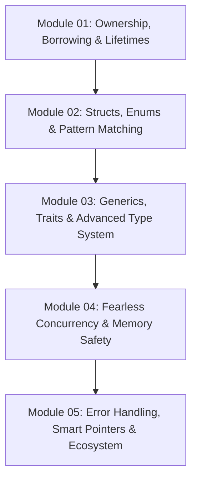

# Rust Systems Programming Revision Guide

Chào mừng bạn đến với lộ trình ôn tập và luyện tập chuyên sâu **Rust Systems Programming**. Rust là ngôn ngữ lập trình hệ thống tiên phong kết hợp hoàn hảo giữa hiệu năng tối đa ngang ngửa C/C++ với sự an toàn bộ nhớ tuyệt đối (Memory Safety) mà không cần Garbage Collector (Bộ thu gom rác).

---

## 🗺️ Lộ Trình 5 Module Chuyên Sâu

### Chi Tiết Từng Module

1. **[01-ownership-borrowing-and-lifetimes/](file:///d:/my-project/revision-document/rust/01-ownership-borrowing-and-lifetimes/README.md)**:
   - 3 Nguyên tắc sở hữu vàng (Ownership Rules) và Quản lý bộ nhớ RAII.
   - Move Semantics vs Trait `Copy`.
   - Cơ chế Mượn (Borrowing): Bất biến (`&T`) vs Khả biến (`&mut T`).
   - Định lý bất biến: **Aliasing XOR Mutability** (Nhiều người đọc HOẶC duy nhất một người viết).
   - Vòng đời (Lifetimes `'a`), Lifetime Elision Rules và cơ chế hoạt động của Borrow Checker.

2. **[02-structs-enums-and-pattern-matching/](file:///d:/my-project/revision-document/rust/02-structs-enums-and-pattern-matching/README.md)**:
   - Cấu trúc Structs: Named-field, Tuple structs, Unit-like structs, Phương thức `impl` (`&self`, `&mut self`).
   - Enums mang dữ liệu (Algebraic Data Types - ADT): `Option<T>` (An toàn tuyệt đối không có NULL) và `Result<T, E>`.
   - Khớp mẫu toàn diện (Pattern Matching): Biểu thức `match`, `if let`, `let else`, Match Guards.

3. **[03-generics-traits-and-types/](file:///d:/my-project/revision-document/rust/03-generics-traits-and-types/README.md)**:
   - Generics trong Hàm, Struct và Enum.
   - Traits: Định nghĩa giao diện, Default implementations, Supertraits, Associated Types.
   - Trait Bounds (`T: Display + Clone`, mệnh đề `where`).
   - Phân giải tĩnh (Static Dispatch / Monomorphization) vs Phân giải động (Dynamic Dispatch / Trait Objects `dyn Trait` qua vtables).
   - Trọn bộ các Standard Traits: `Iterator`, `Clone`, `Copy`, `Debug`, `Deref`, `Drop`.

4. **[04-concurrency-and-threads/](file:///d:/my-project/revision-document/rust/04-concurrency-and-threads/README.md)**:
   - "Fearless Concurrency" (Đồng thời không sợ hãi): Thread spawning (`std::thread`), Move closures.
   - Chia sẻ trạng thái an toàn: `Arc<T>` (Atomic Reference Counting) kết hợp `Mutex<T>` / `RwLock<T>`.
   - Truyền tin nhắn qua kênh (Message Passing): MPSC (Multiple Producer, Single Consumer) channels.
   - Hai Marker Traits thần thánh: `Send` (Chuyển quyền giữa các luồng) và `Sync` (Chia sẻ tham chiếu giữa các luồng).

5. **[05-error-handling-and-ecosystem/](file:///d:/my-project/revision-document/rust/05-error-handling-and-ecosystem/README.md)**:
   - Lỗi không thể phục hồi: `panic!`, Stack unwinding vs Abort.
   - Lỗi có thể phục hồi: Toán tử `?` (Early return và chuyển đổi lỗi `From`/`Into`).
   - Các Smart Pointers: `Box<T>` (Cấp phát Heap, kiểu dữ liệu đệ quy), `Rc<T>` (Đếm tham chiếu đơn luồng), `RefCell<T>` (Interior mutability, runtime borrow check).
   - Hệ sinh thái Cargo: `Cargo.toml`, Workspaces, Features flags, Profiles tối ưu hóa.

---

## ⚡ Tiêu Chuẩn Thực Hành

Mỗi module bao gồm:
- Lý thuyết chi tiết từ cơ bản đến trình độ chuyên gia.
- File code ví dụ Rust chuẩn mực (`.rs`).
- File kiểm thử tự động `practice.mjs` với 5 bài kiểm tra assertions chặt chẽ kiểm định toàn bộ các quy tắc bộ nhớ, cấu trúc dữ liệu và mô phỏng borrow checker.
