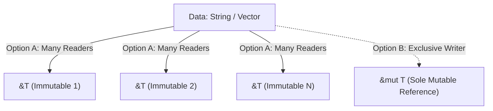

# Rust Systems Programming: Master Cheat Sheet

A comprehensive reference for memory safety without garbage collection, borrow checker mechanics, zero-cost abstractions, fearless concurrency, and the advanced type system.

---

## 1. The Three Golden Rules of Ownership

Rust guarantees memory safety at compile time through its ownership system:
1. **Each value in Rust has an owner (a variable).**
2. **There can only be one owner at a time.**
3. **When the owner goes out of scope, the value is automatically dropped (RAII - Resource Acquisition Is Initialization).**

### Move Semantics vs Copy Trait
- **Copy Types**: Stored entirely on the stack (primitives like `i32`, `f64`, `bool`, `char`, fixed-size arrays `[T; N]`). Assignment copies the bitwise value; original variable remains valid.
- **Move Types**: Allocate heap memory or OS handles (`String`, `Vec<T>`, `Box<T>`, file descriptors). Assignment **transfers ownership**; the source variable is invalidated at compile time.

```rust
let s1 = String::from("hello");
let s2 = s1; // Ownership MOVED to s2!
// println!("{}", s1); // ❌ COMPILE ERROR: value borrowed here after move
```

---

## 2. Borrowing: The Aliasing XOR Mutability Invariant

To use a value without taking ownership, Rust uses **Borrowing (References)**:

> [!IMPORTANT]
> **The Golden Borrowing Rule**: At any given time within a scope, you may have EITHER:
> - **Any number of immutable references (`&T`)**, OR
> - **Exactly one mutable reference (`&mut T`)**.
>
> *(You can NEVER have both active simultaneously! Aliasing XOR Mutability).*



### Why Does This Prevent 100% of Data Races?
A **Data Race** occurs when: (1) Two or more pointers access the same memory concurrently, (2) At least one is writing, (3) There is no synchronization.
Rust's borrow checker mathematically makes this impossible at compile time!

---

## 3. Lifetimes (`'a`) & The Borrow Checker

Lifetimes ensure that references never outlive the data they point to, preventing **Dangling Pointers** and **Use-After-Free** bugs.

```rust
// 'a specifies that returned reference lives as long as the shortest input lifetime
fn longest<'a>(x: &'a str, y: &'a str) -> &'a str {
    if x.len() > y.len() { x } else { y }
}
```

### Lifetime Elision Rules (Compiler automatically infers lifetimes):
1. Each input parameter that is a reference gets its own lifetime: `fn foo<'a>(x: &'a i32)`.
2. If there is exactly one input lifetime parameter, that lifetime is assigned to all output lifetimes: `fn foo<'a>(x: &'a i32) -> &'a i32`.
3. If there are multiple input parameters, but one of them is `&self` or `&mut self`, the lifetime of `self` is assigned to all output references.

---

## 4. Structs, Enums & Pattern Matching

### 4.1 Enums with Data & Null Safety
Rust has **no `NULL` or `nil` pointer**. Missing values are modeled explicitly via `Option<T>`:
```rust
enum Option<T> {
    Some(T),
    None,
}

enum Result<T, E> {
    Ok(T),
    Err(E),
}
```

### 4.2 Exhaustive Pattern Matching
The `match` expression must cover every single possible variant, guaranteeing no unhandled edge cases:
```rust
match result {
    Ok(val) => println!("Success: {}", val),
    Err(err) => eprintln!("Error: {:?}", err),
}
```

---

## 5. Traits: Generics & Dynamic Dispatch

| Dimension | Static Dispatch (`impl Trait`, Generics `<T: Trait>`) | Dynamic Dispatch (`&dyn Trait`, `Box<dyn Trait>`) |
| :--- | :--- | :--- |
| **Mechanism** | **Monomorphization**: Compiler generates separate machine code for each concrete type at compile time. | **vtable**: Function pointer lookup via virtual method table at runtime. |
| **Runtime Cost** | **Zero runtime cost**; enables compiler inlining and SIMD optimizations. | Slight indirection overhead (1 pointer dereference). |
| **Binary Size** | Larger binary (code duplication per concrete type). | Smaller binary (shared machine code). |
| **Heterogeneous Collections** | Impossible (e.g. `Vec<T>` requires all elements to be same type). | Allowed (e.g. `Vec<Box<dyn Drawable>>` holds different types). |

---

## 6. Fearless Concurrency: `Send` & `Sync`

Rust threads are guaranteed safe by two auto-generated marker traits:
- **`Send`**: Indicates that ownership of the type can be transferred across thread boundaries safely (Almost all types except raw pointers `*const T` and `Rc<T>`).
- **`Sync`**: Indicates that it is safe to share references to the type between multiple threads concurrently (`&T` is `Send`).
$$\mathbf{T \text{ is } Sync \iff \&T \text{ is } Send}$$

### Safe Shared State Concurrency: `Arc<Mutex<T>>`
- **`Mutex<T>`**: Provides mutual exclusion via RAII lock guard (`MutexGuard` automatically unlocks on `drop`).
- **`Arc<T>`**: Atomic Reference Counting pointer; allows multiple threads to own shared access to the `Mutex<T>`.

```rust
use std::sync::{Arc, Mutex};
use std::thread;

let counter = Arc::new(Mutex::new(0));
let mut handles = vec![];

for _ in 0..10 {
    let counter_clone = Arc::clone(&counter);
    let handle = thread::spawn(move || {
        let mut num = counter_clone.lock().unwrap();
        *num += 1; // MutexGuard automatically releases lock at end of scope!
    });
    handles.push(handle);
}
```

---

## 7. Smart Pointers Breakdown

| Smart Pointer | Memory Location | Overhead | Mutability | Thread Safe? |
| :--- | :--- | :--- | :--- | :--- |
| **`Box<T>`** | Heap allocated | Zero (pure pointer) | Inherited from variable | Yes (`Send`) |
| **`Rc<T>`** | Heap allocated | Reference count increment | Immutable (needs `RefCell`) | **NO** (Single-thread only) |
| **`Arc<T>`** | Heap allocated | Atomic reference count | Immutable (needs `Mutex`) | **YES** |
| **`RefCell<T>`** | Stack or Heap | Runtime borrow check | **Interior Mutability** | **NO** (panics if rules violated) |
| **`Mutex<T>`** | OS Mutex primitive | OS Lock / Futex | Interior Mutability | **YES** |
