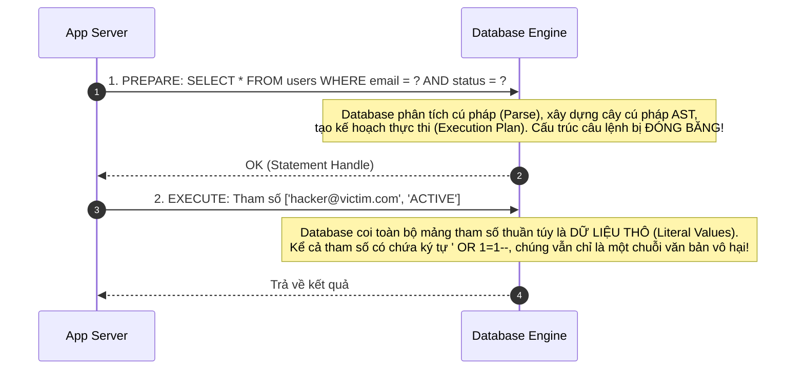

# SQL Injection & Parameterized Queries

SQL Injection (SQLi) là một trong những lỗ hổng bảo mật lâu đời nhất nhưng vẫn nằm trong top các mối đe dọa nghiêm trọng nhất (OWASP Top 10 A03: Injection). Lỗ hổng xảy ra khi dữ liệu do người dùng cung cấp được ghép nối trực tiếp vào câu lệnh SQL mà không qua quá trình tham số hóa.

---

## 1. Bản Chất Kỹ Thuật: Nhầm Lẫn Giữa Code và Data

Khi viết mã:
```javascript
// ❌ CỰC KỲ NGUY HIỂM: Ghép chuỗi SQL
const query = `SELECT * FROM users WHERE username = '${username}' AND password = '${password}'`;
```

Nếu kẻ tấn công nhập:
- `username`: `' OR '1'='1' --`
- `password`: `bất kỳ`

Câu lệnh thực tế mà Database Parser biên dịch thành:
```sql
SELECT * FROM users WHERE username = '' OR '1'='1' --' AND password = 'xxx'
```
- Mệnh đề `'1'='1'` luôn luôn đúng (TRUE).
- Ký tự `--` là chú thích (Comment) trong SQL, khiến toàn bộ phần kiểm tra mật khẩu phía sau bị triệt tiêu hoàn toàn.
- Kẻ tấn công đăng nhập thành công vào tài khoản đầu tiên trong bảng (thường là tài khoản `admin`) mà không cần mật khẩu!

---

## 2. Các Biến Thể SQLi Phổ Biến

1. **In-Band SQLi (Classic & Error-Based)**:
   - Kẻ tấn công nhận được kết quả dữ liệu hoặc thông báo lỗi cú pháp chi tiết từ cơ sở dữ liệu ngay trên màn hình trình duyệt (ví dụ: dùng mệnh đề `UNION SELECT 1, username, password FROM admin_users`).
2. **Blind SQLi (Tấn Công Mù)**:
   - Ứng dụng không trả về dữ liệu hay thông báo lỗi chi tiết mà chỉ trả về trang chung (ví dụ: "Đăng nhập thất bại").
   - **Boolean-based**: Gửi các điều kiện logic (ví dụ: `AND SUBSTRING(password, 1, 1) = 'a'`). Nếu trang hiển thị khác đi một chút, tin tặc đoán được ký tự đầu tiên của mật khẩu.
   - **Time-based**: Ép Database ngủ một khoảng thời gian (ví dụ: `AND IF(version() LIKE '8.%', SLEEP(5), 0)`). Nếu response mất hơn 5 giây để phản hồi, tin tặc xác nhận suy đoán là đúng.

---

## 3. Tuyến Phòng Thủ Tuyệt Đối: Parameterized Queries (Prepared Statements)

> [!IMPORTANT]
> **Prepared Statements** là biện pháp duy nhất triệt tiêu hoàn toàn $100\%$ lỗ hổng SQL Injection.



### Triển Khai Đúng Chuẩn
```javascript
// ✅ AN TOÀN: Sử dụng Tham Số Hóa
const sql = 'SELECT id, email, role FROM users WHERE username = ? AND password_hash = ?';
const [rows] = await db.execute(sql, [username, passwordHash]);
```

### Tại Sao "Escape String" Không Đủ An Toàn?
Nhiều lập trình viên cố gắng dùng hàm `addslashes` hoặc thay thế ký tự nháy đơn `'` bằng `\'`. Cách này cực kỳ nguy hiểm vì:
- Dễ bị vượt qua bởi các bảng mã ký tự nhiều byte (Multibyte Character Encoding, ví dụ: GBK / Big5: ký tự `%bf%27` kết hợp với nháy đơn tạo thành ký tự hợp lệ và triệt tiêu dấu gạch chéo ngược `\`).
- Không bảo vệ được các trường số (ví dụ: `SELECT * FROM items WHERE category_id = ${id}` - không cần nháy đơn kẻ tấn công vẫn inject được).
