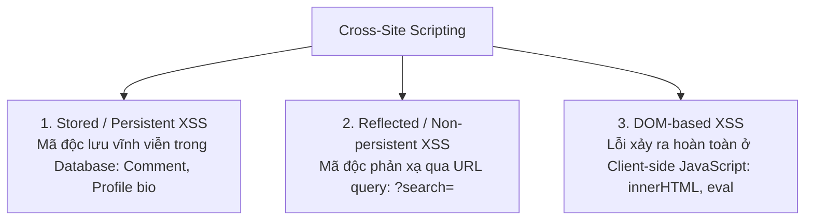

# Cross-Site Scripting (XSS) & Content Security Policy (CSP)

Cross-Site Scripting (XSS) xảy ra khi một ứng dụng web nhận dữ liệu đầu vào không đáng tin cậy từ người dùng và chèn trực tiếp vào trang web mà không qua quá trình mã hóa (Encoding) hoặc làm sạch (Sanitization), cho phép kẻ tấn công thực thi mã JavaScript độc hại trong ngữ cảnh trình duyệt của nạn nhân.

---

## 1. Ba Biến Thể XSS



### Hậu Quả Khi Kẻ Tấn Công Chạy Được JavaScript
- Đọc cắp Cookie phiên làm việc (`document.cookie`) nếu thiếu cờ `HttpOnly`.
- Đọc trộm token trong `localStorage` / `sessionStorage`.
- Gửi các request mạo danh người dùng (Chuyển tiền, đổi email/password).
- Chèn Keylogger theo dõi bàn phím hoặc tạo form đăng nhập giả mạo (Phishing).

---

## 2. Contextual Output Encoding (Mã Hóa Theo Ngữ Cảnh)

Một sai lầm phổ biến là chỉ mã hóa thẻ `<script>`. Trong HTML, mã JavaScript có thể thực thi ở rất nhiều ngữ cảnh khác nhau:

### 2.1 Ngữ Cảnh HTML Body
```html
<p>Xin chào, USER_INPUT</p>
```
- Phải mã hóa 5 ký tự đặc biệt của HTML:
  - `&` $\rightarrow$ `&amp;`
  - `<` $\rightarrow$ `&lt;`
  - `>` $\rightarrow$ `&gt;`
  - `"` $\rightarrow$ `&quot;`
  - `'` $\rightarrow$ `&#x27;`

### 2.2 Ngữ Cảnh HTML Attribute
```html
<input type="text" name="address" value="USER_INPUT">
```
- Nếu không mã hóa dấu nháy kép `"`, kẻ tấn công nhập: `" onfocus="alert(1)" autofocus="` $\rightarrow$ Mã JavaScript tự động kích hoạt ngay khi trang tải xong mà không cần thẻ `<script>`.

### 2.3 Ngữ Cảnh JavaScript Block
```html
<script>
    const userRole = "USER_INPUT";
</script>
```
- Mã hóa HTML ở đây vô dụng! Nếu kẻ tấn công nhập: `"; alert(document.cookie); //`, chúng sẽ phá vỡ chuỗi và thực thi lệnh.
- **Giải pháp**: Phải dùng hàm tuần tự hóa JSON an toàn (`JSON.stringify(data)`) và escape các ký tự Unicode như `\u003c` (`<`) và `\u003e` (`>`).

---

## 3. Tuyến Phòng Thủ Chiều Sâu: Content Security Policy (CSP)

Ngay cả khi lập trình viên vô tình bỏ sót một vị trí bị XSS trong code, một Header **Content Security Policy (CSP)** được cấu hình chuẩn mực sẽ ngăn chặn trình duyệt thực thi mã độc đó.

```http
Content-Security-Policy: default-src 'self'; script-src 'self' 'nonce-rAnd0m123' https://trustedcdn.com; object-src 'none'; base-uri 'self'; require-trusted-types-for 'script';
```

### Các Directive Then Chốt:
- `default-src 'self'`: Mọi tài nguyên mặc định chỉ được tải từ cùng domain nguồn gốc (Same-Origin).
- `script-src 'self' 'nonce-...'`:
  - Chặn đứng toàn bộ việc chạy mã JavaScript nội dòng (Inline Scripts, ví dụ: `<script>alert(1)</script>` hoặc thuộc tính `onload="..."`).
  - Chỉ cho phép các thẻ `<script nonce="rAnd0m123">` có mã Nonce ngẫu nhiên do server sinh ra cho mỗi request riêng biệt.
  - Vô hiệu hóa hàm `eval()` và `new Function()`.
- `object-src 'none'`: Vô hiệu hóa các plugin lỗi thời nguy hiểm như Flash, Java Applets.
