# Cross-Site Request Forgery (CSRF)

Cross-Site Request Forgery (CSRF) là kỹ thuật tấn công lừa trình duyệt của một người dùng đã xác thực (đang đăng nhập) gửi các yêu cầu giả mạo và không mong muốn tới một ứng dụng web đích mà nạn nhân không hề hay biết.

---

## 1. Cơ Chế Khai Thác CSRF

CSRF khai thác cơ chế mặc định mang tính kế thừa của trình duyệt web: **Tự động đính kèm Cookie của domain đích trong mọi yêu cầu cross-origin (Cross-Site Requests)**.

```mermaid
sequenceDiagram
    autonumber
    actor Victim as Người Dùng (Nạn Nhân)
    participant Bank as Ngân Hàng (bank.com)
    participant Evil as Trang Độc Hại (evil.com)

    Victim->>Bank: 1. Đăng nhập vào bank.com
    Bank-->>Victim: Set-Cookie: sessionToken=XYZ123
    Note over Victim,Bank: Phiên đăng nhập đang hợp lệ trong Cookie trình duyệt!

    Victim->>Evil: 2. Vô tình truy cập trang web lừa đảo evil.com
    Note over Evil: Trang evil.com chứa mã ngầm tự động submit form:<br/><form action="https://bank.com/transfer" method="POST"><br/>  <input name="to" value="HackerAccount"/><br/>  <input name="amount" value="50000"/><br/></form><br/><script>document.forms[0].submit()</script>
    Evil-->>Victim: Tự động gửi POST https://bank.com/transfer
    Victim->>Bank: 3. Trình duyệt tự động đính kèm Cookie: sessionToken=XYZ123!
    Note over Bank: Ngân hàng thấy Cookie hợp lệ -> Chuyển $50,000 cho Hacker!
    Bank-->>Victim: 4. Chuyển tiền thành công!
```



---

## 2. Tuyến Phòng Thủ Hiện Đại Số 1: Thuộc Tính Cookie `SameSite`

Kể từ năm 2020, toàn bộ các trình duyệt hiện đại (Chrome, Firefox, Safari, Edge) hỗ trợ thuộc tính `SameSite` cho Cookie để triệt tiêu nguyên nhân cốt lõi của CSRF.

```http
Set-Cookie: sessionToken=XYZ123; Path=/; Secure; HttpOnly; SameSite=Strict
```

### So Sánh 3 Chế Độ SameSite:
1. **`SameSite=Strict`**:
   - **Quy tắc tuyệt đối**: Trình duyệt **KHÔNG BAO GIỜ** gửi cookie này trong bất kỳ yêu cầu nào bắt nguồn từ một domain khác.
   - Kể cả khi người dùng bấm vào một link từ Facebook hoặc Gmail trỏ tới `bank.com`, cookie cũng không được gửi đi.
   - *Đánh đổi*: Người dùng phải reload lại trang thì mới nhận diện đã đăng nhập.
2. **`SameSite=Lax` (Mặc định chuẩn của trình duyệt)**:
   - Cho phép gửi cookie trong các điều kiện: Phải là phương thức **GET an toàn (Safe Top-Level Navigation)** (bấm link thông thường).
   - **CHẶN cookie** trong các yêu cầu cross-origin dạng `POST`, `PUT`, `DELETE`, hoặc gọi qua `fetch()` / `XMLHttpRequest`.
   - Bảo vệ tuyệt đối ứng dụng nếu ứng dụng tuân thủ chuẩn REST (Không bao giờ thay đổi dữ liệu bằng phương thức GET).
3. **`SameSite=None`**:
   - Tắt tính năng bảo vệ. Bắt buộc phải đi kèm cờ `Secure` (chỉ chạy trên HTTPS). Thường chỉ dùng cho cookies của bên thứ ba (Third-party widgets).

---

## 3. Các Phương Pháp Phòng Thủ Bổ Trợ

### 3.1 Synchronizer Token Pattern (CSRF Tokens)
- Server sinh một chuỗi ngẫu nhiên có độ dài lớn, không thể đoán được (*CSRF Token*), liên kết với phiên làm việc của user.
- Mỗi form HTML hoặc API request đều phải gửi kèm token này trong Header (`X-CSRF-Token`) hoặc trường ẩn (`<input type="hidden" name="_csrf" value="...">`).
- Vì trang `evil.com` bị chặn bởi chính sách Same-Origin Policy (SOP), nó không thể đọc được mã CSRF Token của `bank.com` $\rightarrow$ Request giả mạo bị server từ chối.

### 3.2 Double Submit Cookie Pattern (Cho Ứng Dụng Stateless / SPA)
- Server gửi một cookie `csrf_token=random_value` (không có cờ `HttpOnly`).
- Client-side JavaScript đọc cookie này và đính kèm giá trị đó vào HTTP Request Header `X-CSRF-Token`.
- Server so sánh giá trị trong Header và giá trị trong Cookie; nếu khớp nhau thì request hợp lệ.
