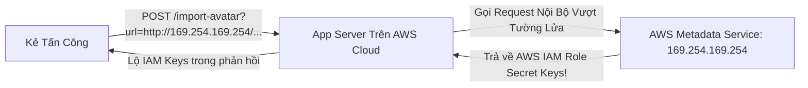

# SSRF, IDOR & Access Control

Hai lỗ hổng thường xuyên dẫn đến các vụ rò rỉ dữ liệu thảm khốc nhất trên môi trường Cloud hiện nay là **Server-Side Request Forgery (SSRF)** và **Broken Object Level Authorization (IDOR / BOLA)**.

---

## 1. Server-Side Request Forgery (SSRF)

SSRF xảy ra khi một máy chủ ứng dụng web thực hiện một cuộc gọi mạng (HTTP request) tới một URL do người dùng cung cấp từ bên ngoài mà không thực hiện kiểm tra và lọc tính hợp lệ của địa chỉ đích.



### 1.1 Vụ Bê Bối Capital One (106 Triệu Hồ Sơ Khách Hàng)
Năm 2019, ngân hàng Capital One bị tin tặc khai thác một lỗ hổng SSRF trên ModSecurity WAF. Máy chủ bị lừa gọi tới địa chỉ **Link-Local Cloud Metadata**:
`http://169.254.169.254/latest/meta-data/iam/security-credentials/`
Từ đó cướp được AWS Temporary Credentials của IAM Role quản trị và tải về hơn 700 S3 buckets chứa dữ liệu thẻ tín dụng.

### 1.2 Các Tuyến Phòng Thủ SSRF Toàn Diện
1. **Chặn Toàn Bộ Dải IP Riêng Tư (RFC 1918 & Link-Local)**:
   - `127.0.0.0/8` (Loopback / Localhost).
   - `10.0.0.0/8`, `172.16.0.0/12`, `192.168.0.0/16` (Mạng nội bộ VPC).
   - `169.254.169.254` (Cloud Metadata Service).
   - `0.0.0.0`, `::1` (IPv6 loopback).
2. **Chống Tấn Công DNS Rebinding**:
   - Kẻ tấn công tạo một tên miền `attacker-domain.com`.
   - Lần phân giải DNS đầu tiên trả về IP công cộng hợp lệ (`1.2.3.4`) để vượt qua bộ lọc URL.
   - Khi máy chủ thực sự gọi `fetch()`, máy chủ DNS độc hại trả về IP nội bộ `169.254.169.254`.
   - **Giải pháp**: Phải phân giải DNS trước (DNS Resolution Pinning), kiểm tra IP thực tế sau khi phân giải, và kết nối thẳng tới IP đã xác minh đó.
3. **Bật IMDSv2 Trên AWS**:
   - Bắt buộc phải có Session Token qua HTTP Header `X-aws-ec2-metadata-token` (Chặn SSRF đơn thuần).

---

## 2. Insecure Direct Object References (IDOR / BOLA)

IDOR (hay BOLA trong API Security) là lỗ hổng đứng số 1 trong OWASP API Security Top 10. Lỗ hổng xảy ra khi ứng dụng sử dụng định danh do người dùng cung cấp để truy cập trực tiếp vào đối tượng trong database mà không kiểm tra xem người dùng đó có quyền sở hữu đối tượng đó hay không.

### 2.1 Kịch Bản Khai Thác
- Người dùng A xem hóa đơn của mình: `GET /api/invoices/1001`
- Người dùng A thử đổi ID thành: `GET /api/invoices/1002` (Hóa đơn của người dùng B).
- Nếu mã nguồn viết:
```javascript
// ❌ LỖ HỔNG IDOR: Thiếu kiểm tra quyền sở hữu đối tượng
app.get('/api/invoices/:id', async (req, res) => {
  const invoice = await db.query('SELECT * FROM invoices WHERE id = ?', [req.params.id]);
  res.json(invoice); // Trả về hóa đơn của người dùng khác!
});
```

### 2.2 Quy Tắc Phòng Thủ IDOR
Luôn luôn gắn chặt truy vấn dữ liệu với **ID của người dùng hiện tại (Current Authenticated User ID)** được trích xuất từ Session hoặc JWT:

```javascript
// ✅ AN TOÀN: Enforce Tenant / Ownership Scoping
app.get('/api/invoices/:id', async (req, res) => {
  const currentUserId = req.user.id; // Lấy từ Session/JWT an toàn
  const invoice = await db.query(
    'SELECT * FROM invoices WHERE id = ? AND user_id = ?',
    [req.params.id, currentUserId]
  );

  if (!invoice) {
    return res.status(404).json({ error: 'Invoice not found' });
  }
  res.json(invoice);
});
```

- **Sử Dụng UUID v4 Thay Vì Auto-Increment ID**: Dùng mã ngẫu nhiên `8f3b6c2a-9e1d-4a5b-8c7d-1e2f3a4b5c6d` khiến kẻ tấn công không thể duyệt tuần tự (`1001`, `1002`, `1003`) để cào dữ liệu hàng loạt.
