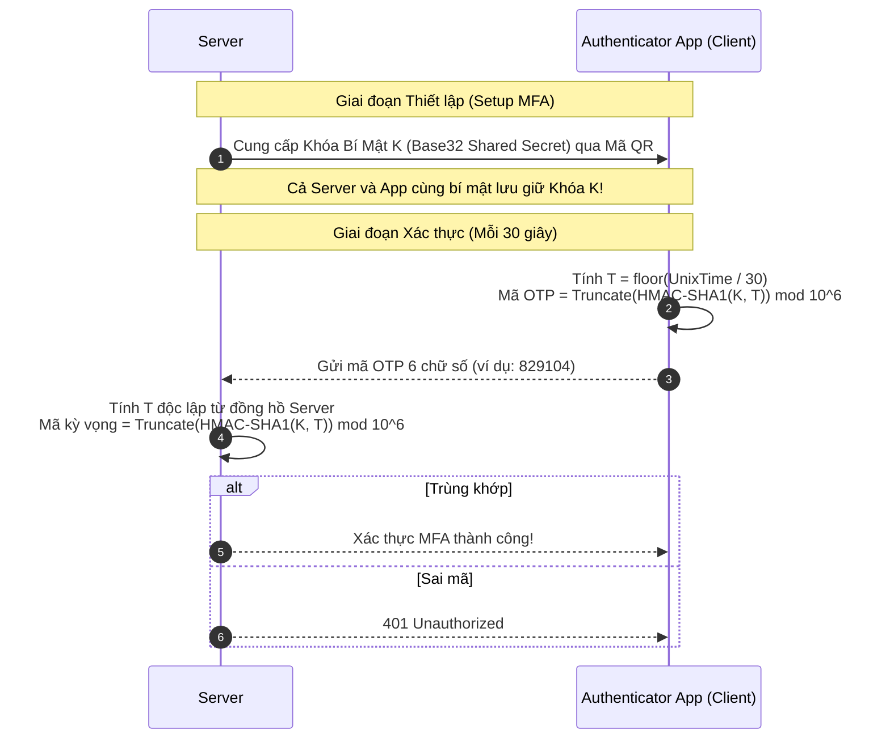
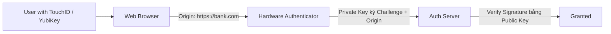

# Multi-Factor Authentication: TOTP & WebAuthn / FIDO2

Mật khẩu đơn thuần có thể bị lộ qua rò rỉ cơ sở dữ liệu, lừa đảo (Phishing), mã độc (Keylogger). Xác thực đa yếu tố (MFA - Multi-Factor Authentication) yêu cầu người dùng chứng minh danh tính qua ít nhất 2 trong 3 yếu tố:
1. **Something you know** (Mật khẩu, mã PIN).
2. **Something you have** (Điện thoại với ứng dụng TOTP, khóa bảo mật phần cứng YubiKey).
3. **Something you are** (Vân tay, nhận diện khuôn mặt FaceID).

---

## 1. TOTP: Time-based One-Time Password (RFC 6238)

TOTP là tiêu chuẩn mở đứng sau các ứng dụng sinh mã như Google Authenticator, Microsoft Authenticator, Authy, và 1Password.

### 1.1 Thuật Toán Chi Tiết (RFC 6238)
1. **Bộ đếm thời gian $T$**:
   $$T = \left\lfloor \frac{\text{Current Unix Timestamp}}{30} \right\rfloor$$
   (Mã OTP tự động thay đổi sau mỗi chu kỳ 30 giây).
2. **Băm HMAC-SHA1**:
   $$\text{Hash} = \text{HMAC-SHA1}(K, T_{\text{8-byte big endian}})$$
3. **Dynamic Truncation (Cắt động 4 bytes)**:
   - Lấy byte cuối cùng của `Hash`: `offset = Hash[19] & 0x0f`.
   - Lấy 4 bytes liên tiếp bắt đầu từ vị trí `offset`, xóa bit dấu `0x7fffffff`:
   $$\text{BinaryCode} = (\text{Hash}[\text{offset} \dots \text{offset}+3]) \ \& \ \text{0x7fffffff}$$
4. **Modulo $10^6$**:
   $$\text{OTP} = \text{BinaryCode} \pmod{1,000,000}$$
   (Cho ra một số nguyên 6 chữ số, ví dụ `048291`).

---

## 2. FIDO2 / WebAuthn & Passkeys (Đỉnh Cao Chống Phishing)

Mặc dù TOTP rất an toàn, nó **VẪN CÓ THỂ BỊ LỪA ĐẢO (Phishable)**. Nếu kẻ tấn công dựng một trang web giả mạo (`bank-fake.com`), nạn nhân có thể nhập cả mật khẩu và mã TOTP 6 số vào đó; kẻ tấn công lập tức chuyển mã này sang web ngân hàng thật trong vòng 30 giây!

**FIDO2 / WebAuthn** giải quyết triệt để vấn đề này nhờ mật mã bất đối xứng gắn liền với tên miền (Domain-Bound Cryptography):

### Tại Sao WebAuthn Chống Phishing 100%?
- Trình duyệt tự động chèn tên miền nguồn gốc (`Origin: https://bank.com`) vào dữ liệu ký mã hóa.
- Khóa bảo mật phần cứng chỉ ký tên miền đã đăng ký trước đó. Kẻ tấn công trên `bank-fake.com` không bao giờ có thể yêu cầu khóa phần cứng ký cho tên miền `bank.com`!
- **Không có Shared Secret**: Server chỉ lưu Public Key của người dùng; kẻ tấn công dù có hack được Database của server cũng không thể mạo danh đăng nhập!
