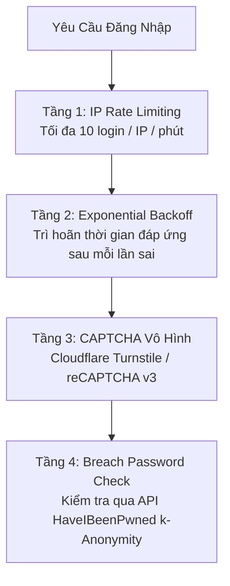

# Brute-Force & Credential Stuffing Defenses

Các cuộc tấn công dò mật khẩu tự động chiếm tới hơn $50\%$ lưu lượng truy cập trên các trang đăng nhập công cộng. Hai hình thức tấn công nguy hiểm nhất là **Brute Force (Vét cạn)** và **Credential Stuffing (Dùng tài khoản lộ lọt)**.

---

## 1. Bản Chất Cuộc Tấn Công

1. **Brute Force Attack**:
   - Nhắm vào **1 tài khoản cụ thể** (ví dụ: `admin@company.com`).
   - Thử hàng chục nghìn mật khẩu phổ biến từ từ điển (`rockyou.txt`).
2. **Credential Stuffing**:
   - Sử dụng các tệp dữ liệu rò rỉ gồm hàng tỷ cặp `email:password` từ các vụ hack trước đó (LinkedIn, Adobe, Dropbox).
   - Vì thói quen người dùng thường đặt **cùng một mật khẩu cho nhiều website**, kẻ tấn công dùng botnet tự động thử đăng nhập đồng loạt trên hàng nghìn website khác nhau.

---

## 2. Cạm Bẫy Của Tính Năng "Khóa Tài Khoản" (Account Lockout)

Một quy tắc ngây thơ thường thấy: "Nếu nhập sai mật khẩu 5 lần liên tiếp, khóa tài khoản đó trong 24 giờ".
- **Lỗ hổng Denial-of-Service (DoS) người dùng**:
  - Kẻ tấn công chỉ cần viết một script đơn giản, gửi 5 request sai mật khẩu cho toàn bộ tài khoản nhân viên công ty (`ceo@company.com`, `cfo@company.com`...).
  - Toàn bộ công ty bị khóa tài khoản và không ai có thể làm việc!

---

## 3. Chiến Lược Phòng Thủ Đa Tầng Cấp Doanh Nghiệp

### 3.1 Exponential Backoff (Trì Hoãn Cấp Số Nhân)
Thay vì khóa tài khoản cứng, hệ thống tăng dần thời gian người dùng phải chờ giữa các lần thử sai:
- Sai lần 1: Thử lại ngay lập tức.
- Sai lần 2: Chờ $1$ giây.
- Sai lần 3: Chờ $2$ giây.
- Sai lần 4: Chờ $4$ giây.
- Sai lần $N$: Chờ $2^{N-2}$ giây.
- Sau 10 lần sai, botnet phải chờ hàng chục phút cho 1 lần thử, triệt tiêu hoàn toàn hiệu quả của việc dò mật khẩu tự động.

### 3.2 Kiểm Tra Mật Khẩu Rò Rỉ Qua Mô Hình k-Anonymity (HaveIBeenPwned)
Khi người dùng đăng ký hoặc đổi mật khẩu:
1. Client tính mã hash SHA-1 của mật khẩu: ví dụ `21BD87...`.
2. Client chỉ gửi **5 ký tự đầu tiên** (`21BD8`) lên API HaveIBeenPwned.
3. HaveIBeenPwned trả về danh sách tất cả các hash bắt đầu bằng `21BD8` kèm số lần xuất hiện trong các vụ rò rỉ dữ liệu.
4. Client tự kiểm tra xem phần còn lại của hash có nằm trong danh sách hay không.
5. **Độ an toàn tuyệt đối**: Mật khẩu của người dùng không bao giờ bị lộ ra ngoài mạng, nhưng hệ thống vẫn ngăn chặn được việc đặt mật khẩu đã bị lộ công khai.
